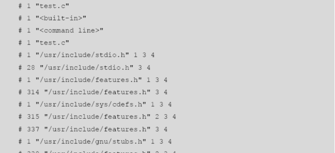

# 离线安装软件

1. 挂载red linux镜像 //mount -s 查看挂载点  mount /dev/sda0 /aa 挂载 mount -s 检查是否挂载
2. vim  /etc/yum.repos.d/任意文件名.repo

```
[dvd]
name = install dvd					#随意,没多么重要
baseurl = file:///aa				#挂载路径,  格式：file:// + 路径
enabled = 1							#这个yum源是否生效,1为true
gpgcheck = 0						#是否校验,放置别人篡改代码。如果配置，后面必须配置证书
```

## 安装gcc,gcc-c++

```
yum  install  gcc 	
yum  install  gcc-c++ 
```

> 若安装失败，则  rm -rf /etc/yum.repos.d/packagekit-media.repo

## 安装vmware_tools

方便传输文件

1. vmware工具栏->虚拟机->重装/安装vmtools
2. 等一会儿，如果没有
   1. 虚拟机->设置->CD/DVD->设备状态->去掉已连接(==断电)
   2. 重复上一步，但勾选已连接
3. 如果有，则解压vmtool,找到install.pl,命令行执行安装即可

---

## gcc使用手册简略

> gcc -o 文件名	以指定文件名输出可执行文件
>
> gcc -E	预处理	| gcc test.c -E -o test.E   //将预处理的内容save到test.E
>
> gcc -S 编译 //生成以 .s 结尾的汇编语言	|   gcc test.c -S -o test.S //将编译好的文件save到test.S
>
> gcc -c 汇编//将.s为后缀的文件汇编生成.o文件  |  gcc test.s -c -o test.o
>
> gcc test.o //将test.o文件生成可执行文件  | gcc test.o -o test //将test.o文件生成可执行文件并以test作为文件名


## gcc使用手册详细

gcc是Linux 下基于命令行的c语言编译器，其基本的使用语法如下：

【基本语法】	gcc  [option | filename ]…

对于编译C++的源程序，其基本的语法如下。

【基本语法】	g++  [ option | filename ]…

其中option 为gcc 使用时的选项，而filename 为需要用gcc 作编译处理的文件名。就gcc 来说，其本身是一个十分复杂的命令，合理地使用其命令选项可以有效提高程序的编译效率、优化代码。

gcc有超过100 个的编译选项可用，这里仅介绍最常用的几种：

\1. 基本编译选项

**①** ***\*无选项：\****不带任何选项，可以将指定源文件编译成名为a.out的可执行程序


**②** ***\*-o选项：\****指定生成的可执行程序的文件名

在默认的状态下，如果gcc指令没有指定编译选项的情况下会在当前目录下生成一个名位a.out的可执行程序，例如：执行# gcc Test.c命令之后会生成一个a.out的可执行程序。因此，为了指定生成的可执行程序的文件名，就可以采用-o选项，比如下面的指令：

 

执行该指令会在当前目录下生成一个名为Test的可执行文件。

【注意】使用-o选项时，-o后面必须带有可执行文件的文件名（可以任意指定）

\2. 其他编译选项

**①** ***\*-\*******\*E\*******\*选项：\****预处理选项，预处理的结果直接打印输出；如果加上-o选项，可以生成.i为后缀的预处理文件。

**②** ***\*-S选项：\****编译选项，该选项会生成一个后缀名为.s的汇编语言文件，不会生成可执行的程序。

**③** ***\*-c 选项\*******\*：\****汇编选项，把.s为后缀的汇编文件生成以.o为后缀的目标文件

这是gcc 命令的常用选项，仅把源程序编译为目标代码而并不做链接的工作，所以采用该选项的编译指令同样不会生成最终的可执行程序，而是生成一个与源程序文件名相同的以.o为后缀的目标文件。

一个Test1.c的源程序经过下面的编译之后会生成一个Test1.o的文件。

 

【注意】目标文件包含机器语言代码，但目标文件不能运行，它还缺少系统的启动代码和库代码。目标文件、启动代码和库代码由链接器结合在一起，放在一个文件里，这个文件才是可执行文件。

**④** ***\*-v选项：\****在Shell的提示符号下键入gcc  -v，屏幕上就会显示出目前正在使用的gcc的版本信息。

**⑤** ***\*-x language：\****强制编译器用指定的语言编译器来编译某个源程序。

 

该指令表示强制采用C++编译器来编译C程序P1.c。

**⑥** ***\*-static选项：\****gcc在默认情况下链接的是动态库，有时为了把一些函数静态编译到程序中，而无需链接动态库就采用-static选项，它会强制程序链接静态库。

【例1】 下面举一个简单的例子来说明gcc的编译过程。首先用vi编辑器编辑一个简单的c程序test.c：

 

根据前面讲到的内容，使用gcc命令来编译该程序：

 

可以从上面的编译过程看到，编译一个这样的程序非常简单，一条指令即可完成，事实上，这一条指令掩盖了很多细节。我们可以从编译器的角度来看上述的编译过程，这对于更好理解gcc编译工作原理有很好的帮助。

① 预处理阶段：生成后缀名为“.i”的文件

gcc编译器首先做的工作是预处理：调用-E 参数可以让gcc在预处理结束后停止编译过程。

 

编译器在这一步调用cpp工具来对源程序进行预处理，此时会生成test.i文件，下面部分列出了test.i文件中的内容。

 

查看代码会发现stdio.h的内容都被加入到该文件里去了，而且被预处理的宏定义也都作了相应的处理。

② 编译阶段

编译器在预处理结束后，gcc首先要检查代码的规范性、是否有语法错误等，以确定代码实际要做的工作。在检查无误后，就开始把代码翻译成汇编语言。

gcc的选项“-S”能使编译器在进行完汇编之前就停止。

\# gcc  -S  test.i  -o  test.s

以下列出了test.s的内容，有兴趣的同学可以分析一下这个简单的C语言小程序用汇编代码是如何实现的。

 

可以看到，这个C语言小程序在汇编中已经复杂很多了，这也是C语言作为中级语言的优势所在。

③ 汇编阶段

汇编阶段是把编译阶段生成的“.s”文件生成目标文件，通过使用-c参数来完成。

\# gcc  -c  test.s  -o  test.o

④ 链接阶段

成功编译后，即进入链接阶段，这个阶段需要用到函数库。

在程序中没有定义“printf”的函数实现，在预编译中包含的“stdio.h”头文件中也只有该函数的声明，而没有定义函数的实现，那么究竟在哪里实现“printf”函数呢？

系统已经把这些函数实现放入名为lib.so.6的库文件中了，在没有特别指定时，gcc会到系统默认的搜索路径/usr/lib下进行查找，也就是链接到libc.so.6库函数中去，这样就能实现函数“printf”了，这也就是链接的作用。

完成链接后，gcc就可以生成最终的可执行文件：

 

## vi|vim使用手册简略

```
vi 文件名
	没有会创建
	有会打开
vi|vim会在编辑时使用带缓冲的标准IO方式，在编辑文件时会生成一个以.swp结尾的临时文件。这点和word很像。
vim 常见模式：
	编辑模式	按i进入
	虚拟模式	按v进入
	普通模式	键入vi|vim进入
	命令模式	按shift+/进入
vim常用操作：

普通模式下：
	hjkl分别代表 left,down,up,right 相传古老的键盘(unix时代)没有方向键，因此用这几个连在一起的键当方向键。
	dd:剪切一行
	number + dd:剪切number行
	yy:复制一样
	number + yy:复制number行
	p:在光标所在行插入剪切板的内容--光标所在行会下移
	shift + p:在光标所在行上插入剪切板的内容--光标所在行不动
	number + gg:到第number行
		1 gg:到第1行
		9999 gg:到最后一行	具体视文件行数而定
	u:撤销之前做的那一步
	ctrl + r:恢复之前撤销的那一步
	shift + a:跳到这一行的最后并进入编辑模式
	a:跳到当前光标所在字符的末尾并进入编辑模式
	shift + i:跳到这一行的最前并进入编辑模式
	i:跳到当前光标所在字符的前面并进入编辑模式
命令模式下：
	/文本:定位文本
		n下一个，N上一个
	q:退出
	w:写入到硬盘
	wq:写入并退出
	!q:强制退出
	!w:强制写入
	q!:不对该文件做任何改变地退出(也是救急退出!!!)
编辑模式：
	Esc:退出编辑模式
	虚拟模式下：
	hjkl同上普通模式，移动可以选择，按y可以复制，按p可以粘贴。
vim配置文件：
	.vimrc是用户的配置文件。
	默认的vim软件的配置文件位于装vim时的那个目录。建议不要动它，因为vim启动优先加载.vimrc。
	.vimrc放在用户的家目录。
	eg:用户A，家目录：/home/A/.vimrc
	vim配置文件可以配置vim，如设置行号啊，tab键缩进啊，vim颜色啊，可以自定义调整。vim配置文件的配置语言是一门古老的vim脚本语言，现在大可不必了解，到网上找别人配置好的就可以拿来用。
	vim可以安装插件，eg:安装划词插件可以实现翻译功能。
					  安装python提示插件可以在写python文件时实现自动提示。
	vim是ide吗？
				   不是。ide是集成开发环境。包括代码编写，测试，编译，部署一系列功能，且迭代较快。反观vim，所有功能必须依赖vim脚本实现，且没有更新迭代，因此vim不是一款ide工具。
```

## vi|vim使用手册详细

```
vi是Linux操作系统的一个编辑器，vim是vi的升级版，不仅兼容vi编辑器的所有指令，而且在vi编辑器的基础上增加了颜色显示，便于程序开发人员编写程序，同时vim也加入了很多额外的功能，如支持多文本编辑、多窗口显示等。
vi/vim编辑器共分为三种模式，分别是普通模式、编辑模式和命令模式：
1)普通模式：用vim打开一个文档后，直接见到的就是普通模式，在该模式下，用户可以通过“←↑↓→”按键来移动光标，可以删除字符或删除整行，也可以复制和粘贴数据。
复制一行-yy；
复制多行-nyy（n为数字，是要复制的行数）；
粘贴-p或P（p是粘贴到光标所在行的下一行，P是粘贴到光标所在行的上一行）；
删除一行-dd；
删除多行-ndd（n为数字，是要复制的行数）；
撤销-u；
恢复-Ctrl+r。
2)编辑模式：在普通模式中可以进行删除、复制、粘贴等操作，但是却无法向文档中输入字符。此时按下字母“i”、“I”、“o”、“O”、“a”、“A”、“r”或“R”，编辑器将从普通模式转入编辑模式，同时在屏幕左下方会出现“INSERT”或“REPLACE”的字样，此时才可以向文档中输入字符。在整个输入过程结束后，按“Esc”键，即可返回普通模式，此时光标将处于刚才输入的最后一个字符的位置。
3)命令模式：在普通模式中，输入“：”、“/”或“？”，编辑器将从普通模式转入命令模式，此时屏幕左下角将出现“：”、“/”或“？”的标志。在命令模式中，用户可以完成搜索、替换、高亮显示、行号显示、保存、退出甚至执行shell 指令等操作。
显示行号-set nu；（取消显示行号-set  nonu）
存盘-w；
退出-q；
存盘退出-wq；
不存盘强制退出-q！。
【注意】如果编辑过程中用ctrl+z组合键，则vi编辑器会转入后台，此时再用vim编辑文件时会有警告信息，因为vim编辑文件时生成一个交换文件，如果vim没有正常退出，该交换文件还存在，会影响再次编辑，解决方法是删除交换文件“.ceshi.swp”。交换文件和原文件在同一个目录下，是一个隐藏文件，可用“ls -a”查看到。
```

## 建立快照

命名为***嵌入式环境初次搭建***

---

# 嵌入式系统概述

## 什么是嵌入式

```
以应用为中心，以计算机技术为基础，软硬件可裁剪，适用于应用系统，对功能、可靠性、成本、体积、功耗等方面有特殊要求的专用计算机系统。
```

- 嵌入式系统与通用计算机系统的本质区别在于系统应用不同，嵌入式系统是将一个计算机系统嵌入到对象系统中，这个对象可能是庞大的机器，也可能是小巧的手持设备；
- 嵌入式系统一般包含嵌入式微处理器、外围硬件设备、嵌入式操作系统和应用程序4个部分；
- 嵌入式领域已经有丰富的软硬件资源可以选择，涵盖了通信、网络、工业控制、消费电子、汽车电子等各种行业。

## 嵌入式操作系统

> 嵌入式Linux、Android、iOS、WindowsEmbedded、VxWorks、……

```
1) 定制化：嵌入式操作系统具备可伸缩性、可裁减的系统体系结构，提供多层次的系统体系结构。嵌入式操作系统将包含各种即插即用的设备驱动接口；

2) 节能化：嵌入式操作系统继续采用微内核技术，实现小尺寸、微功耗、低成本以支持小型电子设备。同时，提高产品的可靠性和可维护性。嵌入式操作系统将形成最小内核处理集，减小系统开销，提高运行效率，并可用于各种非计算机设备；

3) 人性化：嵌入式操作系统将提供精巧的多媒体人机界面，以满足不断提高的用户需求；

4) 安全化：嵌入式操作系统应能够提供安全保障机制，源码的可靠性越来越高；

5) 网络化：面向网络、面向特定应用，嵌入式操作系统要求配备标准的网络通信接口。嵌入式操作系统的开发将越来越易于移植和联网。嵌入式操作系统将具有网络接入功能，提供TCP/UDP/IP/PPP协议支持及统一的MAC访问层接口，为各种移动计算设备预留接口；

6) 标准化：随着嵌入式操作系统的广泛应用的发展，信息交换、资源共享机会增多等问题的出现，需要建立相应的标准去规范其应用。
```

- 2019年更新 

  - 腾讯物联网系统开源 

    - ```
      https://github.com/Tencent/TencentOS-tiny
      ```

## 嵌入式Linux下的软件开发

```
嵌入式软件开发一般是指在嵌入式操作系统下进行开发，本课程主要学习在嵌入式Linux操作系统下的软件开发。
```


