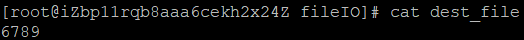
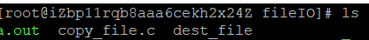
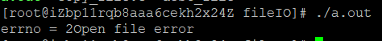
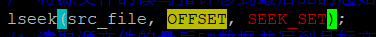
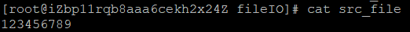
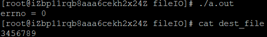

# 文件IO

> 文件I/O操作的系统调用。
>
> API：open()、read()、write()、lseek()和close()。
>
> 这些函数的特点是不带缓存，直接对文件（包括设备）进行读写操作。这些函数虽然不是ANSI C的组成部分，但是是POSIX的组成部分。

> 函数简略说明

| open()  | 打开或创建文件                                               |
| ------- | ------------------------------------------------------------ |
| close() | 关闭一个被打开的文件                                         |
| read()  | 从指定的文件描述符中读出的数据放到缓存区中，并返回实际读入的字节数。 |
| write() | 向打开的文件写数据，写操作从文件的当前指针位置开始           |
| lseek() | 在指定的文件描述符中将文件指针定位到相应的位置               |

> 函数详细说明

| open()  | 在打开或创建文件时可以指定文件的属性及用户的权限等各种参数。 |
| ------- | ------------------------------------------------------------ |
| close() | 当一个进程终止时，所有被它打开的文件都由内核自动关闭，很多程序都使用这一功能而不显示地关闭一个文件。 |
| read()  | 函数若返回0，则表示没有数据可读，即已达到文件尾。读操作从文件的当前指针位置开始。当从终端设备文件中读出数据时，通常一次最多读一行。 |
| write() | 对磁盘文件进行写操作，若磁盘已满或超出该文件的长度，则write()函数返回失败。 |
| lseek() | 它只能用在可定位（可随机访问）文件操作中。管道、套接字和大部分字符设备文件是不可定位的，所以在这些文件的操作中无法使用lseek()调用。 |

## open()

---

> 所需头文件

```c
#include <sys/types.h>  /*提供类型pid_t的定义*/
#include <sys/stat.h>  /*获取文件属性*/
#include <fcntl.h>  /*定义open等函数原型*/
```

> 函数原型

```c
int open(const char *pathname, int flags, int perms)
```

> 函数参数

```c
pathname
    被打开的文件名（可包括路径名）
```

```c
flag
    文件打开的方式
    	O_RDONLY：以只读方式打开文件
    	O_WRONLY：以只写方式打开文件
    	O_RDWR：以读写方式打开文件
    	O_CREAT：如果该文件不存在，就创建一个新的文件，并用第三个参数为其设置权限
    	O_EXCL：如果使用O_CREAT 时文件存在，则可返回错误消息。这一参数可测试文件是否存在。此时open是原子操作，防止多个进程同时创建同一个文件
    	O_NOCTTY：使用本参数时，若文件为终端，那么该终端不会成为调用 `open()` 的那个进程的控制终端
    	O_TRUNC：若文件已经存在，那么会删除文件中的全部原有数据，并且设置文件大小为0。
    	O_APPEND：以添加方式打开文件，在打开文件的同时，文件指针指向文件的末尾，即将写入的数据添加到文件的末尾
```

```
perms
	创建的新文件的存取权限
		可以用一组宏定义：S_I(R/W/X)(USR/GRP/OTH)
		其中R/W/X 分别表示读/写/执行权限
		USR/GRP/OTH 分别表示文件所有者/文件所属组/其他用户
		例如，S_IRUSR | S_IWUSR 表示设置文件所有者的可读可写属性。
		八进制表示法中600也表示同样的权限
```

> 函数返回值

```c
成功：返回文件描述符
失败：-1
```
### tips:

> 在open()函数中，flags参数可通过“|”组合构成，但前3个标志常量（O_RDONLY、O_WRONLY以及O_RDWR）不能相互组合。perms是文件的存取权限，既可以用宏定义表示法，也可以用八进制表示法。

> ① 用open()函数打开文件时，如果没有带O_CREAT选项，则如果该文件不存在时，会提示错误，open()函数的返回值为-1，可以通过errno查看具体的错误信息。
>
> > errno用来记录系统调用时的错误信息，使用时需要添加errno.h头文件。errno的返回值为数字，可以通过《errno代码（中文）.txt》查看数字所对应的具体错误。
> >
> > 具体参考本文结尾--error代码

---

## close()

---

> 所需头文件

```c
#include <unistd.h>
```

> 函数原型

```c
int close(int  fd)
```

> 函数输入值

```c
fd：文件描述符
```

> 函数返回值

```c
0：成功
-1：出错
```

---

## read()

---

> 所需头文件

```c
#include <unistd.h>
```

> 函数原型

```c
ssize_t read(int fd, void *buf, size_t count)
```

> 函数传入值

```c
fd
    文件描述符
```

```c
buf
    指定存储器读出数据的缓冲区
```

```c
count
    指定读出的字节数
```

> 函数返回值

```c
成功：读到的字节数
0：已到达文件尾
-1：出错
```
### tips:

> 在读普通文件时，若读到要求的字节数之前已到达文件的尾部，则返回的字节数会小于希望读出的字节数。

---

## write()

---

> 所需头文件

```c
#include <unistd.h>
```

> 函数原型

```c
ssize_t write(int fd, void *buf, size_t count)
```

> 函数传入值

```c
fd
    文件描述符
```

```c
buf
    指定存储器写入数据的缓冲区
```

```c
count
    指定读出的字节数
```

> 函数返回值

```c
成功：已写的字节数
-1：出错
```

### tips:

> 在写普通文件时，写操作从文件的当前指针位置开始。

---

## lseek()

---

> 所需头文件

```c
#include <unistd.h>
#include <sys/types.h>
```

> 函数原型

```c
off_t lseek(int fd, off_t offset, int whence)
```

> 函数传入值

```c
fd
    文件描述符
```

```c
offset
    偏移量，每一读写操作所需要移动的距离，单位是字节，可正可负（向前移，向后移）
```

```c
whence
    当前位置的基点
    	SEEK_SET：当前位置为文件的开头，新位置为偏移量的大小
    	SEEK_CUR：当前位置为文件指针的位置，新位置为当前位置加上偏移量
    	SEEK_END：当前位置为文件的结尾，新位置为文件的大小加上偏移量的大小
```

> 函数返回值

```c
成功：文件的当前位移
-1：出错
```

---

## code

```
下面列出文件基本操作的实例，基本功能是从一个文件（源文件）中读取最后5B 数据并拷贝到另一个文件（目标文件）。在实例中源文件是以只读方式打开，目标文件是以只写方式打开（可以是读写方式）。若目标文件不存在，可以创建并设置权限的初始值为0644，即文件所有者可读可写，文件所属组和其他用户只能读。
```

### copy_file.c

```c
/* copy_file.c */
#include <unistd.h>
#include <sys/types.h>
#include <sys/stat.h>
#include <fcntl.h>
#include <stdlib.h>
#include <stdio.h>
#define BUFFER_SIZE 1 /* 每次读写缓存大小，单位为字节，影响运行效率*/
#define SRC_FILE_NAME "src_file" /* 源文件名*/
#define DEST_FILE_NAME "dest_file" /* 目标文件名文件名*/
#define OFFSET 5 /* 复制的数据大小，单位为字节，即5个字节*/
int main()
{
int src_file, dest_file;
unsigned char buff[BUFFER_SIZE];
int real_read_len;
/* 以只读方式打开源文件，若文件不存在则出错*/
src_file = open(SRC_FILE_NAME, O_RDONLY);
/* 以只写方式打开目标文件，若此文件不存在则创建该文件, 访问权限值为644 */
dest_file = open(DEST_FILE_NAME,
O_WRONLY|O_CREAT, S_IRUSR|S_IWUSR|S_IRGRP|S_IROTH);
if (src_file< 0 || dest_file< 0)
{
printf("Open file error\n");
exit(1);
}
/* 将源文件的读写指针移到最后5B的起始位置*/
lseek(src_file, -OFFSET, SEEK_END);
/* 读取源文件的最后5B数据并写到目标文件中（指针向前移动OFFSET），每次读写1B */
while ((real_read_len = read(src_file, buff, sizeof(buff))) > 0)
{
write(dest_file, buff, real_read_len);
}
close(dest_file);
close(src_file);
return 0;
}
```

```
	# gcc copy_file.c  -o  copy_file										
	# vim  src_file					//创建源文件，内容为“123456789”		
	# ./copy_file					//执行程序								
	# cat  dest_file				//查看目标文件，内容应为“6789”，即源文件最后5个字节的内容，因为每个数字占用1个字节位置，再加上结束符，共5个字节。		
```




---

### copy_file2.c (with errno code)

> 在copy_file.c基础上添加了errno code提示
>
> > errno 需要  \#include <errno.h>
>
> > 在src_file = open(SRC_FILE_NAME, O_RDONLY)后面添加如下代码：
> >
> > printf("errno = %d\n",errno);
>
> > 删掉src_file，再次测试程序，可得到errno的信息
>
> > 如果没有发生open error，则errno = 0

---

> 将src_file删除，让src_file open error。




> 通过查看发现，errno=2为文件/路径不存在
```c
#define ENOENT 2 /* No such file or directory */文件/路径不存在
```

### copy_file3.c 

> 将源文件第N个字符到结束的所有内容送到目标文件中
>
> > 设置lseek() 的 offset 为 正值
>
> > 设置lseek() 的 whence 为 SEEK_SET，offset 定为2









## errno code中文版

```c
errno错误代码含义： 
    
#define EPERM 1 /* Operation not permitted */操作不允许 
#define ENOENT 2 /* No such file or directory */文件/路径不存在 
#define ESRCH 3 /* No such process */进程不存在 
#define EINTR 4 /* Interrupted system call */中断的系统调用 
#define EIO 5 /* I/O error */I/O错误 
#define ENXIO 6 /* No such device or address */设备/地址不存在 
#define E2BIG 7 /* Arg list too long */参数列表过长 
#define ENOEXEC 8 /* Exec format error */执行格式错误 
#define EBADF 9 /* Bad file number */错误文件编号 
#define ECHILD 10 /* No child processes */子进程不存在 
#define EAGAIN 11 /* Try again */重试 
#define ENOMEM 12 /* Out of memory */内存不足 
#define EACCES 13 /* Permission denied */无权限 
#define EFAULT 14 /* Bad address */地址错误 
#define ENOTBLK 15 /* Block device required */需要块设备 
#define EBUSY 16 /* Device or resource busy */设备或资源忙 
#define EEXIST 17 /* File exists */文件已存在 
#define EXDEV 18 /* Cross-device link */跨设备链路 
#define ENODEV 19 /* No such device */设备不存在 
#define ENOTDIR 20 /* Not a directory */路径不存在 
#define EISDIR 21 /* Is a directory */是路径 
#define EINVAL 22 /* Invalid argument */无效参数 
#define ENFILE 23 /* File table overflow */文件表溢出 
#define EMFILE 24 /* Too many open files */打开的文件过多 
#define ENOTTY 25 /* Not a typewriter */非打字机 
#define ETXTBSY 26 /* Text file busy */文本文件忙 
#define EFBIG 27 /* File too large */文件太大 
#define ENOSPC 28 /* No space left on device */设备无空间 
#define ESPIPE 29 /* Illegal seek */非法查询 
#define EROFS 30 /* Read-only file system */只读文件系统 
#define EMLINK 31 /* Too many links */链接太多 
#define EPIPE 32 /* Broken pipe */管道破裂 
#define EDOM 33 /* Math argument out of domain of func */参数超出函数域 
#define ERANGE 34 /* Math result not representable */结果无法表示 
#define EDEADLK 35 /* Resource deadlock would occur */资源将发生死锁 
#define ENAMETOOLONG 36 /* File name too long */文件名太长 
#define ENOLCK 37 /* No record locks available */没有可用的记录锁 
#define ENOSYS 38 /* Function not implemented */函数未实现 
#define ENOTEMPTY 39 /* Directory not empty */目录非空 
#define ELOOP 40 /* Too many symbolic links encountered */遇到太多符号链接 
#define EWOULDBLOCK EAGAIN /* Operation would block */操作会阻塞 
#define ENOMSG 42 /* No message of desired type */没有符合需求类型的消息 
#define EIDRM 43 /* Identifier removed */标识符已删除 
#define ECHRNG 44 /* Channel number out of range */通道编号超出范围 
#define EL2NSYNC 45 /* Level 2 not synchronized */level2不同步 
#define EL3HLT 46 /* Level 3 halted */3级停止 
#define EL3RST 47 /* Level 3 reset */3级重置 
#define ELNRNG 48 /* Link number out of range */链接编号超出范围 
#define EUNATCH 49 /* Protocol driver not attached */协议驱动程序没有连接 
#define ENOCSI 50 /* No CSI structure available */没有可用的CSI结构 
#define EL2HLT 51 /* Level 2 halted */2级停止 
#define EBADE 52 /* Invalid exchange */无效交换 
#define EBADR 53 /* Invalid request descriptor */无效请求描述 
#define EXFULL 54 /* Exchange full */交换完全 
#define ENOANO 55 /* No anode */无阳极 
#define EBADRQC 56 /* Invalid request code */无效请求码 
#define EBADSLT 57 /* Invalid slot */无效插槽 
#define EDEADLOCK EDEADLK /* Unknown error */未知错误
#define EBFONT 59 /* Bad font file format */错误的字体文件格式 
#define ENOSTR 60 /* Device not a stream */设备不是流 
#define ENODATA 61 /* No data available */无数据 
#define ETIME 62 /* Timer expired */计时器到期 
#define ENOSR 63 /* Out of streams resources */流资源不足 
#define ENONET 64 /* Machine is not on the network */机器不在网络上 
#define ENOPKG 65 /* Package not installed */包未安装 
#define EREMOTE 66 /* Object is remote */对象是远程 
#define ENOLINK 67 /* Link has been severed */链接正在服务中 
#define EADV 68 /* Advertise error */广告错误 
#define ESRMNT 69 /* Srmount error */？ 
#define ECOMM 70 /* Communication error on send */发送过程中通讯错误 
#define EPROTO 71 /* Protocol error */协议错误 
#define EMULTIHOP 72 /* Multihop attempted */多跳尝试 
#define EDOTDOT 73 /* RFS specific error */RFS特定错误 
#define EBADMSG 74 /* Not a data message */不是数据类型消息 
#define EOVERFLOW 75 /* Value too large for defined data type */对指定的数据类型来说值太大 
#define ENOTUNIQ 76 /* Name not unique on network */网络上名字不唯一 
#define EBADFD 77 /* File descriptor in bad state */文件描述符状态错误 
#define EREMCHG 78 /* Remote address changed */远程地址改变 
#define ELIBACC 79 /* Can not access a needed shared library */无法访问需要的共享库 
#define ELIBBAD 80 /* Accessing a corrupted shared library */访问损坏的共享库 
#define ELIBSCN 81 /* .lib section in a.out corrupted */库部分在a.out损坏 
#define ELIBMAX 82 /* Attempting to link in too many shared libraries */试图链接太多的共享库 
#define ELIBEXEC 83 /* Cannot exec a shared library directly */不能直接运行共享库 
#define EILSEQ 84 /* Illegal byte sequence */非法字节序 
#define ERESTART 85 /* Interrupted system call should be restarted */应重新启动被中断的系统调用 
#define ESTRPIPE 86 /* Streams pipe error */流管错误 
#define EUSERS 87 /* Too many users */用户太多 
#define ENOTSOCK 88 /* Socket operation on non-socket */在非套接字上进行套接字操作 
#define EDESTADDRREQ 89 /* Destination address required */需要目的地址 
#define EMSGSIZE 90 /* Message too long */消息太长 
#define EPROTOTYPE 91 /* Protocol wrong type for socket */错误协议类型 
#define ENOPROTOOPT 92 /* Protocol not available */协议不可用 
#define EPROTONOSUPPORT 93 /* Protocol not supported */不支持协议 
#define ESOCKTNOSUPPORT 94 /* Socket type not supported */不支持套接字类型 
#define EOPNOTSUPP 95 /* Operation not supported on transport endpoint */操作上不支持传输端点 
#define EPFNOSUPPORT 96 /* Protocol family not supported */不支持协议族 
#define EAFNOSUPPORT 97 /* Address family not supported by protocol */协议不支持地址群 
#define EADDRINUSE 98 /* Address already in use */地址已被使用 
#define EADDRNOTAVAIL 99 /* Cannot assign requested address */无法分配请求的地址 
#define ENETDOWN 100 /* Network is down */网络已关闭 
#define ENETUNREACH 101 /* Network is unreachable */网络不可达 
#define ENETRESET 102 /* Network dropped connection because of reset */网络由于复位断开连接 
#define ECONNABORTED 103 /* Software caused connection abort */软件导致连接终止 
#define ECONNRESET 104 /* Connection reset by peer */连接被对方复位 
#define ENOBUFS 105 /* No buffer space available */没有可用的缓存空间 
#define EISCONN 106 /* Transport endpoint is already connected */传输端点已连接 
#define ENOTCONN 107 /* Transport endpoint is not connected */传输端点未连接 
#define ESHUTDOWN 108 /* Cannot send after transport endpoint shutdown */传输端点关闭后不能在发送 
#define ETOOMANYREFS 109 /* Too many references: cannot splice */太多的引用：无法接合 
#define ETIMEDOUT 110 /* Connection timed out */连接超时 
#define ECONNREFUSED 111 /* Connection refused */连接被拒绝 
#define EHOSTDOWN 112 /* Host is down */主机已关闭 
#define EHOSTUNREACH 113 /* No route to host */无法路由到主机 
#define EALREADY 114 /* Operation already in progress */操作已在进程中 
#define EINPROGRESS 115 /* Operation now in progress */进程中正在进行的操作 
#define ESTALE 116 /* Stale NFS file handle */ 
#define EUCLEAN 117 /* Structure needs cleaning */ 
#define ENOTNAM 118 /* Not a XENIX named type file */ 
#define ENAVAIL 119 /* No XENIX semaphores available */ 
#define EISNAM 120 /* Is a named type file */ 
#define EREMOTEIO 121 /* Remote I/O error */ 
#define EDQUOT 122 /* Quota exceeded */ 
#define ENOMEDIUM 123 /* No medium found */ 
#define EMEDIUMTYPE 124 /* Wrong medium type */ 
```


