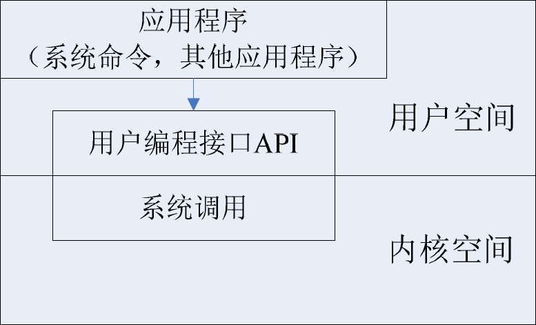

## 一.linux系统编程

### 内核空间和用户空间

```
用户编程无法访问内核空间。

内核态和用户态存在逻辑隔离。
```

#### 用户程序操作内核

```
由kernal来规定用户进程进入kernal具体位置。

linux系统调用使用最精简的250个左右的进程调用。
```

##### API&&系统命令之间的关系




> 系统命令就是在shell中输入的一系列命令。
>
> 系统命令调用kernel对用户态提供的编程接口API。
>
> API进行系统调用。

##### linux系统调用

```
软中断
Linux系统调用部分是非常精简的系统调用（只有250个左右），它继承了UNIX系统调用中最基本和最有用的部分。
这些系统调用按照功能逻辑大致可分为进程控制、进程间通信、文件系统控制、系统控制、存储管理、网络管理、socket控制（IP地址和端口控制）、用户管理等几类。
```

##### 中断

```
中断是计算机操作系统设备管理一章的一个概念。
也是唯一的一种由用户态向内核态转变的方式。
cpu只根据一个bit位判断在内核态还是用户态。

中断思想的产生：
为了对抗单道程序的效率低的问题，我们引入操作系统来管理计算机的硬件和软件资源。--单道批处理程序
操作系统为了让程序可以并发执行，引入了中断机制。--多道批处理程序(中断其实是给OS一个信号)

中断分为：
	1.内中断(信号来自cpu内部)
		陷入(trap):程序有意而为之，如：系统调用
		故障(fault):由错误条件引起，可被修复，如：缺页中断
		终止(abort):致命错误，即使os介入也无法修复，如：int i = 1/0;
	
	2.外中断(信号来自cpu外部)
		I/O中断请求，如：打印机完成发送外中断
		人工干预
linux系统调用使用软中断--内中断。
与之相对的硬中断--外中断。
```

##### 用户编程接口(API)

```
前面讲到的系统调用并不是直接与程序员进行交互的，它仅仅是一个通过软中断机制向内核提交请求，以获取内核服务的接口。在实际使用中程序员调用的通常是用户编程接口——API，也就是API 函数。但并不是所有的函数都一一对应一个系统调用，有时，一个API 函数会需要几个系统调用来共同完成函数的功能，甚至还有一些API 函数不需要调用相应的系统调用（因此它所完成的不是内核提供的服务）。
在Linux 中，用户编程接口（API）遵循了在UNIX 中最流行的应用编程界面标准——POSIX 标准（可移植操作系统接口）。POSIX标准是由IEEE（电气与电子工程师协会）和ISO/IEC（国际电工委员会）共同开发的标准。
该标准基于当时现有的UNIX 实践和经验，描述了操作系统的系统调用编程接口（实际上就是API），用于保证应用程序可以在源代码一级上在多种操作系统上移植运行。
linux kernel正是严格依照这个标准开发，才使得和unix大体兼容。
```

##### shell命令

```
shell命令调用API。
```

## 二.linux中文件

| 普通文件 | 目录文件 | 链接文件 | 管道文件 | 套接字文件 | 设备文件 |
| -------- | -------- | -------- | -------- | ---------- | -------- |
|          |          |          |          |            |          |

### 文件描述符

```
文件描述符(嵌入式中简称fd)为kernel对file操作的唯一媒介。
	这个id是一个索引值，指向kernel中每个proceeding打开的文件记录表。
	每每打开一个文件或创建一个文件，内核向该进程返回一个文件描述符。
	读写文件，也需要将文件描述符当做基本参数进行传递。
tips:每一个文件都有一个冗长的表项，记录了文件的基本信息。这些基本信息中就有一项为文件描述符。
文件描述符集：
	通常，一个进程启动时，都会打开3个文件：标准输入、标准输出和标准出错处理。这3 个文件分别对应文件描述符为0、1 和2（也就是宏替换STDIN_FILENO、STDOUT_FILENO 和STDERR_FILENO）。
tips:文件描述符一定是一个集合。因为你不管创建，读写文件，都得先打开文件。故必须打开三个文件，返回三个文件描述符0，1，2。因此说一个proceeding文件描述符至少有3个。它要想操作1个文件，那么返回的fd至少是3之后的数字。
文件描述符：linux独有，兼容POSIX标准。
```

| STDIN_FILENO | STDOUT_FILENO | STDERR_FILENO |
| ------------ | ------------- | ------------- |
| 0            | 1             | 2             |

### 文件IO/标准IO

linux支持两种IO。

> 文件I/O 读写文件时，每次操作都会执行相关**系统调用**。这样处理的好处是直接读写实际文件，坏处是频繁的系统调用会增加系统开销。标准I/O可以看成是在文件I/O 的基础上封装了缓冲机制。先读写缓冲区，必要时再访问实际文件，从而减少了系统调用的次数。
>
> 文件I/O中用文件描述符表示一个打开的文件，可以访问不同类型的文件，如普通文件、设备文件和管道文件等。而标准I/O中用FILE（流）表示一个打开的文件，通常只用来访问普通文件。
>
> 文件I/O不带缓冲，即在用户的进程中对这两个函数不会**自动缓冲，**每次读写操作都要进行一次系统调用，直接对文件进行读写，所以能实时反映文件的内容。而标准I/O在打开文件时会自动缓冲，每次读写时仅对缓冲区进行操作，不对文件操作，退出时才更新文件。

---

文件IO更低级。

标准IO带缓冲。

---

## 三.文件锁

> 为什么要有文件锁？
>
> 我们要明白，linux是一个多用户操作系统。那么，很有可能你正在打开的文件别人也同样正在打开。
>
> 读锁--多个人同时可以读，这是进程的同步
>
> 写锁--一个人写时，其他进程不能写，这是进程的互斥
>
> 其中，这个文件就是临界资源

> 文件锁的等级
>
> 建议锁&强制锁
>
> 建议锁--**用户态**实现的加锁方式
>
> 强制锁--**内核态**实现的加锁方式
>
> vim编辑器不遵循建议锁，是一个不文明的进程。即使加建议锁，同样会写入。数据库系统广泛采用建议锁。
>
> 强制锁对系统性能影响极大。

> 在Linux 中，实现文件上锁的函数有lockf()和fcntl()。
>
> lockf()用于对文件施加建议性锁。
>
> fcntl()不仅可以施加建议性锁，还可以施加强制锁。
>
> 同时，fcntl()还能对文件的某一记录上锁，也就是记录锁。
>

## 四.记录锁

> fcntl()可以对记录上锁。
>
> 记录锁又分为读锁和写锁。
>
> 记录锁又可分为读取锁和写入锁，其中读取锁又称为共享锁，它能够使多个进程都能在文件的同一部分建立读取锁。而写入锁又称为互斥锁，在任何时刻只能有一个进程在文件的某个部分上建立写入锁。
>
> 
>
> 当然，在文件的同一部分不能同时建立读取锁和写入锁。

