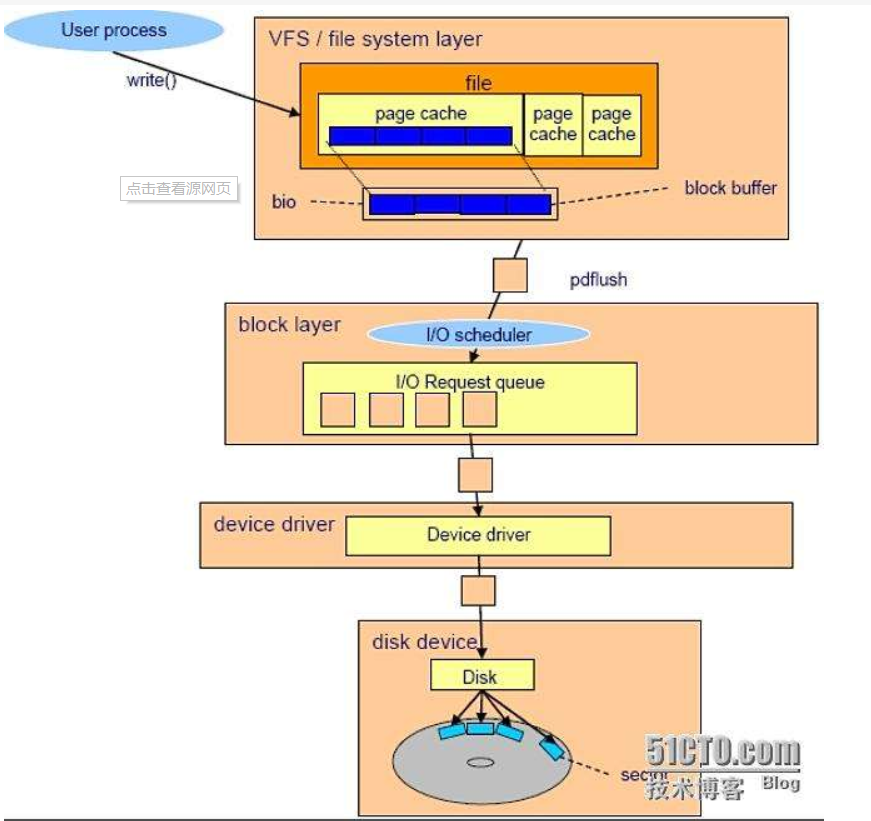
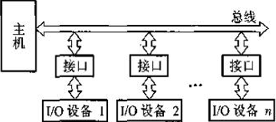
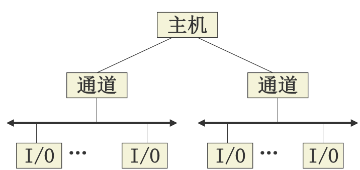
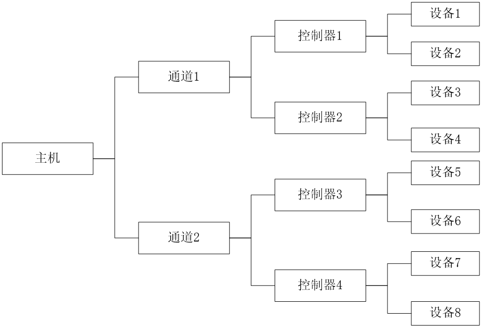
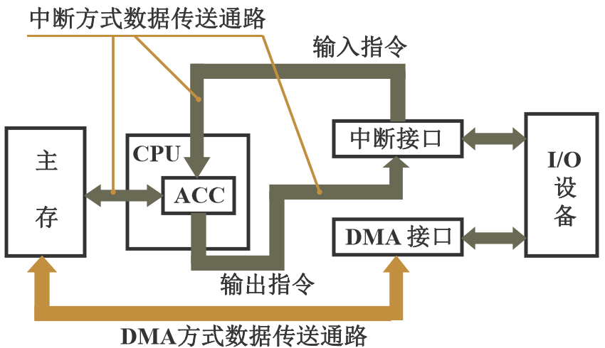
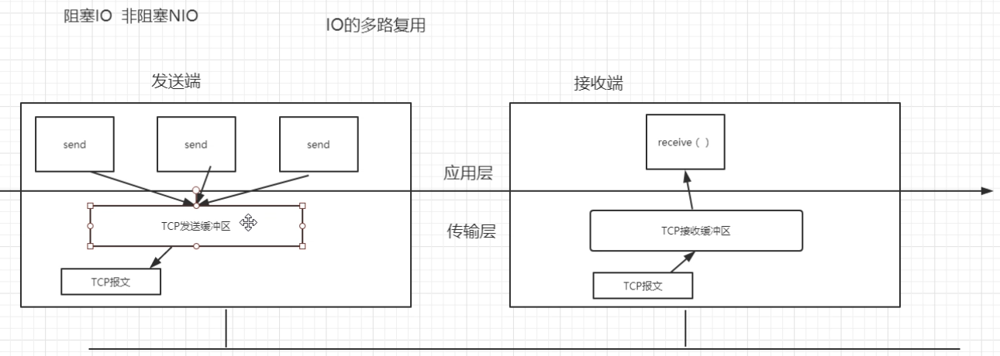

## IO多路复用

### 使用场景

> 本文概要：IO多路复用使用的是I/O多路转接模型

> 为了搞一台高性能的服务器而进行IO多路复用。
>
> 这台高性能的服务器可以供应许多客户端的HTTP连接，
>
> 同时处理很多请求。

```
前面提到的这台服务器如果交给自己实现，
如何实现？
```

```
可能的思路：
多线程处理请求
	缺点：cpu上下文切换。涉及到读句柄。极大消耗cpu的资源，尤其是当请求很多时。
```

```
这种方式显然不可以。
单线程处理请求
	疑问：单线程处理请求，请求是否会丢失？不会。DMA专注于单线程的请求。DMA不是cpu。
```

>  理解IO多路复用，先得了解IO。

> I/O系统是操作系统的一章节。
>
> 从名字就可以看出来，I/O必定和文件系统一样，也是虚拟出来的一个模型。

### I/O系统

```
为了OS可以管理I/O设备，而设置了I/O系统这一节。
```



```
IO系统又是主要对IO进行操作管理。
设计它的目的秉承着快速使用IO设备的原则。
```

```
计算机组成原理中提到：
早期的IO设备和CPU是串行工作
```


```
计算机组成原理中又提到：
后来的IO设备和CPU是并行工作
	1.中断
	2.DMA
```



```
计算机组成原理中还说：
再往后IO设备就形成了通道
```



```
计算机组成原理最后说：
IO设备都有自己的处理机了
通道就是一个简单的cpu，它有自己的指令集
这里的通道就是IO通道
```
### IO通道


### DMA和中断

> DMA和中断天生就是一对儿仇人。
>
> DMA和中断现在成了IO设备和主存之间唯二的交换数据的方式。他们天生在设计思想上有所不同。



> 要走大数据，肯定直接用DMA会比中断来的方便。

### IO复用

> 由此，最主要的任务之一**(这个之一主要是这里讲的，这里只关心这个之一)**提高设备的利用率，得解决。

#### 多路IO复用

> 多路就是多个IO请求

> 接下来借用tcp通信讲解IO多路复用



> send 发送的 没有到 receive
>
> receive调用select()函数	select()函数负责处理这些tcp请求
>
> select()函数负责分发请求，到应用层去执行
>
> 这里，因为是单线程嘛，如果是多线程，一个线程处理一个请求，那么发生这种阻塞情况，唯有靠kernel来管。但kernel管又有效率低的问题，因此kernel给我们一个select函数来在单个进程中管这些请求。
>
> 可以理解为这些请求加入到了select请求队列中，当时机一到，就会从里面挑出那个请求进行处理。

```
所以，当tcp请求换成IO请求，这就是多路IO复用的模型
```

## 多路IO复用模型

- 阻塞I/O模型：在这种模型下，若所调用的I/O函数没有完成相关的功能，则会使进程挂起，直到相关数据到达才会返回。对管道设备、终端设备和网络设备进行读写时经常会出现这种情况。
- 非阻塞模型：在这种模型下，当请求的I/O操作不能完成时，不让进程睡眠，而是立即返回。非阻塞I/O使用户可以调用不会阻塞的I/O操作，如open()、write()和read()。如果该操作不能完成，则会立即返回出错（例如：打不开文件）或者返回0（例如：在缓冲区中没有数据可以读取或者没有空间可以写入数据）。
- **I/O多路转接模型**：在这种模型下，如果请求的I/O操作阻塞，则它不是真正阻塞I/O，而是让其中的一个函数等待，在这期间，I/O还能进行其他操作。本次课要介绍的select()和poll函数()就是属于这种模型。
- 信号驱动I/O模型：在这种模型下，通过安装一个信号处理程序，系统可以自动捕获特定信号的到来，从而启动I/O。这种模型是由内核通知用户何时可以启动一个I/O操作。
- 异步I/O模型：在这种模型下，当一个描述符已准备好，可以启动I/O时，进程会通知内核。

---

```
对于I/O复用，可以使用select()和poll()的I/O多路转接模型处理，它可以具体设置程序中每一个所关心的文件描述符的条件、希望等待的时间等，从select()和poll()函数返回时，内核会通知用户已准备好的文件描述符的数量、已准备好的条件等。通过使用select()和poll()函数的返回结果，就可以调用相应的I/O处理函数。
```

## 管道

> 管道是Linux中很重要的一种通信方式，是把一个程序的输出直接连接到另一个程序的输入。无名管道和有名管道。

> 在 Linux中，管道的实现并没有使用专门的数据结构，而是借助了文件系统的file结构体和VFS的索引节点inode。通过将两个 file结构体指向同一个临时的 VFS索引节点，而这个 VFS索引节点又指向一个物理页面而实现的。 

[^文件结构体]:文件结构体代表一个打开的文件，系统中的每个打开的文件在内核空间都有一个关联的struct file。它由内核在打开文件时创建，并传递给在文件上进行操作的任何函数。在文件的所有实例都关闭后，内核释放这个数据结构。在内核创建和驱动源码中，struct file的指针通常被命名为file或filp
[^Virtual File System]:Virtual File System，即虚拟文件系统。VFS的作用就是采用标准的Unix系统调用读写位于不同物理介质上的不同文件系统。是一个可以让open()、read()、write()等系统调用不用关心底层的存储介质和文件系统类型就可以工作的粘合层。

### inode和文件描述符

- inode或i节点是指对文件的索引。如一个系统，所有文件是放在磁盘或flash上，就要编个目录来说明每个文件在什么地方，有什么属性，及大小等，就像书本的目录一样，便于查找和管理。
- 文件描述符：在linux中，内核通过inode来找到每个文件，但一个文件可以被许多用户同时打开或一个用户同时打开多次。这就有一个问题，如何管理文件的当前位移量，因为可能每个用户打开文件后进行的操作都不一样，这样文件位移量也不同，当然还有其他的一些问题。所以linux又搞了一个文件描述符（File Descriptor）这个东西，来分别为每一个用户服务。每个用户每次打开一个文件，就产生一个文件描述符，多次打开就产生多个文件描述符，一一对应，不管是同一个用户，还是多个用户。该文件描述符就记录了当前打开的文件的偏移量等数据。所以一个i节点可以有0个或多个文件描述符。多个文件描述符可以对应一个i节点。

### 管道的读写

```
管道写函数通过将字节复制到 VFS 索引节点指向的物理内存而写入数据，而管道读函数则通过复制物理内存中的字节而读出数据。当然，内核必须利用一定的机制同步对管道的访问，为此，内核使用了锁、等待队列和信号。 

当写进程向管道中写入时，它利用标准的库函数write()，系统根据库函数传递的文件描述符，可找到该文件的 file 结构。file 结构中指定了用来进行写操作的函数（即写入函数）地址，于是，内核调用该函数完成写操作。写入函数在向内存中写入数据之前，必须首先检查 VFS 索引节点中的信息，同时满足如下条件时，才能进行实际的内存复制工作：
```

- 内存中有足够的空间可容纳所有要写入的数据
- 内存没有被读程序锁定

```
如果同时满足上述条件，写入函数首先锁定内存，然后从写进程的地址空间中复制数据到内存。否则，写入进程就休眠在 VFS 索引节点的等待队列中，接下来，内核将调用调度程序，而调度程序会选择其他进程运行。写入进程实际处于可中断的等待状态，当内存中有足够的空间可以容纳写入数据，或内存被解锁时，读取进程会唤醒写入进程，这时，写入进程将接收到信号。当数据写入内存之后，内存被解锁，而所有休眠在索引节点的读取进程会被唤醒。  
```

```
管道的读取过程和写入过程类似。但是，进程可以在没有数据或内存被锁定时立即返回错误信息，而不是阻塞该进程，这依赖于文件或管道的打开模式。反之，进程可以休眠在索引节点的等待队列中等待写入进程写入数据。当所有的进程完成了管道操作之后，管道的索引节点被丢弃，而共享数据页也被释放。
```

```
Linux 管道对阻塞之前一次写操作的大小有限制。专门为每个管道所使用的内核级缓冲区确切为 4096 字节。 除非阅读器清空管道，否则一次超过 4K 的写操作将被阻塞。实际上这算不上什么限制，因为读和写操作是在不同的线程中实现的。
```

