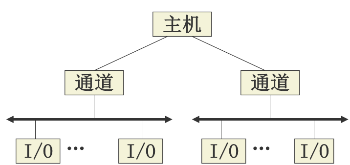
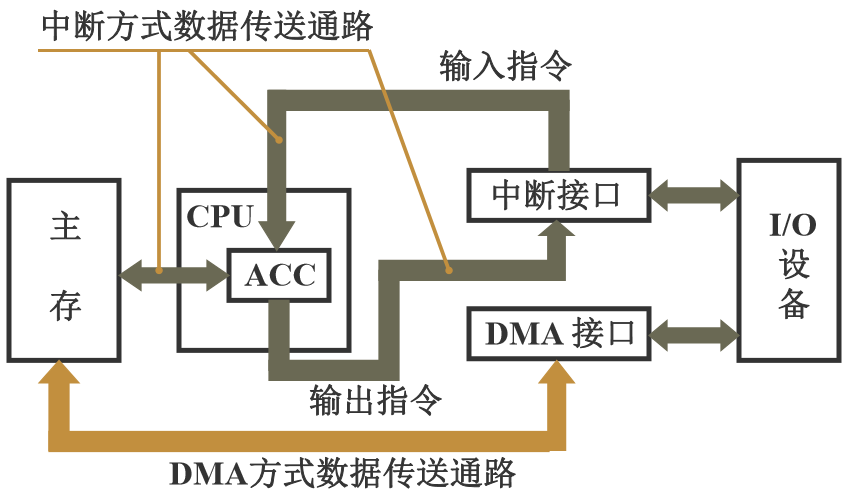
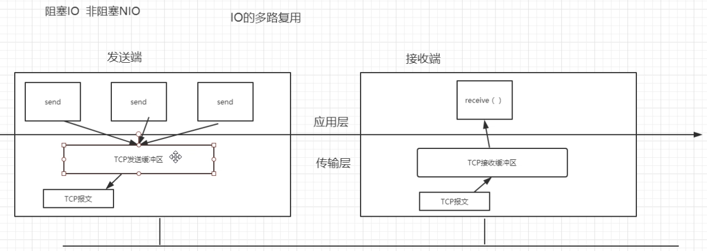

## IO多路复用

### 使用场景

> 本文概要：IO多路复用使用的是I/O多路转接模型

> 为了搞一台高性能的服务器而进行IO多路复用。
>
> 这台高性能的服务器可以供应许多客户端的HTTP连接，
>
> 同时处理很多请求。

```
前面提到的这台服务器如果交给自己实现，
如何实现？
```

```
可能的思路：
多线程处理请求
	缺点：cpu上下文切换。设计到读句柄。极大消耗cpu的资源，尤其是当请求很多时。
```

```
这种方式显然不可以。
单线程处理请求
	疑问：单线程处理请求，请求是否会丢失？不会。DMA专注于单线程的请求。DMA不是cpu。
```

>  理解IO多路复用，先得了解IO。

> I/O系统是操作系统的一章节。
>
> 从名字就可以看出来，I/O必定和文件系统一样，也是虚拟出来的一个模型。

### I/O系统

```
为了OS可以管理I/O设备，而设置了I/O系统这一节。
```


```
IO系统又是主要对IO进行操作管理。
设计它的目的秉承着快速使用IO设备的原则。
```

```
计算机组成原理中提到：
早期的IO设备和CPU是串行工作
```


```
计算机组成原理中又提到：
后来的IO设备和CPU是并行工作
	1.中断
	2.DMA
```


```
计算机组成原理中还说：
再往后IO设备就形成了通道
```



```
计算机组成原理最后说：
IO设备都有自己的处理机了
通道就是一个简单的cpu，它有自己的指令集
这里的通道就是IO通道
```
### IO通道


### DMA和中断

> DMA和中断天生就是一对儿仇人。
>
> DMA和中断现在成了IO设备和主存之间唯二的交换数据的方式。他们天生在设计思想上有所不同。



> 要走大数据，肯定直接用DMA会比中断来的方便。

### IO复用

> 由此，最主要的任务之一**(这个之一主要是这里讲的，这里只关心这个之一)**提高设备的利用率，得解决。

#### 多路IO复用

> 多路就是多个IO请求

> 接下来借用tcp通信讲解IO多路复用



> send 发送的 没有到 receive
>
> receive调用select()函数	select()函数负责处理这些tcp请求
>
> select()函数负责分发请求，到应用层去执行
>
> 这里，因为是单线程嘛，如果是多线程，一个线程处理一个请求，那么发生这种阻塞情况，唯有靠kernel来管。但kernel管又有效率低的问题，因此kernel给我们一个select函数来在单个进程中管这些请求。
>
> 可以理解为这些请求加入到了select请求队列中，当时机一到，就会从里面挑出那个请求进行处理。

```
所以，当tcp请求换成IO请求，这就是多路IO复用的模型
```

## 多路IO复用模型

- 阻塞I/O模型：在这种模型下，若所调用的I/O函数没有完成相关的功能，则会使进程挂起，直到相关数据到达才会返回。对管道设备、终端设备和网络设备进行读写时经常会出现这种情况。
- 非阻塞模型：在这种模型下，当请求的I/O操作不能完成时，不让进程睡眠，而是立即返回。非阻塞I/O使用户可以调用不会阻塞的I/O操作，如open()、write()和read()。如果该操作不能完成，则会立即返回出错（例如：打不开文件）或者返回0（例如：在缓冲区中没有数据可以读取或者没有空间可以写入数据）。
- **I/O多路转接模型**：在这种模型下，如果请求的I/O操作阻塞，则它不是真正阻塞I/O，而是让其中的一个函数等待，在这期间，I/O还能进行其他操作。本次课要介绍的select()和poll函数()就是属于这种模型。
- 信号驱动I/O模型：在这种模型下，通过安装一个信号处理程序，系统可以自动捕获特定信号的到来，从而启动I/O。这种模型是由内核通知用户何时可以启动一个I/O操作。
- 异步I/O模型：在这种模型下，当一个描述符已准备好，可以启动I/O时，进程会通知内核。

---

```
对于I/O复用，可以使用select()和poll()的I/O多路转接模型处理，它可以具体设置程序中每一个所关心的文件描述符的条件、希望等待的时间等，从select()和poll()函数返回时，内核会通知用户已准备好的文件描述符的数量、已准备好的条件等。通过使用select()和poll()函数的返回结果，就可以调用相应的I/O处理函数。
```

### select()函数的作用

> 作用一

```
select()函数的作用是在规定的时间内阻塞进程，轮询某个文件描述符集中的文件是否准备好（可读、可写或出错），如果文件没有准备好，则select继续阻塞进程并持续轮询所有文件；如果有文件做好了准备，则返回准备好的文件数量，并解除阻塞。
```
> 作用二

```
select()也可以实现精确计时，计时精度可达到微秒（百万分之一秒）级。

1s=10^3ms(毫秒)=10^6μs(微秒)=10^9ns(纳秒)=10^12ps(皮秒)=10^15fs(飞秒)=10^18as(阿秒)=10^21zm(仄秒)=10^24ym(幺秒)
select()函数可以精确到微秒
```

> 作用三

```
select()函数适用于网络编程。
```

