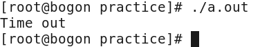

## select()函数的作用

> 作用一

```
select()函数的作用是在规定的时间内阻塞进程，轮询某个文件描述符集中的文件是否准备好（可读、可写或出错），如果文件没有准备好，则select继续阻塞进程并持续轮询所有文件；如果有文件做好了准备，则返回准备好的文件数量，并解除阻塞。
```

> 作用二

```
select()也可以实现精确计时，计时精度可达到微秒（百万分之一秒）级。

1s=10^3ms(毫秒)=10^6μs(微秒)=10^9ns(纳秒)=10^12ps(皮秒)=10^15fs(飞秒)=10^18as(阿秒)=10^21zm(仄秒)=10^24ym(幺秒)
select()函数可以精确到微秒
```

> 作用三

```
select()函数适用于网络编程。
```

## select()

---

> 所需头文件

```c
#include <sys/types.h>
#include <sys/time.h>
#include <unistd.h>
```

> 函数原型

```c
int select(int numfds, fd_set *readfds, fd_set *writefds，fd_set *exceptfds, struct timeval *timeout)
```
[^fd_set]:long类型的数组
> 函数传入值

```c
numfds
    需要监视的文件的个数，即需要监视的文件描述符的最大值加1。
因为select()函数遍历文件列表中[0，numfds)的内容，所以只有numfds的值比文件描述符的最大值多1，才能遍历所有的文件。
```

```
readfds
	由select()监视的读文件描述符集合
```

```
writefds
	由select()监视的写文件描述符集合
```

```
exeptfds
	由select()监视的异常处理文件描述符集合
```

```
timeout
	NULL:永远等待，直到捕捉到信号或文件描述符已准备好为止
	具体值:struct timeval类型的指针，若等待了timeout时间还没有检测到任何文件描符准备好，就立即返回
	0:从不等待，测试所有指定的描述符并立即返回
```

```c
struct timeval
{
long tv_sec; /* 秒 */
long tv_usec; /* 微秒 */
}
```


> 函数返回值

```
大于0：成功，表示有文件已经准备好（可读、可写或出错），返回准备好的文件描述符的数目
0：超时；
-1：出错
```

> select()函数相关的宏定义函数
>
> 宏定义--预编译期间直接替换内容

```c
FD_ZERO(fd_set *set)
    清除一个文件描述符集
```

```c
FD_SET(int fd, fd_set *set)
    将一个文件描述符加入文件描述符集中
```

```c
FD_CLR(int fd, fd_set *set)
    将一个文件描述符从文件描述符集中清除
```

```CQL
FD_ISSET(int fd, fd_set *set)
    判断文件描述符fd是否在文件描述符集fd_set里。如果文件描述符fd是fd_set集中的一个元素，则返回非零值，否则返回0。
可以用于调用select()之后测试文件描述符集中的文件描述符是否有变化，因为select()轮询时会把没有准备好的fd剔除。
```

> select()函数相关的宏定义函数
>
> 一般来说，在使用select()函数之前，首先使用FD_ZERO()和FD_SET()来初始化文件描述符集，在使用了select()函数时，可循环使用FD_ISSET()来测试描述符集，在执行完对相关文件描述符的操作之后，使用FD_CLR()来清除描述符集。

---

> 由于多路复用通常用于I/O操作可能会被阻塞的情况，而对于可能会有阻塞I/O的管道、网络编程，到现在为止还没有涉及，所以这里通过手动创建两个管道文件（用mknod或者mkfifo命令），重点说明如何使用多路复用函数。

---

### multiplex_select.c

> 通过调用select()函数来监听3个终端的输入（分别重定向到两个管道文件的虚拟终端以及主程序所运行的虚拟终端），并分别进行相应的处理。在这里我们建立了一个select()函数监视的读文件描述符集，其中包含3个文件描述符，分别为一个标准输入文件描述符和两个管道文件描述符。通过监视主程序的虚拟终端标准输入来实现程序的控制，以两个管道作为数据输入，主程序将从两个管道读取的输入字符串写入到标准输出文件（屏幕）。

> 为了充分表现select()调用的功能，在运行主程序的时候，需要打开3个虚拟终端：首先用mknod命令创建两个管道in1 和in2。接下来，在两个虚拟终端上分别运行cat>in1和cat>in2，同时在第三个虚拟终端上运行主程序。在程序运行之后，如果在两个管道终端上输入字符串，则可以观察到同样的内容将在主程序的虚拟终端上逐行显示。如果想结束主程序，只要在主程序的虚拟终端下输入以‘q’或‘Q’字符开头的字符串即可。如果三个文件一直在无输入状态中，则主程序一直处于阻塞状态。为了防止无限期的阻塞，在select程序中设置超时值（本实例中设置为60s），当无输入状态持续到超时值时，主程序主动结束运行并退出。


```c
/* multiplex_select.c */
#include <fcntl.h>
#include <stdio.h>
#include <unistd.h>
#include <stdlib.h>
#include <string.h>
#include <time.h>
#include <errno.h>
#define MAX_BUFFER_SIZE 1024 /* 缓冲区大小*/
#define IN_FILES 3 /* 多路复用输入文件数目 */
#define TIME_DELAY 60 /* 超时值秒数 */
#define MAX(a, b) ((a > b)?(a):(b))
int main()
{
int fds[IN_FILES];
char buf[MAX_BUFFER_SIZE];
int i, res, real_read, maxfd;
struct timeval tv;
fd_set inset,tmp_inset;
/*首先以只读非阻塞方式打开两个管道文件*/
fds[0] = 0;
if((fds[1] = open ("in1", O_RDONLY|O_NONBLOCK)) < 0)
{
printf("Open in1 error\n");
return 1;
}
if((fds[2] = open ("in2", O_RDONLY|O_NONBLOCK) ) < 0)
{
printf("Open in2 error\n");
 return 1;
 }
 /*取出两个文件描述符中的较大者*/
 maxfd = MAX(MAX(fds[0], fds[1]), fds[2]) ;
 /*初始化读集合 inset，并在读集合中加入相应的描述集*/
 FD_ZERO(&inset);
 for (i = 0; i < IN_FILES; i++)
 {
 FD_SET(fds[i], &inset);
 }
 tv.tv_sec = TIME_DELAY;
 tv.tv_usec = 0;
 /*循环测试该文件描述符是否准备就绪，并调用 select 函数对相关文件描述符做对应操作*/
 while(FD_ISSET(fds[0],&inset) && FD_ISSET(fds[1],&inset) && FD_ISSET(fds[2], &inset) )
 {
 /* 文件描述符集合的备份， 这样可以避免每次进行初始化 */
 tmp_inset = inset;
 res = select(maxfd + 1, &tmp_inset, NULL, NULL, &tv); 
 switch(res)
 {
 case -1:
 {
 printf("Select error\n");
 return 1;
 }
 break;
 case 0: /* Timeout */
 {
 printf("Time out\n");
 return 1;
 }
 break;
 default:
 {
 for (i = 0; i < IN_FILES; i++)
 {
 if (FD_ISSET(fds[i], &tmp_inset) )
 {
 memset(buf, 0, MAX_BUFFER_SIZE);
real_read = read(fds[i], buf, MAX_BUFFER_SIZE) ;
 if (real_read < 0)
 {
 if (errno != EAGAIN)
 {
 return 1;
 }
 }
 else if (!real_read)
 {
 close(fds[i]);
 FD_CLR(fds[i], &inset);
 }
 else
 {
 if (i == 0)
 {/* 主程序终端控制 */
 if ((buf[0] == 'q') || (buf[0] == 'Q'))
 {
 return 1;
 }
 }
 else
 {/* 显示管道输入字符串  */
 buf[real_read] = '\0';
 printf("From  file  in%d(fd = %d):  %s", i, fds[i],  buf);
 }
 }
 } /* end of if */
 } /* end of for */
 }
 break;
 } /* end of switch */
 } /*end of while */
 return 0;
}
```

> 如何测试？

> 1.创建管道文件

```c
mknod in1 p&mknod in2 p
```

> 2.在终端1中打开管道文件in1

```
cat > in1	
```

> 3.在终端2中打开管道文件in2

```
cat > in2
```

> 4.在终端3中运行主程序

```
gcc multiplex_select.c
./a.out
```

> 5.分别在in1和in2中输入数据，发现在in1和in2中输入的数据马上会在运行主程序的终端3中显示输出。


> 6.在主终端上输入q或Q会立刻结束程序

> 7.程序等待一分钟，看看超时效果



---

> 可以看到，使用select()可以很好地实现I/O 多路复用。
>
> 但是当使用select()函数时，存在一系列的问题，例如：内核必须检查多余的文件描述符，每次调用select()之后必须重置被监听的文件描述符集，而且可监听的文件个数受限制（使用FD_SETSIZE 宏来表示fd_set 结构能够容纳的文件描述符的最大数目）等。
>
> 除select()函数外，还有poll()函数，也可以实现I/O多路复用，此处仅给出poll的语法格式，不再举例说明。

## poll()

>  所需头文件

```c
#include <sys/types.h>
#include <poll.h>
```

> 函数原型

```c
int poll(struct  pollfd  *fds, int numfds, int timeout)
```

> 函数传入值

```c
fds
    struct pollfd 结构的指针，用于描述需要对哪些文件的哪种类型的操作进行监控。
```
```c
struct pollfd
{
int fd; /* 需要监听的文件描述符 */
short events; /* 需要监听的事件 */
short revents; /* 已发生的事件 */
}
events成员描述需要监听哪些类型的事件，可以用以下几种标志来描述。
POLLIN：文件中有数据可读，用1表示，实验中使用到了这个标志
POLLPRI:：文件中有紧急数据可读，用2表示
POLLOUT：可以向文件写入数据，用4表示
POLLERR：文件中出现错误，只限于输出，用8表示
POLLHUP：与文件的连接被断开了，只限于输出，用16表示
POLLNVAL：文件描述符不合法，即它并没有指向一个成功打开的文件，用32表示
```
```c
numfds
	需要监听的文件个数，即第一个参数所指向的数组中的元素数目
```
```c
timeout
    表示poll阻塞的超时时间（毫秒）。如果该值小于等于0，则表示无限等待
```


> 函数返回值

```c
成功：返回大于0 的值，表示事件发生的pollfd结构的个数
0：超时；
-1：出错
```

