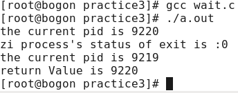

## fork()函数简介

> 在Linux 中创建一个新进程的惟一方法是使用fork()函数。fork()函数是Linux 中一个非常重要的函数，和以往遇到的函数有一些区别，因为它看起来执行一次却返回两个值。for

## fork()函数精讲

> fork()函数用于从已存在的进程中创建一个新进程。新进程称为子进程，而原进程称为父进程。使用fork()函数得到的子进程是父进程的一个复制品，它从父进程处继承了整个进程的地址空间，包括进程上下文、代码段、进程堆栈、内存信息、打开的文件描述符、信号控制设定、进程优先级、进程组号、当前工作目录、根目录、资源限制和控制终端等，而子进程所独有的只有它的进程号、资源使用和计时器等。

[^小测验]:这里，用fork()创建一个进程后打印一下pid测试一下。

```c
/*fork.c*/
#include "stdio.h"
#include <sys/types.h> // 提供类型pid_t 的定义
#include <unistd.h>
int main()
{
    pid_t p = fork();
    if(p==0){
        //在子进程内
        printf("zi:%d\n",getpid());
        printf("zi_getppid:%d\n",getppid());
    }else if(p>0){
        //在父进程内,因为程序是并行的吗，然后如果父进程先于子进程执行，那么子进程的getppid()就出错了，
        //那么就返回的是1，而不是父进程的pid。
        sleep(10);
        printf("fu:%d\n",getpid());
    }

    return 0;
}
```

> 运行结果


> 在父进程中执行fork()函数时，父进程会复制出一个子进程，而且父子进程的代码从fork()函数的返回开始分别在两个地址空间中同时运行。从而两个进程分别获得其所属fork()的返回值，其中在父进程中的返回值是子进程的进程号，而在子进程中返回0。因此，可以通过返回值来判定该进程是父进程还是子进程。

> 同时可以看出，使用fork()函数的代价是很大的，它复制了父进程中的代码段、数据段和堆栈段里的大部分内容，使得fork()函数的系统开销比较大，而且执行速度也不是很快。

> fork()函数可以让父子进程执行不同的代码段。

## fork()

> 所需头文件

```c
#include <sys/types.h> 
#include <unistd.h>
```

[^#include  <sys/types.h>]: 提供类型pid_t 的定义

> 函数原型

```c
pid_t  fork(void)
```

[^pid_t]:int类型


> 返回值

```c
0：子进程
子进程ID（大于0 的整数）：父进程
-1：出错  
```

---

### fork.c

```c
/* fork.c */
#include <sys/types.h>
#include <unistd.h>
#include <stdio.h>
#include <stdlib.h>
int main(void)
{
pid_t result;
/*调用fork()函数*/
result = fork();
/*通过result 的值来判断fork()函数的返回情况，首先进行出错处理*/
if(result == -1)
{
printf("Fork error\n");
}
else if (result == 0) /*返回值为0 代表子进程*/
{
printf("The returned value is %d\n In child process!!\n My PID is %d\n",result,getpid());
}
else /*返回值大于0 代表父进程*/
{
printf("The returned value is %d\n In father process!!\n My PID is %d\n",result,getpid());
}
Sleep(60);  /*让进程休眠，以便通过ps可以查看到当前进程的PID*/
return result;
}
```

### vfork()

> 由于fork()完整地复制了父进程的整个地址空间，因此执行速度是比较慢的。
>
> 为了加快fork()的执行速度，有些UNIX 系统设计者创建了vfork()。
>
> vfork()也能创建新进程，但它不产生父进程的副本，它是通过允许父子进程可访问相同物理内存从而伪装了对进程地址空间的真实拷贝，当子进程需要改变内存中数据时才复制父进程。这就是著名的“写操作时复制”（copy-on-write）技术。

## exec函数族

> exec函数族提供了一个在进程中启动另一个程序执行的方法。

> 它可以根据指定的文件名或目录名找到可执行文件，
>
> 并用它来取代原调用进程的数据段、代码段和堆栈段，
>
> 在执行完之后，原调用进程的内容除了进程号外，其他全部被新的进程替换了。
>
> 另外，这里的可执行文件既可以是二进制文件，也可以是Linux下任何可执行的脚本文件。

### exec函数族使用说明

> 在进程中使用exec函数族的作用是使运行结果替换原有进程。
>
> 所以为了避免父进程被替换掉，需要先在父进程中通过fork()函数创建子进程，然后在子进程中使用exec函数。
>
> 在shell命令行执行ps命令，实际上是shell进程调用fork复制一个新的子进程，再利用exec系统调用将新产生的子进程完全替换成ps进程。

> 当进程认为自己不能再为系统和用户做出任何贡献时，就可以调用exec 函数族中的任意一个函数让自己重生。

> l 如果一个进程想执行另一个程序，那么它就可以调用fork()函数新建一个进程，然后调用exec 函数族中的任意一个函数，这样看起来就像通过执行应用程序而产生了一个新进程（这种情况非常普遍）。

### exec函数族语法

> 实际上，在Linux 中并没有exec()函数，而是有6 个以exec 开头的函数，它们之间语法有细微差别。

| 表3 exec函数族成员函数语法 |                                                              |
| -------------------------- | ------------------------------------------------------------ |
| 所需头文件                 | #include <unistd.h>                                          |
| 函数原型                   | int execl(const char *path, const char *arg, ...)            |
|                            | int execv(const char *path, char *const argv[])              |
|                            | int execle(const char *path, const char *arg, ..., char *const envp[]) |
|                            | int execve(const char *path, char *const argv[], char *const envp[]) |
|                            | int execlp(const char *file, const char *arg, ...)           |
|                            | int execvp(const char *file, char *const argv[])             |
| 函数返回值                 | -1：出错                                                     |

> 这6 个函数在函数名和使用语法的规则上都有细微的区别，下面就可执行文件查找方式、参数表传递方式及环境变量这几个方面进行比较。

---

```
查找方式
	表3中的前4 个函数的查找方式都是完整的文件目录路径，而最后2 个函数（也就是以p 结尾的两个函数）可以只给出文件名，系统就会自动按照环境变量“$PATH”所指定的路径进行查找。
```

```
参数传递方式
	exec 函数族的参数传递有两种方式：一种是逐个列举的方式，而另一种则是将所有参数整体构造指针数组传递。
	在这里是以函数名的第5 位字母来区分的，字母为“l”（list）的表示逐个列举参数的方式，其语法为char *arg；字母为“v”（vertor）的表示将所有参数整体构造指针数组传递，其语法为char *const argv[]。
	这里的参数实际上就是用户在使用这个可执行文件时所需的全部命令选项字符串（包括该可执行程序命令本身）。要注意的是，这些参数必须以NULL 表示结束，如果使用逐个列举方式，那么要把它强制转化成一个字符指针，否则exec 将会把它解释为一个整型参数，那么exec 函数就会报错。
```

```
环境变量
	exec 函数族可以使用系统默认的环境变量，也可以传入指定的环境变量。这里以“e”（environment）结尾的两个函数execle()和execve()就可以在envp[]中指定当前进程所使用的环境变量。
```

```
表4是对这4 个函数中函数名和对应语法的小结，主要指出了函数名中每一位所表明的含义，希望大家结合此表加以记忆。
```

| 表4 exec函数名对应含义        |                           |                       |
| ----------------------------- | ------------------------- | --------------------- |
| 前4位                         | 统一为：exec              |                       |
| 第5位                         | l：参数传递为逐个列举方式 | execl、execle、execlp |
| v：参数传递为构造指针数组方式 | execv、execve、execvp     |                       |
| 第6位                         | e：可传递新进程环境变量   | execle、execve        |
| p：可执行文件查找方式为文件名 | execlp、execvp            |                       |

### exec函数族用法提示

> 在使用exec 函数族时，一定要加上错误判断语句。exec 很容易执行失败，其中最常见的原因有：

- 找不到文件或路径，此时errno 被设置为ENOENT，对应数值为2
- 没有对应可执行文件的运行权限，此时errno 被设置为EACCES，对应数值为13

## execlp()

> 函数语法

```c
execlp(file，arg1，arg2，……，NULL)
```

> execlp()会从PATH 环境变量（可通过env命令查看$PATH）所指的目录中查找符合参数file的文件名，找到后便执行该文件，然后将第二个以后的参数当做该文件的argv[0]、argv[1]……，最后一个参数必须用空指针(NULL)作结束。

### execlp.c

```c
/*execlp.c*/
#include <unistd.h>
#include <stdio.h>
#include <stdlib.h>
#include <errno.h>

int main()
{
if (fork() == 0)
{
/*调用execlp()函数，这里相当于调用了"ps -u"命令*/
if ((execlp("ps", "ps", "-u", NULL)) < 0)
{
perror("Execlp error\n");
}
}
}
```

## execl()

> 使用完整的文件目录来查找对应的可执行文件。注意目录必须以“/”开头，否则将其视为文件名。

### execl.c

```c
/*execl.c*/
#include <unistd.h>
#include <stdio.h>
#include <stdlib.h>
#include <errno.h>
int main()
{
if (fork() == 0)
{
/*调用execl()函数，注意这里要给出ps 程序所在的完整路径*/
if (execl("/bin/ps","ps","-u",NULL) < 0)
{
perror("Execl error\n");
}
}
}
```

## execle()

>  给新建的子进程指定环境变量，这里的“env”是查看当前进程环境变量的命令

### execle.c

```c
/* execle.c */
#include <unistd.h>
#include <stdio.h>
#include <stdlib.h>
#include <errno.h>
int main()
{
/*命令参数列表，必须以NULL 结尾*/
char *envp[]={"PATH=/tmp","USER=david", NULL};
if (fork() == 0)
{
/*调用execle()函数，注意这里也要指出env 的完整路径*/
if (execle("/usr/bin/env", "env", NULL, envp) < 0)
{
perror("Execle error\n");
}
}
}
```

## execv()

> 和execve()一样，通过构造指针数组的方式来传递参数，参数列表一定要以NULL 作为结尾标识符。
>
> 区别在于，execv()使用系统默认环境变量，不需要传递新环境变量。

### execv.c

```c
/*execv.c*/
#include <unistd.h>
#include <stdio.h>
#include <stdlib.h>
#include <errno.h>
int main()
{
/*命令参数列表，必须以NULL 结尾*/
char *arg[] = {"ls","-l","/", NULL};
if (fork() == 0)
{
if (execv("/bin/ls", arg) < 0)
{
perror("Execve error\n");
}
}
}
```

## execve()

> 通过构造指针数组的方式来传递参数。
>
> 注意：参数列表一定要以NULL 作为结尾标识符。

### execve.c

```c
/*execve.c*/
#include <unistd.h>
#include <stdio.h>
#include <stdlib.h>
#include <errno.h>
int main()
{
/*命令参数列表，必须以NULL 结尾*/
char *arg[] = {"env", NULL};
char *envp[] = {"PATH=/tmp", "USER=david", NULL};
if (fork() == 0)
{
if (execve("/usr/bin/env", arg, envp) < 0)
{
perror("Execve error\n");
}
}
}
```

## execl_errno.c

> 使用execl()函数测试errno的情况。

```c
/*execl_errno.c*/
#include <unistd.h>
#include <stdio.h>
#include <stdlib.h>
#include <errno.h>
int main()
{
if (fork() == 0)
{
/*调用execlp()函数，这里相当于调用了"ps -u"命令*/
if ((execl("/bin/ps", "ps", "-u", NULL)) < 0)
{
perror("Execl error\n");
printf(“Errno is : %d\n”,errno);
}
}
}
```

【测试一】将execl("/bin/ps", "ps", "-u", NULL)改为execl(***\*"ps"\****, "ps", "-u", NULL)，执行程序时将找不到ps命令，此时errno为ENOENT，对应数值为2：

 

【测试二】将测试一所做的修改恢复，然后将ps命令“组外其他用户”的可执行权去掉，再切换到rjxy用户执行程序。rjxy在执行程序过程中需要调用ps命令，而ps命令将rjxy用户的可执行权删掉了，所以在执行过程中缺少对应的权限，此时errno为EACCES，对应数值为13：

 


[^小知识]:事实上，这6 个函数中真正的系统调用只有execve()，其他5 个都是库函数，它们最终都会调用execve()这个系统调用。

---

## exit()和_exit()函数讲解

> exit()和_exit()函数都是用来终止进程的。当程序执行到exit()或_exit()时，进程会无条件地停止剩下的所有操作，清除包括进程控制块（PCB）在内的各种数据结构，并终止本进程的运行。但是，这两个函数还是有区别的，这两个函数的调用过程如下图所示：


> 从图中可以看出，_exit()函数的作用是：直接使进程停止运行，清除其使用的内存空间，并清除其在内核中的各种数据结构；
>
> exit()函数则在这些基础上做了一些包装，在执行退出之前加了若干道工序。

> exit()函数在调用exit 系统调用之前要检查文件的打开情况，把文件缓冲区中的内容写回文件，就是图中的“清理I/O缓冲”一项。

> 由于在Linux 的标准函数库中，有一种被称作“缓冲I/O（buffered I/O）”操作，如fread，其特征就是对应每一个打开的文件，在内存中都有一片缓冲区。每次读文件时，会连续读出若干条记录，这样在下次读文件时就可以直接从内存的缓冲区中读取；同样，每次写文件的时候，也仅仅是写入内存中的缓冲区，等满足了一定的条件（如达到一定数量或遇到特定字符等），再将缓冲区中的内容一次性写入文件。

> 这种技术大大增加了文件读写的速度，但也为编程带来了一些麻烦。比如有些数据，认为已经被写入文件中，实际上因为没有满足特定的条件，它们还只是被保存在缓冲区内，这时用_exit()函数直接将进程关闭，缓冲区中的数据就会丢失。因此，若想保证数据的完整性，就一定要使用exit()函数。

## exit()和_exit()

> 所需头文件

```c
exit：#include <stdlib.h>
```

```c
_exit：#include <unistd.h>
```

> 函数原型

```c
exit：void exit(int status)
```

```c
_exit：void _exit(int status)
```

> 函数传入值

```c
status 是一个整型的参数，可以利用这个参数传递进程结束时的状态。
    一般来说，0 表示正常结束；其他的数值表示出现了错误，进程非正常结束。
	在实际编程时，可以用wait()系统调用接收子进程的返回值，从而针对不同的情况进行不同的处理
```

### exit.c

> 这两个示例比较了exit()和_exit()两个函数的区别。
>
> 由于printf()函数使用的是缓冲I/O 方式，该函数在遇到“\n”换行符时自动从缓冲区中将记录读出。
>
> 示例中就是利用这个性质来进行比较的。

eg1:

```c
/* exit.c */
#include <stdio.h>
#include <stdlib.h>
int main()
{
printf("Using exit...\n");
printf("This is the content in buffer");
exit(0);
}
```

### _exit.c

```c
/* _exit.c */
#include <stdio.h>
#include <unistd.h>
int main()
{
printf("Using _exit...\n");
printf("This is the content in buffer"); /* 加上回车符之后结果又如何 */
_exit(0);
}
```


> exit退出前检查io缓存，如果有，那么还会处理。
>
> 而\_exit退出直接退。printf没有加\n结束字符，那么就会在缓存区中，\_exit直接忽略缓存文件。

[^小知识]:在一个进程调用了exit()之后，该进程并不会立刻完全消失，而是留下一个称为僵尸进程（Zombie）的数据结构。僵尸进程是一种非常特殊的进程，它已经放弃了几乎所有的内存空间，没有任何可执行代码，也不能被调度，仅仅在进程列表中保留一个位置，记载该进程的退出状态等信息供其他进程收集，除此之外，僵尸进程不再占有任何内存空间。

---

## wait()和waitpid()函数讲解

> wait()函数是用于使父进程（也就是调用wait()的进程）阻塞，直到一个子进程结束或者该进程接到了一个指定的信号为止。
>
> 如果该父进程没有子进程或者他的子进程已经结束，则wait()就会立即返回。
>
> wait就是用来等子进程的。

> waitpid()的作用和wait()一样，但它并不一定要等待第一个终止的子进程，它还有若干选项：
>
> 比如  可以提供一个非阻塞版本的wait()功能，也能支持作业控制。
>
> 实际上wait()函数只是waitpid()函数的一个特例，在Linux内部实现wait()函数时直接调用的就是waitpid()函数。

---

## wait()

> 所需头文件

```c
#include <sys/types.h>
#include <sys/wait.h>
```

> 函数原型

```c
pid_t wait(int *status)
```

> 函数传入值

```c
这里的status 是一个整型指针，是该子进程退出时的状态
	status若不为空，则通过它可以获得子进程的结束状态（是否正常结束），子进程的结束状态可由Linux 中一些特定的宏来测定；
	status若为空，表示不关心子进程的结束状态。
```

> 函数返回值

```c
成功：已结束运行的子进程的进程号
失败:-1
```

### wait.c

```c
/*wait.c*/
#include <sys/types.h>
#include <sys/wait.h>
#include <unistd.h>
#include <stdio.h>
int main()
{
    int return_status_of_p;
    //return Value
    pid_t rV;
    int *pi = &return_status_of_p;
    pid_t p=fork();
    if(p<0)
    {
        printf("fork error!!!\n");
    }else if(p==0){
        printf("the current pid is %d\n",getpid());
    }else{
        rV=wait(pi);
        printf("zi process's status of exit is :%d\n",(*pi));
        printf("the current pid is %d\n",getpid());
        printf("return Value is %d\n",rV);
    }
    return 0;
}
```



### wait2.c

```c
/*wait2.c*/
/*NULL类型参数*/
#include <sys/types.h>
#include <sys/wait.h>
#include <unistd.h>
#include <stdio.h>
int main()
{
    //return Value
    pid_t rV;
    pid_t p=fork();
    if(p<0)
    {
        printf("fork error!!!\n");
    }else if(p==0){
        printf("the current pid is %d\n",getpid());
    }else{
        rV=wait(NULL);
        printf("the current pid is %d\n",getpid());
        printf("return Value is %d\n",rV);
    }
    return 0;
}
```


## waitpid()

> 所需头文件

```c
#include <sys/types.h>
#include <sys/wait.h>
```

> 函数原型

```c
pid_t  waitpid(pid_t  pid,  int  *status,  int  options)
```

> 函数传入值

```c
pid
    pid > 0：只等待进程ID等于pid的子进程，不管是否有其他子进程运行结束退出，只要指定的子进程还没有结束，waitpid()就会一直等下去
    pid = -1：等待任何一个子进程退出，此时和wait()作用一样
    pid = 0：等待其组ID 等于调用进程的组ID 的任一子进程
    pid < -1：等待其组ID 等于pid 的绝对值的任一子进程
```
```
进程组ID可通过"ps  -A  -o  pgrp="命令查看所有进程的组ID，或者通过"ps  -p  进程PID  -o  pgrp="查看PID所对应进程的组ID；在程序中可通过getpgrp()函数或者getpgid(0)获取当前进程的组ID。
```
```c
status(同wait())
    这里的status 是一个整型指针，是该子进程退出时的状态
	status若不为空，则通过它可以获得子进程的结束状态（是否正常结束），子进程的结束状态可由Linux 中一些特定的宏来测定；
	status若为空，表示不关心子进程的结束状态。
```

```c
options
    WNOHANG：若由pid 指定的子进程当前不可用，则waitpid()不阻塞，此时返回值为0
    0：同wait()，阻塞父进程，等待子进程退出
```

> 函数返回值

```c
正常：已经结束运行的子进程的进程号
使用选项WNOHANG 且没有子进程退出：0
调用出错：-1
```

---

### waitpid.c

> 本例中首先使用fork()创建一个子进程。
>
> 然后让其子进程暂停5s。
>
> 接下来对原有的父进程使用waitpid()函数，并使用参数WNOHANG使该父进程不会阻塞。
>
> 若有子进程退出，则waitpid()返回子进程号；
>
> 若没有子进程退出，则waitpid()返回0。
>
> 并且父进程每隔一秒循环判断一次。
>
> 该程序的流程图如下图所示：


```c
/* waitpid.c */
#include <sys/types.h>
#include <sys/wait.h>
#include <unistd.h>
#include <stdio.h>
#include <stdlib.h>
int main()
{
	pid_t pc, pr;
	pc = fork();
	if (pc < 0)
	{
		printf("Error fork\n");
	}
	else if (pc == 0) /*子进程*/
	{
		/*子进程暂停5s*/
		sleep(5);
		/*子进程正常退出*/
		exit(0);
	}
	else /*父进程*/
	{
		/*循环测试子进程是否退出*/
		do
		{
		/*调用waitpid，且父进程不阻塞*/
		pr = waitpid(pc, NULL, WNOHANG);
		/*若子进程还未退出，则父进程暂停1s*/
			if (pr == 0)
			{
				printf("The child process has not exited\n");
				sleep(1);
			}
		} while (pr == 0);
			/*若发现子进程退出，打印出相应情况*/
			if (pr == pc)
			{
				printf("Get child exit code: %d\n",pr);
			}
			else
			{
				printf("Some error occured.\n");
			}
	}
}
```


>  waitpid()返回值是要等待的那个子进程的pid()
>
> 因为子进程可能有多个，本例只有一个	


