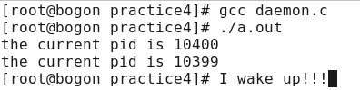
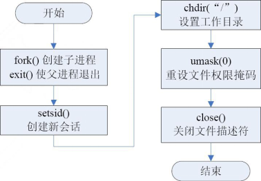

## 守护进程

> Daemon

> Daemon是linux的后台服务进程。
>
> 它的生命周期较长。
>
> 它独立于控制终端，周期性重复干一些事情。
>
> 它在系统载入时就开始启动，在系统关闭时终止。
>
> 它的一员比如：network。(用来激活网络接口的一个脚本)

### 终端

> 系统与用户进行交流的界面称为终端

> 每一个从该终端开始运行的进程都会依附于这个终端，这个终端就称为这些进程的控制终端

> 当控制终端被关闭时，相应的进程都会自动关闭。

> 但是守护进程却能够突破这种限制，它从被执行开始运转，直到整个系统关闭时才会退出。

> 运行下面一段代码，相信你会对守护进程更加了解

#### test_daemon.c

```c
/*test_daemon.c*/
#include <sys/types.h>
#include <stdlib.h>
#include <sys/wait.h>
#include <unistd.h>
#include <stdio.h>
int main()
{
    pid_t p=fork();
    if(p<0)
    {
        printf("fork error!!!\n");
    }else if(p==0){
        printf("the current pid is %d\n",getpid());
        sleep(3);
        printf("I wake up!!!");
        getchar();
    }else{
        sleep(1);
        printf("the current pid is %d\n",getpid());
        exit(0);
    }
    return 0;
}

```



> 分析：可以看到，大的那个pid先答应。那么是先执行了子进程的部分。
>
> 而当执行到子进程睡3秒时，父进程开始获得cpu，执行。
>
> 当父进程退出后，终端就变成[root@bogon practice4]了。
>
> 子进程继续执行，当执行结束，我们查看`ps -e|grep a.out`时发现


> 说明，父进程进程调用exit()，也就是API，然后启动了系统调用，最终向CPU发出了一个中断信号，父进程的PCB被清理，这时回到bash。而子进程又过了2秒睡醒，打印了那句话后，等待终端输入。键入一些字符按下回车后，子进程也exit()了。

---

> 对守护进程了解的更清楚了吗？

> 如何把这个进程变成守护进程呢？

---

## 编写守护进程

> 编写守护进程只需要5个步骤，
>
> 分别是：
>
> 创建子进程、退出父进程
>
> 在子进程中创建新会话
>
> 改变当前目录为根目录
>
> 重设文件权限掩码
>
> 关闭文件描述符



### 1.创建子进程、退出父进程

> 这是编写守护进程的第一步。
>
> 由于守护进程是脱离控制终端的，因此，完成第一步后就会在shell终端里造成一种程序已经运行完毕的假象，之后的所有工作都在子进程中完成，而用户在shell 终端里则可以执行其他的命令，从而在形式上做到了与控制终端的脱离。

> 但是，父进程创建了子进程之后退出，此时该子进程不就没有父进程了吗？
>
> 守护进程中确实会出现这么一个有趣的现象，由于父进程已经先于子进程退出，会造成子进程没有父进程，从而变成一个孤儿进程。在Linux 中，每当系统发现一个孤儿进程，就会自动由1号进程（也就是init进程）收养它，这样，原先的子进程就会变成init进程的子进程了。

### 2.在子进程中创建新会话

> 会话：是一个客户与服务器之间的不中断的请求响应序列。

> 在这里创建会话使用的是系统函数setsid()。
>
> 在具体介绍setsid()之前，首先要了解两个概念：进程组和会话期。

#### 进程组&回话期

- 进程组是一个或多个进程的集合，每一个进程都属于一个进程组，进程组由进程组ID 来惟一标识。除了进程号（PID）之外，进程组ID也是一个进程的必备属性。每个进程组都有一个组长进程，其组长进程的进程号等于进程组ID，且该进程组ID不会因组长进程的退出而受到影响。
- 会话期是一个或多个进程组的集合。通常，一个会话开始于用户登录，终止于用户退出，在此期间该用户运行的所有进程都属于这个会话期。

#### setsid()函数讲解

```
setsid()函数用于创建一个新的会话，并担任该会话组的组长。调用setsid()有下面的3个作用。
让进程摆脱原会话的控制；//摆脱当前用户登录的那个回话期
让进程摆脱原进程组的控制；
让进程摆脱原控制终端的控制。
```

#### setsid()

---

> 所需头文件

```c
#include <sys/types.h>
#include <unistd.h>
```

> 函数原型

```c
pid_t  setsid(void)
```

> 函数返回值

```c
成功：该进程组ID
出错：-1
```

---

### 3.改变当前目录为根目录

> 使用fork()创建的子进程继承了父进程的当前工作目录。
>
> 由于在进程运行过程中，当前目录所在的文件系统（比如“/mnt/usb”等）是不能卸载的，这对以后的使用会造成诸多的麻烦。
>
> 因此，通常的做法是让“/”作为守护进程的当前工作目录，当然，如有特殊需要，也可以把当前工作目录换成其他的路径，如/tmp。

#### chdir()

---

> 函数原型

```c
int chdir(char *arg);
```

> 参数

```
arg:
	字符串|字符数组
```

> 返回值

```c
成功：返回0
失败：返回-1
```

### 4.重设文件权限掩码

> 简单来说，设置umask值

> 由于使用fork()函数新建的子进程继承了父进程的文件权限掩码，这就给该子进程使用文件带来了诸多的麻烦。因此，把文件权限掩码设置为0，可以大大增强该守护进程的灵活性。

#### umask()

---

```c
umask(0);
```

> 该函数调用后返回值为修改前的掩码值，不会有错误值返回。

---

### 5.关闭文件描述符

> 同文件权限掩码一样，用fork()函数新建的子进程会从父进程那里继承一些已经打开了的文件。
>
> 这些被打开的文件可能永远不会被守护进程读或写，但它们一样消耗系统资源，而且可能导致所在的文件系统无法被卸载。

> 在子进程中创建新的会话之后，守护进程已经与所属的控制终端失去了联系。
>
> 因此从终端输入的字符不可能达到守护进程，守护进程中用常规方法（如printf()）输出的字符也不可能在终端上显示出来。
>
> 所以，文件描述符为0、1和2的3个文件（常说的输入、输出和报错这3个文件）已经失去了存在的价值，也应被关闭。

>  通常按如下方式关闭文件描述符：

```c
for(int i = 0; i < MAXFILE; i++)
{
close(i);
}
```

#### daemon.c

> 下面是实现守护进程的一个完整实例，该实例首先按照以上的创建流程建立了一个守护进程，然后让该守护进程每隔10s 向日志文件/tmp/daemon.log 写入一句话。

```c
/* daemon.c创建守护进程实例*/
#include<stdio.h>
#include<stdlib.h>
#include<string.h>
#include<fcntl.h>
#include<sys/types.h>
#include<unistd.h>
int main()
{
	pid_t pid;
	int i, fd;
	char *buf = "This is a Daemon\n";
	pid = fork(); /* 第一步*/
	if (pid< 0)
	{
		printf("Error fork\n");
		exit(1);
	}
	else if (pid> 0)
	{
		exit(0); /* 父进程退出*/
	}
	setsid(); /*第二步*/
	chdir("/"); /*第三步*/
	umask(0); /*第四步*/
	for(i = 0; i <getdtablesize(); i++) /*第五步*/
	{
		close(i);
	}
	/*这时创建完守护进程，以下开始正式进入守护进程工作*/
	while(1)
	{
		if ((fd = open("/tmp/daemon.log",O_CREAT|O_WRONLY|O_APPEND, 0600)) < 0)
		{
			printf("Open file error\n");
			exit(1);
		}
		write(fd, buf, strlen(buf));
		close(fd);
		sleep(10);
	}
	exit(0);
}
```

> tail -f /tmp/daemon.log

---

### 守护进程的出错处理

```
读者在前面编写守护进程的具体调试过程中会发现，由于守护进程完全脱离了控制终端，因此，不能像其他普通进程一样将错误信息输出到控制终端来通知程序员，即使使用gdb也无法正常调试。那么，守护进程的进程要如何调试呢？
```

```
一种通用的办法是使用syslog服务，将程序中的出错信息输入到系统日志文件中（例如“/var/log/messages”），从而可以直观地看到程序的问题所在。
```

[^小知识]:系统日志文件“/var/log/message”只能由拥有root 权限的超级用户查看。在不同Linux发行版本中，系统日志文件路径全名可能有所不同，例如可能是“/var/log/syslog”

> syslog是Linux中的系统日志管理服务，通过守护进程rsyslogd来维护。

> 该守护进程在启动时会读配置文件“/etc/rsyslog.conf”（Linux从2.6内核开始是“/etc/rsyslog.conf”文件，之前的内核是“/etc/syslog.conf”）
>
> 该文件决定了不同种类的消息会发送向何处，例如紧急消息可被送向系统管理员并在控制台上显示，而警告消息则可被记录到一个文件中。

> rsyslog.conf见文末
>
> `Linux bogon 2.6.32-131.0.15.el6.i686 #1 SMP Tue May 10 15:42:28 EDT 2011 i686 i686 i386 GNU/Linux`

> 该机制提供了3个syslog相关函数，分别为openlog()、syslog()和closelog()。下面就分别介绍这3个函数。

```
openlog()函数用于打开系统日志服务的一个连接；
syslog()函数是用于向日志文件中写入消息，在这里可以规定消息的优先级、消息输出格式等；
closelog()函数是用于关闭系统日志服务的连接。
```

### openlog()

---

> 所需头文件

```c
#include <syslog.h>
```

> 函数原型

```c
void openlog (char *ident, int option , int facility)
```

> 函数传入值

```c
ident
    要向每个消息加入的字符串，通常为程序的名称
```

```
option
	LOG_CONS：如果消息无法送到系统日志服务，则直接输出到系统控制终端
	LOG_NDELAY：立即打开系统日志服务的连接。在正常情况下，直接发送到第一条消息时才打开连接
	LOG_PERROR：将消息也同时送到stderr上
	LOG_PID：在每条消息中包含进程的PID
```

```
facility：指定程序发送的消息类型
	LOG_AUTHPRIV：安全/授权信息
	LOG_CRON：时间守护进程（cron及at）
	LOG_DAEMON：其他系统守护进程
	LOG_KERN：内核信息
	LOG_LOCAL[0~7]：保留
	LOG_LPR：行打印机子系统
	LOG_MAIL：邮件子系统
	LOG_NEWS：新闻子系统
	LOG_SYSLOG：syslogd内部所产生的信息
	LOG_USER：一般使用者等级信息
	LOG_UUCP：UUCP 子系统
```

---

### syslog()

---

> 所需头文件

```c
#include <syslog.h>
```

> 函数原型

```c
void syslog(int  priority, char *format, ...)
```

> 函数传入值

```c
priority：指定消息的重要性
    LOG_EMERG：紧急情况，需要立即通知技术人员
    LOG_ALERT：应该被立即改正的问题，如系统数据库被破坏，ISP连接丢失
    LOG_CRIT：重要情况，如硬盘错误，备用连接丢失
    LOG_ERR：错误，不是非常紧急，在一定时间内修复即可
    LOG_WARNING：警告信息，不是错误，比如系统磁盘使用了85%等
    LOG_NOTICE：正常情况，不是错误，也不需要立即处理
    LOG_INFO：情报信息，正常的系统消息，比如骚扰报告，带宽数据等，不需要处理
    LOG_DEBUG：包含详细的开发情报的信息，通常只在调试一个程序时使用
```

```c
format
    以字符串指针的形式表示输出的格式，类似printf
```

---

### closelog()

---

> 所需头文件

```c
#include <syslog.h>
```

> 函数原型

```c
void closelog(void)
```

---

#### syslog_daemon.c

```c
/* syslog_daemon.c利用syslog 服务的守护进程实例*/
#include <stdio.h>
#include <stdlib.h>
#include <string.h>
#include <fcntl.h>
#include <sys/types.h>
#include <unistd.h>
#include <sys/wait.h>
#include <syslog.h>
int main()
{
	pid_t pid, sid;
	int i, fd;
	char *buf = "This is a Daemon\n";
	pid = fork(); /* 第一步*/
	if (pid< 0)
	{
		printf("Error fork\n");
		exit(1);
	}
	else if (pid> 0)
	{
		exit(0); /* 父进程退出*/
	}
	/* 打开系统日志服务，openlog */
	openlog("daemon_syslog", LOG_PID, LOG_DAEMON);
	if ((sid = setsid()) < 0) /*第二步*/
	{
		syslog(LOG_ERR, "setsid");
		exit(1);
	}
	if ((sid = chdir("/")) < 0) /*第三步*/
	{
		syslog(LOG_ERR, "chdir");
		exit(1);
	}
	umask(0); /*第四步*/
	for(i = 0; i <getdtablesize(); i++) /*第五步*/
	{
		close(i);
	}
	/*这时创建完守护进程，以下开始正式进入守护进程工作*/
	while(1)
	{
		if ((fd = open("/tmp/daemon.log",O_CREAT|O_WRONLY|O_APPEND, 0600))<0)
		{
			syslog(LOG_ERR, "open");
			exit(1);
		}
		write(fd, buf, strlen(buf));
		close(fd);
		sleep(10);
	}
	closelog();
	exit(0);
}
```

> 这个程序对比daemon.c只是将错误信息输入到系统日志中去了。
>
> 可以通过tail -10 /var/log/messages来显示

```c
#动态地显示这个文件最后10行
tail -f /var/log/messages
```

> 怎么让它出错呢？
>
> 验证代码中chdir&open两处
>
> 1.chdir
>
> ​	1.1 切换一个不存在的路径
>
> 
>
> 
>
> 2.open
>
> ​	2.1 因为必须要root才可以open系统日志。尝试着用普通用户运行程序
>
> 
>
> 

> 这个日志只有错误了，才会运行里面的代码，才会在日志里写入


## 附录

### rsyslog.conf

```
#rsyslog v3 config file

# if you experience problems, check
# http://www.rsyslog.com/troubleshoot for assistance

#### MODULES ####

$ModLoad imuxsock.so	# provides support for local system logging (e.g. via logger command)
$ModLoad imklog.so	# provides kernel logging support (previously done by rklogd)
#$ModLoad immark.so	# provides --MARK-- message capability

# Provides UDP syslog reception
#$ModLoad imudp.so
#$UDPServerRun 514

# Provides TCP syslog reception
#$ModLoad imtcp.so  
#$InputTCPServerRun 514


#### GLOBAL DIRECTIVES ####

# Use default timestamp format
$ActionFileDefaultTemplate RSYSLOG_TraditionalFileFormat

# File syncing capability is disabled by default. This feature is usually not required, 
# not useful and an extreme performance hit
#$ActionFileEnableSync on


#### RULES ####

# Log all kernel messages to the console.
# Logging much else clutters up the screen.
#kern.*                                                 /dev/console

# Log anything (except mail) of level info or higher.
# Don't log private authentication messages!
*.info;mail.none;authpriv.none;cron.none                /var/log/messages

# The authpriv file has restricted access.
authpriv.*                                              /var/log/secure

# Log all the mail messages in one place.
mail.*                                                  -/var/log/maillog


# Log cron stuff
cron.*                                                  /var/log/cron

# Everybody gets emergency messages
*.emerg                                                 *

# Save news errors of level crit and higher in a special file.
uucp,news.crit                                          /var/log/spooler

# Save boot messages also to boot.log
local7.*                                                /var/log/boot.log


# ### begin forwarding rule ###
# The statement between the begin ... end define a SINGLE forwarding
# rule. They belong together, do NOT split them. If you create multiple
# forwarding rules, duplicate the whole block!
# Remote Logging (we use TCP for reliable delivery)
#
# An on-disk queue is created for this action. If the remote host is
# down, messages are spooled to disk and sent when it is up again.
#$WorkDirectory /var/spppl/rsyslog # where to place spool files
#$ActionQueueFileName fwdRule1 # unique name prefix for spool files
#$ActionQueueMaxDiskSpace 1g   # 1gb space limit (use as much as possible)
#$ActionQueueSaveOnShutdown on # save messages to disk on shutdown
#$ActionQueueType LinkedList   # run asynchronously
#$ActionResumeRetryCount -1    # infinite retries if host is down
# remote host is: name/ip:port, e.g. 192.168.0.1:514, port optional
#*.* @@remote-host:514
# ### end of the forwarding rule ###
```


