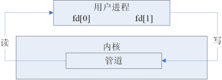
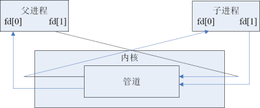
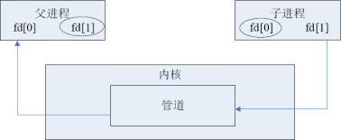
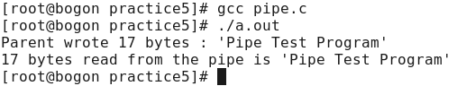
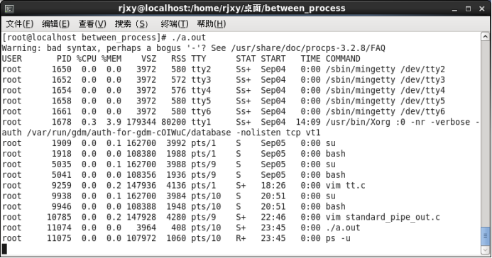
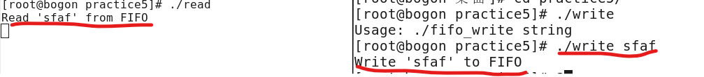

## 进程通信

> 进程是一段程序的执行过程。

> 这里所说的进程一般是指运行在用户态（对应于内核态）的进程，而由于处于用户态的不同进程之间是彼此隔离的，就像处于不同城市的人们，它们必须通过某种方式来进行通信，例如人们使用手机等方式相互通信。

- 用户态：user mode，非特权状态，每个进程都在各自的用户空间中运行，而不允许存取其他程序的用户空间。

- 用户空间：Linux系统将自身划分为两部分，一部分为核心软件，即kernel，也称作内核空间；另一部分为普通应用程序，称为用户空间。

### 进程通信的几种方式

| 进程通信的几种方式                   |                                                              |
| ------------------------------------ | ------------------------------------------------------------ |
| 管道（pipe）和有名管道（named pipe） | 管道可用于具有亲缘关系进程间的通信；有名管道，除具有管道所具有的功能外，还允许无亲缘关系进程间的通信。<1>管道（pipe）：在进程中产生，进程结束也随之结束，如"ls\|grep abc"。<2>有名管道（named pipe）：通过mkfifo或mknod创建的管道文件。 |
| 信号（Signal）                       | 信号是在软件层次上对中断机制的一种模拟，它是比较复杂的通信方式，用于通知进程有某事件发生，一个进程收到一个信号与处理器收到一个中断请求效果上可以说是一样的。 |
| 消息队列（Message Queue）            | 消息队列是消息的链接表，它克服了前两种通信方式中信息量有限的缺点，具有写权限的进程可以按照一定的规则向消息队列中添加新消息；对消息队列有读权限的进程则可以从消息队列中读取消息。 |
| 共享内存（Shared memory）            | 可以说这是最有用的进程间通信方式。它使得多个进程可以访问同一块内存空间，不同进程可以即时看到对方进程中对共享内存中数据的更新。这种通信方式需要某种同步机制，如互斥锁和信号量（信号灯）等。 |
| 信号量（Semaphore）                  | 又称为信号灯，主要作为进程之间以及同一进程的不同线程之间的同步和互斥手段。 |
| 套接字（Socket）                     | 这是一种更为一般的进程间通信机制，可用于网络中不同机器之间的进程间通信，应用非常广泛。 |

## 管道

> 管道是Linux中一种很重要的通信方式，它是把一个程序的输出直接连接到另一个程序的输入。

> 第3章介绍了有名管道，这里不再写。

- 管道也可以看成是一种特殊的文件，对于它的读写也可以使用普通的read()和write()等函数。但是它不是普通的文件，不属于任何文件系统，只存在于内核的内存空间中；
- 它只能用于具有亲缘关系的进程之间的通信（也就是父子进程或者兄弟进程之间）
- 它具有固定的读端和写端
- 进程退出，管道也随之关闭

### 管道系统调用

#### 管道创建与关闭说明

> 管道是基于文件描述符的通信方式，当一个管道建立时，它会创建两个文件描述符fd[0]和fd[1]，其中fd[0]固定用于读管道，而fd[1]固定用于写管道，如下图所示，这样就构成了一个通道。
>
> 

> 管道关闭时只需将这两个文件描述符关闭即可，可使用普通的close()函数逐个关闭各个文件描述符。

---

> pipe()函数用于创建管道

#### pipe()

---

> 所需头文件

```c
#include <unistd.h>
```

> 函数原型

```c
int pipe(int fd[2])
```

> 函数传入值

```c
fd[2]：管道的两个文件描述符，pipe之后就可以直接操作这两个文件描述符
```

> 返回值

```c
成功：0
出错：-1
```

---





> 1个进程中管道体现不出来。
>
> 2个进程中，管道可以是双向的。但一般只用于单向的，如上图：子进程向父进程写数据。

---

##### pipe.c

> 通过管道：父进程写，子进程读

```c
/* pipe.c */
#include <unistd.h>
#include <errno.h>
#include <stdio.h>
#include <stdlib.h>
#include <string.h>
#define MAX_DATA_LEN 256
#define DELAY_TIME 1
int main()
{
	pid_t pid;
	int pipe_fd[2];
	char buf[MAX_DATA_LEN];
	const char data[] = "Pipe Test Program";
	int real_read, real_write;
	memset((void*)buf, 0, sizeof(buf));
	/* 创建管道 */
	if (pipe(pipe_fd) < 0)
	{
		printf("pipe create error\n");
		exit(1);
	}
	/* 创建一子进程 */
	if ((pid = fork()) == 0)
	{
		/* 子进程关闭写描述符，并使子进程暂停1s等待父进程已关闭相应的读描述符 */
		close(pipe_fd[1]);
		sleep(DELAY_TIME);
		/* 子进程读取管道内容 */
		if ((real_read = read(pipe_fd[0], buf, MAX_DATA_LEN)) > 0)
		{
			printf("%d bytes read from the pipe is '%s'\n", real_read, buf);
		}
		/* 关闭子进程读描述符 */
		close(pipe_fd[0]);
		exit(0);
	}
    else if (pid > 0)
	{
		/* 父进程关闭读描述符，写入相应信息 */
		close(pipe_fd[0]);
		if((real_write = write(pipe_fd[1], data, strlen(data))) != -1)
		{
			printf("Parent wrote %d bytes : '%s'\n", real_write, data);
		}
		/*关闭父进程写描述符*/
		close(pipe_fd[1]);
		/*收集子进程退出信息*/
		waitpid(pid, NULL, 0);
		exit(0);
	}
}
```



##### memset()

```c
void *memset(void *s, int ch, size_t n);
函数解释：将中前n个字节用ch替换并返回s。
本例表示把buf中所有的数据清零。
memset的操作对象是内存，所以须将buf转换为指针类型。该操作可以省略。
```

> 只有在管道的读端存在时，向管道写入数据才有意义。

> 向管道写入数据时，管道缓冲区一有空闲区域，写进程就会试图向管道写入数据。如果读进程不读取管道缓冲区中的数据，那么写操作将会一直阻塞。

> 父子进程在运行时，它们的先后次序并不能保证，因此，在这里为了保证父子进程已经关闭了相应的文件描述符，可在两个进程中调用sleep()函数，当然这种调用不是很好的解决方法，在后面会学习进程之间的同步与互斥机制。

---

#### popen()

> 标准流管道

> 与Linux的文件操作中有基于文件流的标准I/O操作一样，管道的操作也支持基于文件流的模式。

```
popen()所完成的工作有以下几步：
创建一个管道；
fork()一个子进程；
在父子进程中关闭不需要的文件描述符；
执行exec函数族调用；
执行函数中所指定的命令。

这个函数的使用可以大大减少代码的编写量，但同时也有一些不利之处，例如，它不如前面管道创建的函数那样灵活多样，并且用popen()创建的管道必须使用标准I/O函数进行操作，而不能使用前面的read()、write()一类不带缓冲的I/O函数。
```

> 与之相对应，关闭用popen()创建的流管道必须使用函数pclose()，该函数关闭标准I/O流，并等待命令执行结束。

---

> 所需头文件

```c
#include <stdio.h>
```

> 函数原型

```c
FILE *popen(const char *command, const char *type)
```

> 函数传入值

```c
command：指向的是一个以null 结束符结尾的字符串，这个字符串包含一个shell命令，并由shell来执行
```

```c
type
    “r”：文件指针连接到command的标准输出，即该命令的结果产生输出
	“w”：文件指针连接到command的标准输入，即该命令的结果产生输入
```

> 返回值

```c
成功：文件流指针
	当type=“r”时，可以读取命令的执行结果；当type=‘w’时，可以给命令输入参数
出错：NULL
```

---

#### pclose()

---

> 所需头文件

```c
#include <stdio.h>
```

> 函数原型

```c
int pclose(FILE *stream)
```

> 函数传入值

```c
stream：要关闭的文件流
```

> 返回值

```c
成功：0
出错：-1
```

---

##### standard_pipe_r.c

```c
/* standard_pipe_r.c */
#include <stdio.h>
#include <stdlib.h>
#define BUFSIZE 1024
int main()
{
	FILE *fp;
	char *cmd = "ps  -u";
	char buf[BUFSIZE];
	/*调用popen()函数执行相应的命令*/
	if ((fp = popen(cmd, "r")) == NULL)
	{
		printf("Popen error\n");
		exit(1);
	}
    /*fgets()把fp指向的流数据送入buf指定的数组中。*/
	while ((fgets(buf, BUFSIZE, fp)) != NULL)
	{
		printf("%s",buf);
	}
	pclose(fp);
	exit(0);
}
```



##### standard_pipe.c

```c
/* standard_pipe.c */
#include <stdio.h>
#include <unistd.h>
#include <stdlib.h>
#include <fcntl.h>
#define BUFSIZE 1024
int main()
{
	FILE *fp;
	char *cmd = "cat > aaa";
	char buf[BUFSIZE]="how do you do\n";
	/*调用popen()函数执行相应的命令*/
	if ((fp = popen(cmd, "w")) == NULL)
	{
		printf("Popen error\n");
		exit(1);
	}
	fwrite(buf,BUFSIZE,1,fp);
	pclose(fp);
	exit(0);
}
```

>  fwrite() 是 C 语言标准库中的一个文件处理函数，功能是向指定的文件中写入若干数据块，如成功执行则返回实际写入的数据块数目。该函数以二进制形式对文件进行操作，不局限于文本文件。 
>
>  size_t fwrite(const void *ptr, size_t size, size_t nmemb, FILE *stream) 
>
>  把**ptr**所指向的数组中的数据写入到给定流**stream**中 

- **ptr**-- 这是指向要被写入的元素数组的指针。
- **size**-- 这是要被写入的每个元素的大小，以字节为单位。
- **nmemb**-- 这是元素的个数，每个元素的大小为 size 字节。
- **stream**-- 这是指向 FILE 对象的指针，该 FILE 对象指定了一个输出流。

> 该代码先用popen创建了一个文件aaa，然后用fwrite往里面写数据。

---

#### fifo函数思想

>  fifo是有名管道。
>
> 有名管道可以使互不相关的两个进程实现彼此通信。
>
> 该管道可以通过路径名来指出，并且在文件系统中是可见的。在建立了管道之后，两个进程就可以把它当作普通文件一样进行读写操作，使用非常方便。不过值得注意的是:
>
> FIFO是严格地遵循先进先出规则的，对管道及FIFO的读总是从开始处返回数据，对它们的写则把数据添加到末尾，它们不支持如 lseek()等文件定位操作。

#### mkfifo()

> 有名管道的创建可以使用函数mkfifo()，该函数可以指定管道的路径和读写权限。

> 对于读进程

```
若该管道是阻塞打开，且当前FIFO内没有数据，则对读进程而言将一直阻塞到有数据写入。

若该管道是非阻塞打开，则不论FIFO内是否有数据，读进程都会立即执行读操作。如果FIFO内没有数据，则读函数将立刻返回0。
```

> 对于写进程

```
若该管道是非阻塞打开而不能写入全部数据，则写操作进行部分写入或者调用失败。
```

---

> 所需头文件

```c
#include <sys/types.h>
#include <sys/state.h>
```

> 函数原型

```c
int mkfifo(const char *filename,  mode_t mode)
```

> 函数传入值

```c
filename：
    要创建的管道
mode：
    读写权限
```

> 返回值

```c
成功：0
出错：-1
```

> FIFO 相关的出错信息做了归纳，方便查错：

| 表5 mkfifo相关的出错信息 |                                              |
| ------------------------ | -------------------------------------------- |
| EACCESS                  | 参数filename所指定的目录路径无可执行的权限   |
| EEXIST                   | 参数filename所指定的文件已存在               |
| ENAMETOOLONG             | 参数filename的路径名称太长                   |
| ENOENT                   | 参数filename包含的目录不存在                 |
| ENOSPC                   | 文件系统的剩余空间不足                       |
| ENOTDIR                  | 参数filename路径中的目录存在但却非真正的目录 |
| EROFS                    | 参数filename指定的文件存在于只读文件系统内   |

---

##### fifo_read.c

> 下面的实例包含了两个程序，一个用于读管道，另一个用于写管道。其中在读管道的程序里创建管道，并且作为main()函数里的参数由用户输入要写入的内容。读管道的程序会读出用户写入到管道的内容，这两个程序采用的是阻塞式读写管道模式。

```c
/*fifo_read.c*/
#include <errno.h>
#include <fcntl.h>
#include <stdio.h>
#include <stdlib.h>
#include <limits.h>
#include <string.h>
#define MYFIFO "myfifo" /* 有名管道文件名*/
#define MAX_BUFFER_SIZE  PIPE_BUF /*定义在于limits.h 中*/
int main()
{
	char buff[MAX_BUFFER_SIZE];
	int fd;
	int nread;
	/* 判断有名管道是否已存在，若尚未创建，则以相应的权限创建*/
	if((mkfifo(MYFIFO, 0666) < 0) && (errno != EEXIST))
	{
		printf("Cannot create fifo file\n");
		exit(1);
	}
	/* 以只读阻塞方式打开有名管道*/
	fd = open(MYFIFO, O_RDONLY);
	if(fd == -1)
	{
		printf("Open fifo file error\n");
		exit(1);
	}
	while(1)
	{
		memset(buff, 0, sizeof(buff));
		if ((nread = read(fd, buff, MAX_BUFFER_SIZE)) > 0)
		{
			printf("Read '%s' from FIFO\n", buff);
		}
	}
	close(fd);
	exit(0);
}
```

##### fifo_write.c

```c
/* fifo_write.c */
#include <errno.h>
#include <fcntl.h>
#include <stdio.h>
#include <stdlib.h>
#include <limits.h>
#define MYFIFO "myfifo" /* 有名管道文件名*/
#define MAX_BUFFER_SIZE  PIPE_BUF /*PIPI_BUF为管道的缓冲区大小，在limits.h中定义*/
int main(int argc, char * argv[]) /*参数为即将写入的字符串*/
{
	int fd;
	char buff[MAX_BUFFER_SIZE];
	int nwrite;
	if(argc <= 1)
	{
		printf("Usage: ./fifo_write string\n");
		exit(1);
	}
    /*把argv[1]的数据送到buff中。
	可以用sscanf代替，注意sscanf和sprintf的参数顺序不一致：
	sscanf(argv[1], "%s", buff);*/
	sprintf(buff,"%s",argv[1]);
	/* 以只写阻塞方式打开FIFO 管道*/
	fd = open(MYFIFO, O_WRONLY);
	if (fd == -1)
	{
		printf("Open fifo file error\n");
		exit(1);
	}
	/*向管道中写入字符串*/
	if ((nwrite = write(fd, buff, MAX_BUFFER_SIZE)) > 0)
	{
		printf("Write '%s' to FIFO\n", buff);
	}
	close(fd);
	exit(0);
}
```

> 先运行fifo_read.c，
>
> 再打开一个终端，运行fifo_write.c



> 如果先运行fifo_write.c，
>
> 再打开一个终端，运行fifo_read.c
>
> 因为是阻塞打开，所以fifo_write.c会一直等待直到有人读，它才会打印Write ''to FIFO,从而解除阻塞

> 如果写管道不是以只写方式（WRONLY）打开FIFO文件，而是以读写方式（O_RDWR）打开，这样先运行写程序就不会出现阻塞问题，但是后续打开的读程序无法读到以前写入管道的信息。

> 如果写管道程序以非阻塞方式打开FIFO文件，即把fifo_write.c中的“open(MYFIFO, O_WRONLY)”改为“open(MYFIFO, O_WRONLY|O_NONBLOCK)”，那么不开启读管道程序，直接运行写管道程序时，进程将不阻塞等待，而是直接返回错误提示，如下所示，：


```

```

