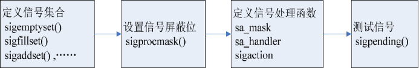

> 信号的发送和捕捉函数 kill()、 raise()、 alarm()以及 pause()

# 信号的发送和捕捉

## kill()

---
> 可以发送kill信号，也可以发送其他信号

> 所需头文件

```c
#include <signal.h>
#include <sys/types.h>
```

> 函数原型

```c
int kill(pid_t pid, int sig)
```

> 参数列表

```c
pid
    正数：要发送信号的进程号
	0：信号被发送到所有和当前进程在同一个进程组的进程
	-1：信号发给所有的进程表中的进程
	<-1：信号发送给进程组号为-pid的每一个进程
```

```
sig
	信号
```

> 返回值

```c
成功：0
出错：-1
```

---

## raise()

---

> 只能向自己发送信号

> 所需头文件

```c
#include <signal.h>
#include <sys/types.h>
```

> 函数原型

```c
int raise(int sig)
```

> 函数传入值

```c
sig
    信号
```

> 返回值

```c
成功：0
出错：-1
```

---

### kill_raise.c

```c
/* kill_raise.c  */
#include <stdio.h>
#include <stdlib.h>
#include <signal.h>
int main()
{
	pid_t pid;
	int ret;
 	/* 创建一子进程 */
 	if ((pid = fork()) < 0)
 	{
		printf("Fork error\n");
 		exit(1);
 	}
	if (pid == 0)
 	{
 		/* 在子进程中使用 raise() 函数发出 SIGSTOP 信号, 使子进程暂停 */
		printf("Child(pid : %d) is waiting for any signal\n", getpid());
 		raise(SIGSTOP);
 		exit(0);
 	}
 	else
 	{
 		/* 在父进程中收集子进程发出的信号，并调用 kill() 函数进行相应的操作 */
		sleep(1);
		if ((waitpid(pid, NULL, WNOHANG) ) == 0)
 		{
 			if ((ret = kill(pid, SIGKILL) ) == 0)
 			{
				printf("Parent killed %d\n",pid);
 			}
 		}
 		exit(0);
 	}
}
```

## alarm()

---

> 它可以在进程中设置一个定时器，当定时器指定的时间到时，它就向进程发送SIGALRM信号
>
> 1个进程只能有1个alarm()。如果重复设，则alarm()倒计时还是现在距离结束还剩的时间，返回值也是这个时间。（返回值正常为0）

> 所需头文件

```c
#include <unistd.h>
```

> 函数原型

```c
unsigned int alarm(unsigned int seconds)
```

> 函数传入值

```c
seconds：指定秒数，系统经过seconds 秒之后向该进程发送SIGALRM信号
```

> 返回值

```c
成功：如果调用此alarm()前，进程中已经设置了闹钟时间，则返回上一个闹钟时间的剩余时间，否则返回0
出错：-1
```

---

## pause()

---

> pause()函数是用于将调用进程挂起直至捕捉到信号为止。
>
> 这个函数很常用，通常可以用于判断信号是否已到。

> 所需头文件

```c
#include <unistd.h>
```

> 函数原型

```c
int pause(void)
```

> 函数返回值

```c
-1，并且把errno值设为EINTR
```

### alarm_pause_mod.c

```c
/* alarm_pause_mod.c */
#include <stdio.h>
#include <stdlib.h>
int main()
{
 	/*调用 alarm 定时器函数*/
	int ret = alarm(5) ;
	printf("I have been waken up.\n"); 
	sleep(3);
	ret = alarm(15);
	printf("alarm = %d\n",ret);
}
```

---

# 信号的处理

> 建立进程与其信号之间的对应关系

## signal()

---

> 前32种非实时信号，不支持信号传递信息。

> 所需头文件  

```c
#include <signal.h>
```

> 函数原型  

```c
void (*signal(int signum, void (*func)(int)))(int)
```

- 最后一个“int” 是获取的信号，由进程自动获取；
- signal函数的第一个参数signum是一个整数，是指定的信号代码（在signal.h头文件中引用的“bits/signum.h”中定义，如信号SIGINT的代码是2），signal函数把由进程获取到的信号和signum对比，如果一致，再将该信号传递给signal的第二个参数，即函数指针func，这样func函数所使用的参数（倒数第二个“int”）其实就是由进程获取到的信号（最后一个“int”）；
- 以获取到的信号作为参数执行func函数；

> 函数传入值  

```c
signum
    指定信号代码，signal一旦获取到signum指定的信号，就开始执行func所指定的函数。
```

```c
mode
    SIG_IGN：忽略该信号
	SIG_DFL：采用系统默认方式处理信号
	自定义的信号处理函数指针，此函数必须在signal()被调用前申明，func就是这个函数的名字。当接收到一个类型为	sig的信号时，就执行func所指定的函数。这个函数应有如下形式的定义：
	void func(int sig);
```

> 返回值  

```c
成功：以前的信号处理配置
出错：-1
```

---

## sigaction()

---

> 所需头文件  

```c
#include <signal.h>
```

> 函数原型

```c
int sigaction(int signum, const struct sigaction *act, struct sigaction *oldact)
```

> 函数传入值  

```c
signum
    信号代码，可以是除SIGKILL及SIGSTOP外的任何一个有效的信号
```

```c
act
    指向结构sigaction的一个实例的指针，指定对特定信号的处理
```

```c
sigaction()函数中第2个和第3个参数用到的sigaction结构
```

```c
struct sigaction
{
void (*sa_handler)(int signo);
sigset_t  sa_mask;/*信号集和信号集操作函数*/
int sa_flags;
void (*sa_restore)(void);
}
```

```c
sa_handler
    是一个函数指针，指定信号处理函数，这里除可以是用户自定义的处理函数外，还可以为SIG_DFL（采用缺省的处理方式）或 SIG_IGN（忽略信号）。它的处理函数只有一个参数，即信号值。
```

```c
sa_mask
    是一个信号集，它可以指定在信号处理程序执行过程中哪些信号应当被屏蔽。在调用信号捕获函数之前，该信号集要加入到信号的信号屏蔽字中。如果没有需要屏蔽的信号，需要用sigemptyset函数将sa_mask初始化（即清空）。
```

```
sa_flags
	中包含了许多标志位，是对信号进行处理的各个选择项。它的常见可选值如表13所示。
```

```
#常见标志位的含义及默认操作
信号名				含义
SA_NOCLDSTOP	进程忽略子进程产生的任何SIGSTOP、SIGTSTP、SIGTTIN和SIGTTOU 信号
SA_NOCLDWAIT	当调用此系统调用的进程之子进程终止时，系统不会建立zombie进程
SA_RESETHAND	信号处理函数接收到信号后，会先将对信号处理的方式设为预设方式，而且当函数处理该信号时，后来发生的信号将不会被阻塞
SA_ONSTACK	如果利用sigaltstack()建立信号专用堆栈，则此标志会把所有信号送往该堆栈
SA_NODEFER	在信号处理函数处置信号的时段中，核心程序不会把这个间隙中产生的信号阻塞
SA_SIGINFO	指定信号处理函数需要三个参数，所以应使用sa_sigaction替sa_handler
```

```
sa_restore
	参数未使用
```

```c
oldact
    保存原来对相应信号的处理
```

>  返回值  

```c
成功：0
出错：-1
```

---

### signal.c

```c
/* signal.c */
#include <signal.h>
#include <stdio.h>
#include <stdlib.h>
/*自定义信号处理函数*/
void my_func(int sign_no)
{
	if (sign_no == SIGINT)
	{
		printf("I have get SIGINT %d\n",sign_no);
	}
	else if (sign_no == SIGQUIT)
	{
		printf("I have get SIGQUIT %d\n",sign_no);
	}
}
int main()
{
	printf("Waiting for signal SIGINT or SIGQUIT...\n");
	/* 发出相应的信号，并跳转到信号处理函数处 */
	signal(SIGINT, my_func);
	signal(SIGQUIT, my_func);
    /* 忽略SIGTSTP（ctrl+z）信号 */
	signal(SIGTSTP,SIG_IGN);   
	pause();
	exit(0);
}
```

```
SIGINT -- Ctrl C(2)
SIGQUIT -- Ctrl \(3)
SIGKILL -- (9)
SIGSTP -- Ctrl z(19)
```

> 尝试着打开另一个终端，输入kill -2|3 进程id。来控制这个程序。

### sigaction.c

```c
/* sigaction.c */
#include <signal.h>
#include <stdio.h>
#include <stdlib.h>
/*自定义信号处理函数*/
void my_func(int sign_no)
{
	if (sign_no == SIGINT)
	{
	printf("I have get SIGINT %d\n",sign_no);
	}
	else if (sign_no == SIGQUIT)
	{
		printf("I have get SIGQUIT %d\n",sign_no);
	}
}
int main()
{
	struct sigaction action;
	printf("Waiting for signal SIGINT or SIGQUIT...\n");
	/* sigaction 结构初始化 */
	action.sa_handler = my_func;
    /* 初始化（清空）action.sa_mask信号集 */
	sigemptyset(&action.sa_mask);
	action.sa_flags = 0;
	/* 发出相应的信号，并跳转到信号处理函数处 */
	sigaction(SIGINT, &action, NULL);
	sigaction(SIGQUIT, &action, NULL);
	pause();
	exit(0);
}
```

> 和上面例子不同的是，按ctrl+Z会直接退出。

## 信号集函数

> 使用信号集函数组处理信号时涉及一系列的函数，这些函数按照调用的先后次序可分为以下几大功能模块：创建信号集合、注册信号、处理函数以及检测信号。

### 创建信号集合

> 主要用于处理用户感兴趣的一些信号，其函数包括以下几个:

|               |                                  |
| ------------- | -------------------------------- |
| sigemptyset() | 将信号集合初始化为空             |
| sigfillset()  | 将所有已定义的信号加入信号集合中 |
| sigaddset()   | 将指定信号加入到信号集合中       |
| sigdelset()   | 将指定信号从信号集合中删除       |
| sigismember() | 查询指定信号是否在信号集合之中   |

### 注册信号

> 将信号值加入到进程的未决信号集中
>
> ​	其中“未决”是一种状态，指的是从信号产生到信号被处理前的这段时间

### 处理函数

> 决定进程如何处理信号

> 信号集里的信号并不是真正可以处理的信号，只有当信号的状态处于非阻塞状态时才会真正起作用。
>
> 因此，首先使用sigprocmask()函数检测并更改信号屏蔽字
>
> > 信号屏蔽字是用来指定当前被阻塞的一组信号，它们不会被进程接收
>
> 然后使用sigaction()函数来定义进程接收到特定信号之后的行为

### 检测信号

> 是信号处理的后续步骤

> 因为被阻塞的信号不会传递给进程，所以这些信号就处于“未处理”状态
>
> > 也就是进程不清楚它的存在
>
> sigpending()函数允许进程检测“未处理”信号，并进一步决定对它们作何处理。

---

### 信号集函数()

---

> 所需头文件

```c
#include <signal.h>
```

> 函数原型

```c
int sigemptyset(sigset_t *set)
int sigfillset(sigset_t *set)
int sigaddset(sigset_t *set, int signum)
int sigdelset(sigset_t *set, int signum)
int sigismember(sigset_t *set, int signum)
```

> 函数传入值

```c
set
    信号集
```

```c
signum
    指定信号代码
```

> 返回值

```c
成功：0（sigismember成功返回1，失败返回0）
出错：-1
```

---

### sigprocmask()

---

> 所需头文件

```c
#include <signal.h>
```

> 函数原型

```c
int sigprocmask(int  how, const sigset_t *set, sigset_t *oset)
```

> 函数传入值

```c
how
    决定函数的操作方式
   		SIG_BLOCK：将set所指向的信号集中包含的信号加到当前的信号掩码中
		SIG_UNBLOCK：将set所指向的信号集中包含的信号从当前的信号掩码中删除
		SIG_SETMASK：将set的值设定为新的进程信号掩码
```

```c
set
    指向信号集的指针，在此专指新设的信号集，如果仅想读取现在的屏蔽值，可将其置为NULL
```

```c
oset
    也是指向信号集的指针，在此存放原来的信号集。可用来检测信号掩码中存在什么信号。
```

> 返回值

```c
成功：0
出错：-1
```

---

### sigpending()

---

> 所需头文件

```c
#include <signal.h>
```

> 函数原型

```c
int  sigpending(sigset_t *set)
```

> 函数传入值

```c
set
    要检测的信号集
```

> 返回值

```c
成功：0
出错：-1
```

---

### 信号处理流程图



### sigset.c

```c
/* sigset.c */
#include <sys/types.h>
#include <unistd.h>
#include <signal.h>
#include <stdio.h>
#include <stdlib.h>
/*自定义的信号处理函数*/
void my_func(int signum)
{
	printf("If you want to quit, please try SIGQUIT\n");
}
int main()
{
	sigset_t set;
	struct sigaction action1,action2;
	/* 初始化信号集为空 */
	if (sigemptyset(&set) < 0)
	{
		perror ("sigemptyset");
		exit(1);
	}
	/* 将相应的信号加入信号集 */
	if (sigaddset(&set, SIGQUIT) < 0)
	{
		perror("sigaddset");
		exit(1);
	}
	if (sigaddset(&set, SIGINT) < 0)
	{
		perror("sigaddset");
		exit(1);
	}
    /* 查询指定信号是否在信号集中 */
	if (sigismember(&set, SIGINT))
	{
		sigemptyset(&action1.sa_mask);
		action1.sa_handler = my_func;
		action1.sa_flags = 0;
        /*sigint ctrl c*/
		sigaction(SIGINT, &action1, NULL);
	}
	if (sigismember(&set, SIGQUIT))
	{
		sigemptyset(&action2.sa_mask);
		action2.sa_handler = SIG_DFL;
		action2.sa_flags = 0;
        /*sigquit ctrl \*/
		sigaction(SIGQUIT, &action2,NULL);
	}
	/* 设置信号集屏蔽字，此时set中的信号不会被传递给进程，暂时进入待处理状态 */
	if (sigprocmask(SIG_BLOCK, &set, NULL) < 0)
	{
		perror("sigprocmask");
		exit(1);
	}
	else
	{
		printf("Signal set was blocked, Press any key!");
		getchar();
	}
	/* 在信号屏蔽字中删除set 中的信号 */
	if (sigprocmask(SIG_UNBLOCK, &set, NULL) < 0)
	{
		perror("sigprocmask");
		exit(1);
	}
	else
	{
		printf("Signal set is in unblock state\n");
	}
	while(1);
	exit(0);
}
```


```

```