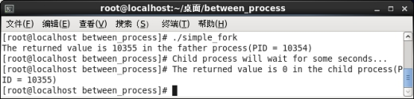
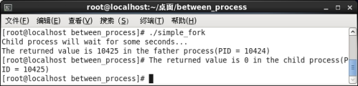
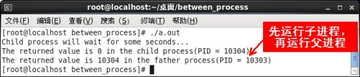

# 信号量编程
> linux中，使用信号量通常分为几个步骤。
- 创建信号量集|获取系统已存在信号量集
  - 需要用semget()函数。不同进程通过使用同一个信号量键值来获得同一个信号量集。
- 初始化信号量
  - 需要用到semctl()函数。设置指定信号量的初值。当使用二维信号量时，通常将信号量初始化为1。
- 设置信号量的PV操作
  - 此时调用semop()函数，设置指定信号量集中的指定信号量的PV操作。这一步是同步和互斥的核心工作部分。注意：信号量值只能通过PV操作改变。
- 删除无用信号量
  - 通过semclt()函数的IPC_RMID操作。此时需要注意，在程序中，不应该出现对已经删除的信号量的操作。
# 1.创建信号量集|获取系统已存在信号量集

## semget()
---
> 所需头文件
```c
#include <sys/types.h>
#include <sys/ipc.h>
#include <sys/sem.h>
```
> 函数原型
```c
int  semget(key_t  key ,  int  nsems ,  int  semflg)
```

> 函数传入值
```c
key
    信号量集的键值，可通过ftok()函数得到
```

```
#ftok()函数生成键值，semget()函数生成标识符。
```
```c
nsems
    需要创建的信号量数目，通常取值为1
```
```c
semflg
    同open()函数的权限位，如使用IPC_CREAT 标志创建新的信号量集，即使该信号量集已经存在（具有同一个键值的信号量集已在系统中存在），也不会出错。如果同时使用IPC_EXCL 标志可以创建一个新的唯一的信号量集，此时如果该信号量集已经存在，该函数会返回出错等
```
> 返回值

```c
成功：信号量集IPC标识符（作用类似于文件标识符，不同在于文件标识符只对当前进程有效，而信号量IPC标识符对所有进程有效，其中IPC为“进程间通信”），在信号量的其他函数中都会使用该值
出错：-1（errno被设置为相应的值）
```

---

### ftok()

---

> 把一个已存在的路径名和一个整数标识符转换成IPC键值；

> 原型

```c
key_t  ftok(const char *pathname, int proj_id)；
```

> 函数传入值

```c
pathname
    指定的文件，此文件必须存在且可存取
```

```c
proj_id
    计划代号（project ID）
```

> 函数返回值

```c
成功：返回key_t值（即IPC 键值）
出错：-1，错误原因存于error中
```

```
【注意】
ftok的典型实现是组合以下三个值：
① pathname所在的文件系统的信息（stat结构的st_dev成员）；
②该文件在本文件系统内的索引节点号；
③proj_id的低序8位（不能为0）。上述三个值的组合产生一个32位键。

【注意】所谓的键值，实质上就是在指定的路径下一个指定的ID号，只不过semget函数不能直接使用这个路径和ID号，所以我们必须通过ftok函数把这个路径和ID号生成一个32位的二进制数，即键值，才能被semget函数使用。另外，类似于我们在系统中创建一个文件，进程用open函数打开文件时，会产生文件标识符，进程用semget函数打开键值时，也会产生相应的信号量集IPC标识符。
```

---

> 下面例子简单创建了一个简单的键值，打印输出可以看到，键值长度为4字节。

## key.c

```c
/* key.c */
#include <stdio.h>
#include <sys/types.h>
#include <sys/ipc.h>
#include <sys/sem.h>
int main()
{
        int x;
        x=ftok("/",1);    /* 在根目录下创建一个ID为1的键值 */
        printf("x = %p\n",x);
}
```

> ipcs  -s可以查看是否生成信号量,
>
> ipcs是用于报告进程间通信机制状态的命令。
>
> 它可以查看共享内存(-m)，消息队列(-q)，信号量(-s)等各种进程间通信机制的情况。
>
> 查看后看到还没有生成信号量，因为此时还没有调用semget，仅仅是生成了键值。
>
> 下面添加代码，生成信号量。

## semget.c

```c
/* semget.c */
#include <stdio.h>
#include <sys/types.h>
#include <sys/ipc.h>
#include <sys/sem.h>
int main()
{
        int x,y;
        x=ftok("/",1);    
        printf("x = %p\n",x);
        y=semget(x,1,0666|IPC_CREAT);  /* 用ftok生成的键值，创建信号量集，信号量集中只有1个信号量，读写权限为0666 */
        printf("y = %d\n",y);
}
```

> 再次运行“ipcs  -s”目录，可以看到生成了信号量，信号量的key值就是ftok生成的键值，信号量的semid值就是semget生成的信号量集IPC标识符。

# 2.初始化信号量

## semctl()

---

> 所需头文件

```c
#include <sys/types.h>
#include <sys/ipc.h>
#include <sys/sem.h>
```

> 函数原型

```c
int  semctl(int  semid ,  int  semnum ,  int  cmd ,  union  semun  arg)
```

> 函数传入值

```c
semid
    semget()函数返回的信号量集IPC标识符
```

```c
semnum
    操作信号量在信号量集中的编号，第一个信号量的编号为0，如果只有一个信号量，该值就取0
```

```c
cmd
    指定对信号量的各种操作，常用的有以下几种：
    	IPC_STAT：获得该信号量（或者信号量集合）的semid_ds结构，并存放在由第4 个参数arg的buf指向semid_ds结构中。semid_ds是在系统中描述信号量的数据结构，在/usr/include/linux/shm.h中定义；
		IPC_RMID：从系统中删除信号量集；
		SETVAL：将信号量集中某一信号量值设置为arg的val值；
		SETALL：设置信号量集中所有信号量的值
		GETVAL：返回信号量集中一个信号量的当前值
		GETALL：读取信号量集中所有信号量的值
    
    >>>>>semid_ds>>>>>
    
struct shmid_ds{
      	struct ipc_perm shm_perm;/* 操作权限*/
       	int shm_segsz;            /*段的大小（以字节为单位）*/
      	time_t shm_atime;        /*最后一个进程附加到该段的时间*/
       	time_t shm_dtime;       /*最后一个进程离开该段的时间*/
      	time_t shm_ctime;       /*最后一个进程修改该段的时间*/
      	unsigned short shm_cpid; /*创建该段进程的pid*/
       	unsigned short shm_lpid; /*在该段上操作的最后1个进程的pid*/
       	short shm_nattch;        /*当前附加到该段的进程的个数*/
		/*下面是私有的*/
        unsigned short shm_npages;  /*段的大小（以页为单位）*/
      	unsigned long *shm_pages;   /*指向frames->SHMMAX的指针数组*/
      	struct vm_area_struct *attaches; /*对共享段的描述*/
};
```

```c
arg
    是union semun结构，该结构可能在某些系统中并不给出定义，此时必须由程序员自己定义
    
    union semun
	{
    	int  val;      //信号量的初值，二维信号量可设置为0或1，当cmd为SETVAL时使用
		struct  semid_ds  *buf;     //当cmd为STAT时使用
		unsigned  short  *array;    //当cmd为GETALL或SETALL时使用
	}
```

> 返回值

```c
成功：根据cmd值的不同而返回不同的值
IPC_STAT、IPC_SETVAL、IPC_RMID：返回0
IPC_GETVAL：返回信号量的当前值
出错：-1（errno被设置为相应的值）
```

---

## semop()

---

> 所需头文件

```c
#include <sys/types.h>
#include <sys/ipc.h>
#include <sys/sem.h>
```

> 函数原型

```c
int  semop(int  semid ,  struct  sembuf  *sops , size_t  nsops)
```

> 函数传入值

```c
sops
    指向信号量操作数组，一个数组包括以下成员：
    
    struct  sembuf
	{
		short sem_num; /* 信号量编号，第一个信号量的编号为0，如果只有一个信号量，该值就取0/
		short sem_op; /* 信号量操作：取值为-1 则表示P 操作，取值为+1 则表示V 操作*/
		short sem_flg; /* 通常设置为SEM_UNDO，这样在进程没释放信号量而退出时，系统自动释放该进程中未释放的信号量*/
	}
```

```c
nsops
    操作数组sops 中的操作个数，即要进行操作的信号量的个数，如果只有1个信号量，则取值为1
```

> 返回值

```c
成功：0
出错：-1（errno被设置为相应的值）
```

---

> 本实例说明信号量的概念以及基本用法。在实例程序中，首先创建一个子进程，接下来使用信号量来控制两个进程（父子进程）之间的执行顺序。要求子进程先运行，然后父进程再运行。此时可以将信号量初值设置为0，子进程不执行P操作直接运行，运行结束后执行V操作；父进程先执行P操作，再运行，结束后不执行V操作。
>
> 因为信号量相关的函数调用接口比较复杂，我们可以将它们封装成二维单个信号量的几个基本函数。它们分别为信号量初始化函数（或者信号量赋值函数）init_sem()、 P操作函数sem_p()、 V操作函数sem_v()以及删除信号量的函数del_sem()等，具体实现如下所示：

### sem_com.c

```c
/* sem_com.c */
/* 信号量初始化（赋值）函数*/
int init_sem(int sem_id, int init_value)
{
	union semun{
	int val;
	struct semid_ds *buf;
	unsigned short *array;
	};
	union semun sem_union;
	sem_union.val = init_value;   /* init_value 为初始值 */
    /*
    semctl函数为sem_id对应的信号量集中的0号信号量（第一个信号量）设置初值。因为用了SETVAL命令，所以初值		的大小就是sem_union联合体中val的值，即init_value。
    */
	if (semctl(sem_id, 0, SETVAL, sem_union) == -1)
	{
		perror("Initialize semaphore");
		return -1;
	}
	return 0;
}
/* 从系统中删除信号量的函数 */
int del_sem(int sem_id)
{
	union semun{
	int val;
	struct semid_ds *buf;
	unsignedshort *array;
	};
	union semun sem_union;
    /*
    semctl函数使用IPC_RMID命令将sem_id对应的信号量集删除。第二个参数可以是任意的整数。
注意，因为删除信号量时不需要从sem_union联合体中获取信息，所以这里可以把sem_union改为“0”或“NULL”，在del_sem()函数中也不需要定义semun联合体。
    */
	if (semctl(sem_id, 1, IPC_RMID, sem_union) == -1)
	{
		perror("Delete semaphore");
		return -1;
	}
}	
/* P 操作函数 */
int sem_p(int sem_id)
{
	struct sembuf sem_b;
	sem_b.sem_num = 0; /* 单个信号量的编号应该为0，即信号量集中的第一个信号量 */
	sem_b.sem_op = -1; /* 表示P 操作 */
	sem_b.sem_flg = SEM_UNDO; /* 系统自动释放将会在系统中残留的信号量*/
    /*
    semop函数将sem_id所指向的信号量集中的0号（第一个信号量）设置为P操作，每次只执行1个操作
    */
	if (semop(sem_id, &sem_b, 1) == -1)
	{
		perror("P operation");
		return -1;
	}
	return 0;
}
/* V 操作函数*/
int sem_v(int sem_id)
{
	struct sembuf sem_b;
	sem_b.sem_num = 0; /* 单个信号量的编号应该为0 */
	sem_b.sem_op = 1; /* 表示V 操作 */
	sem_b.sem_flg = SEM_UNDO; /* 系统自动释放将会在系统中残留的信号量*/
	if (semop(sem_id, &sem_b, 1) == -1)
	{
		perror("V operation");
		return -1;
	}
	return 0;
}
```

> 现在我们调用这些简单易用的接口，可以轻松解决控制两个进程之间的执行顺序的同步问题。实现代码如下所示：

### fork.c

```c
/* fork.c */
#include<sys/types.h>
#include<unistd.h>
#include<stdio.h>
#include<stdlib.h>
#include<sys/ipc.h>
#include<sys/sem.h>
#include"sem_com.c"
#define DELAY_TIME 3 /* 为了突出演示效果，等待几秒钟*/
int main(void)
{
	pid_t result;
	int sem_id; /* 定义信号量集的ID号*/
    /*
    ftok()函数创建一个键值，segmet()函数根据此键值创建一个信号量集，信号量集中的信号数量为1，信号量集的读写权限为0666，如果信号量集不存在将自动创建。
    
    问：如果设置为600，那么非创建者用户是否能正常使用该信号量？
    */
	sem_id = semget(ftok("/", 1), 1, 0666|IPC_CREAT); /* 创建一个信号量集*/
    /*
    将sem_id指向的信号量集中的0号信号量（第一个信号量）初值设置为0，即没有可用的资源
    */
	init_sem(sem_id, 0); /* 初始化信号量*/
	/*调用fork()函数创建子进程*/
	result = fork();
	if(result == -1)
	{
		perror("Fork\n");
	}
	elseif (result == 0) /*返回值为0 代表子进程，在子进程中直接运行程序，最后调用sem_v释放资源*/
	{
		printf("Child process will wait for some seconds...\n");
		sleep(DELAY_TIME);
		printf("The returned value is %d, in the child process(PID = %d)\n",result, getpid());
		sem_v(sem_id);
	}
	else/*返回值大于0 代表父进程，在父进程中先调用sem_p消耗资源，因为信号量初值设置为0，即没有资源，如果子进程没有释放出资源，则父进程sem_p操作不能进行，所以父进程一直等待子进程释放出资源后才能继续sem_p(sem_id)后面的程序。*/
	{
		sem_p(sem_id);
		printf("The returned value is %d, in the father process(PID = %d)\n",result, getpid());
		del_sem(sem_id);
	}
	exit(0);
}
```

> 可以先从该程序中删除掉信号量相关的代码部分并观察运行结果，发现每次运行结果不一定相同，因为父子进程执行顺序不确定。当然可以在父进程中添加sleep语句，让父进程休眠时间比子进程长，但是用这种方法并不可靠，因为系统中还有其他进程需要占用CPU，如果其他进程占用CPU的时间超过sleep的时间，则父子进程的执行顺序就又无法确定了。

 

 

> 再添加信号量的控制部分并运行结果。

 

> 本实例说明使用信号量怎么解决多进程之间存在的同步问题。我们将在后面讲述的共享内存和消息队列的实例中，看到使用信号量实现多进程之间的互斥。


