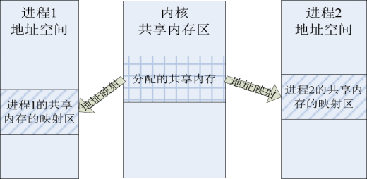

## 共享内存

>  shared memory

> 共享内存是最高效的通信方式

> 我们写的c工程(包含很多.c文件)，运行起来便是一个进程。如果我们再跑一个，再跑一个，这样跑很多个，这些进程之间，交换数据是便是进程间的通信。

> 现在有一种更方便的方法，便是由内核给进程一块儿内存区域，我划分的进程都可以共享这块内存区域。这便是共享内存。

## 地址映射

> 我们写的c程序，存储器分配给你最开始的地址是0000...开头到正无穷。
>
> 这个在还是单道的年代特别容易处理。
>
> 只需要+base(基址)就可以了。
>
> 即使多道程序的处理稍稍复杂，但原理仍是大差不差。
>
> 何不想成单道程序？
>
> 这就是地址映射--把理论的，不能用的地址转化为实际的，内存中能对的上号的地址。

