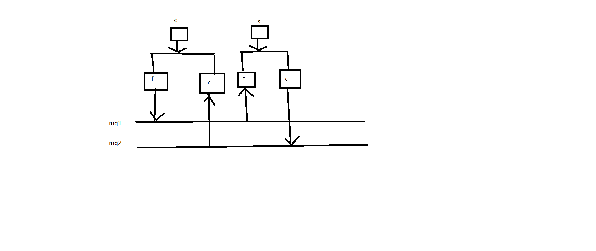
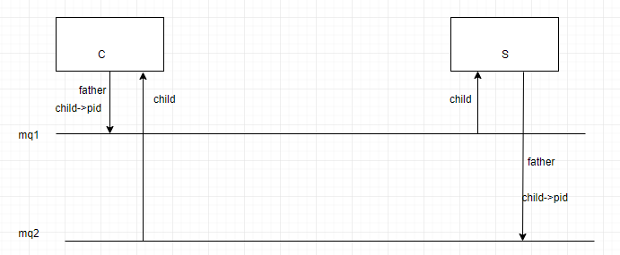

## 实验10

> 1. 将第10课讲稿中的例子代码编写、编译、调试、运行；

> 2. 用消息队列实现简单的聊天功能：
>
> ```c
> 1)创建两个程序，分别为server和client；
> 2)先运行server程序，创建消息队列，并打印输出信号量集的队列ID和其他提示语句；
> 3)client程序打开server程序创建的消息队列，并打印输出信号量集的队列ID和其他提示语句，若server程序未运行（消息队列不存在），则输出提示后退出client；
> 4)任一方可任意输入信息，对方可即时接收并显示信息； 
> 5)任一方输入“quit”后退出双方聊天程序，退出聊天前，由输入“quit”的一方删除消息队列。
> ```

*

*

*

*

*

*

*

**

*

*

*

*

*

*

*

**

*

*

*

*

*

*

*

**

*

*

*

*

*

*

*

**

*

*

*

*

*

*

*

**

*

*

*

*

*

*

*

**

*

*

*

*

*

*

*

**

---

### 实验讲解

#### 思路图

> 这个是我第一次做的，没做出来。



> 2
>
> client.c

```c
#include <stdio.h>
#include <sys/types.h> 
#include <unistd.h>
#include <stdlib.h>
#include <errno.h>
#include <sys/types.h>
#include <sys/ipc.h>
#include <sys/shm.h>
#include <sys/msg.h>
#include <string.h>
#define MESSAGE_BUFF_SIZE 512
struct msgbuf
{
long mtype;
char mtext[MESSAGE_BUFF_SIZE];
};
int mqid,mqid2;
struct msgbuf mb,mb2;

void msg_receive2();
void msg_send();

int main(void)
{
	pid_t pid;
	if((pid = fork())<0)
	{
		perror("fork process error!!!");
		exit(1);
	}else if(pid==0)
	{
		printf("[Client]:Child process'd pid is:%d\n",getpid() );
		//c-c-mq2-receive
		mqid2 = get_message_quene2();
		msg_receive2();//if p close message quene 1,then c close message quene2
		exit(0);
	}else
	{
		printf("[Client]:Father process'd pid is:%d\n",getpid() );
		//c-f-mq-send
		mqid = get_message_quene();
		msg_send();
		exit(0);
	}


	
	return 0;
}


int get_message_quene()
{
	key_t key;
	if((key = ftok("/",'a')) < 0)
	{
		printf("errno is:%d",errno);
		exit(1);
	}
	if((mqid = msgget(key,IPC_EXCL))<0)
	{
		printf("Server is not started!!!\n");
		exit(1);
	}
	if((mqid = msgget(key,0666))<0)
	{
		perror("message quene open fail!!!");
		exit(1);
	}
	printf("[Client]:father process %d opened message quene: %d\n",getpid(),mqid);
    return mqid;
}

int get_message_quene2()
{
	key_t key;
	if((key = ftok("/",'b')) < 0)
	{
		printf("errno is:%d",errno);
		exit(1);
	}
	if((mqid2 = msgget(key,IPC_EXCL))<0)
	{
		printf("Server is not started!!!\n");
		exit(1);
	}
	if((mqid2 = msgget(key,0666))<0)
	{
		perror("message quene open fail!!!");
		exit(1);
	}
	printf("[Client]:child process %d opened message quene2: %d\n",getpid(),mqid2);
    return mqid2;
}

void msg_receive2()
{
	//添加信号，如果收到kill信号则关闭消息队列
	do
    {
    	memset(mb2.mtext, 0, MESSAGE_BUFF_SIZE);
        if(msgrcv(mqid2,&mb2,MESSAGE_BUFF_SIZE,0,0)<0)
        {
            perror("message receive error!");
        }
        printf("Client's Process %d received data from server:%s",getpid(),mb2.mtext);
    }while(strncmp(mb2.mtext, "quit", 4)!=0);

}

void msg_send()
{
    mb.mtype=getpid();
    while(1)
    {
        printf("input some data to message quene buff:\n");
        if(fgets(mb.mtext,MESSAGE_BUFF_SIZE,stdin)==NULL)
        {
            printf("No message from stdin!\n");
            exit(1);
        }
        if(msgsnd(mqid,&mb,strlen(mb.mtext),0)<0)
        {
            perror("message send error!");
            exit(1);
        }
        if (strncmp(mb.mtext, "quit", 4) == 0)
        {
        	if ((msgctl(mqid, IPC_RMID, NULL)) < 0)
    		{
    			perror("remove message quene error");
    			exit(1);
    		}
/*    		if ((msgctl(mqid2, IPC_RMID, NULL)) < 0)
    		{
    			perror("remove message quene2 error");
    			exit(1);
    		}*/
    		printf("messages be removed by process %d\n",getpid());
    		break;
        }
    }

}
```

> server.c

```c
#include <stdio.h>
#include <sys/types.h> 
#include <unistd.h>
#include <stdlib.h>
#include <errno.h>
#include <sys/types.h>
#include <sys/ipc.h>
#include <sys/shm.h>
#include <sys/msg.h>
#include <string.h>
#define MESSAGE_BUFF_SIZE 512
struct msgbuf
{
long mtype;
char mtext[MESSAGE_BUFF_SIZE];
};
int mqid,mqid2;
struct msgbuf mb,mb2;
void msg_send2();
void msg_receive();


int main(void)
{
	pid_t pid;
	if((pid = fork())<0)
	{
		perror("fork process error!!!");
		exit(1);
	}else if(pid==0)
	{
		printf("[Server]:Child process'd pid is:%d\n",getpid() );
		//s-c-mq2-send
		mqid2 = create_message_quene2();
		msg_send2();
		exit(0);

	}else
	{
		printf("[Server]:Father process'd pid is:%d\n",getpid() );
		//s-f-mq-receive
		mqid = create_message_quene();
		msg_receive();
		exit(0);
	}


	
	return 0;
}


int create_message_quene()
{
	key_t key;
	if((key = ftok("/",'a')) < 0)
	{
		printf("errno is:%d",errno);
		exit(1);
	}
	if((mqid = msgget(key,IPC_CREAT|0666))<0)
    {
        perror("message quene create failed!!!");
        exit(1);
    }
    printf("[Server]:father process %d created message quene :%d\n",getpid(),mqid);
    return mqid;
}

int create_message_quene2()
{
	key_t key;
	if((key = ftok("/",'b')) < 0)
	{
		printf("errno is:%d",errno);
		exit(1);
	}
	if((mqid2 = msgget(key,IPC_CREAT|0666))<0)
    {
        perror("message quene create failed!!!");
        exit(1);
    }
    printf("[Server]:child process created message quene2 :%d\n",mqid2);
    return mqid2;
}


//c
void msg_send2()
{
	mb2.mtype=getpid();
    while(1)
    {
        printf("input some data to message quene buff:\n");
        if(fgets(mb2.mtext,MESSAGE_BUFF_SIZE,stdin)==NULL)
        {
            printf("No message from stdin!\n");
            exit(1);
        }
        if(msgsnd(mqid2,&mb2,strlen(mb2.mtext),0)<0)
        {
            perror("message send error!");
            exit(1);
        }
        if (strncmp(mb2.mtext, "quit", 4) == 0)
        {
    		if ((msgctl(mqid2, IPC_RMID, NULL)) < 0)
    		{
    			perror("remove message quene2 error");
    			exit(1);
    		}
    		printf("messages be removed by process %d\n",getpid());
    		// if ((msgctl(mqid, IPC_RMID, NULL)) < 0)
    		// {
    		// 	perror("remove message quene error");
    		// 	exit(1);
    		// }
    		break;
        }
    }

}

void msg_receive()
{
	do
    {
    	memset(mb.mtext, 0, MESSAGE_BUFF_SIZE);
    	//如果接受到杀死信号，则将消息队列关闭
        if(msgrcv(mqid,&mb,MESSAGE_BUFF_SIZE,0,0)<0)
        {
            perror("message receive error!");
        }
        printf("Server's Process %d received data from client:%s",getpid(),mb.mtext);
    }while(strncmp(mb.mtext, "quit", 4)!=0);

}

```

> 现在我改变了思路，可以了。

#### 思路图2



##### server_mod.c

```c
#include <stdio.h>
#include <sys/types.h> 
#include <unistd.h>
#include <stdlib.h>
#include <errno.h>
#include <sys/types.h>
#include <sys/ipc.h>
#include <sys/shm.h>
#include <sys/msg.h>
#include <string.h>
#define MESSAGE_BUFF_SIZE 512
struct msgbuf
{
long mtype;
char mtext[MESSAGE_BUFF_SIZE];
};
int mqid,mqid2;
struct msgbuf mb,mb2;
void msg_send2();
void msg_receive();
int get_message_quene();


int main(void)
{
	pid_t pid;
	if((pid = fork())<0)
	{
		perror("fork process error!!!");
		exit(1);
	}else if(pid==0)
	{
		printf("[Server]:Father process'd pid is:%d\n",getpid() );
		//s-f-mq-receive
		mqid = create_message_quene();
		msg_receive();
		exit(0);

	}else
	{
		printf("[Server]:Child process'd pid is:%d\n",getpid() );
		//s-c-mq2-send
		mqid2 = create_message_quene2();
		msg_send2(pid);
		exit(0);
	}


	
	return 0;
}


int create_message_quene()
{
	key_t key;
	if((key = ftok("/",'a')) < 0)
	{
		printf("errno is:%d",errno);
		exit(1);
	}
	if((mqid = msgget(key,IPC_CREAT|0666))<0)
    {
        perror("message quene create failed!!!");
        exit(1);
    }
    printf("[Server]:father process %d created message quene :%d\n",getpid(),mqid);
    return mqid;
}

int create_message_quene2()
{
	key_t key;
	if((key = ftok("/",'b')) < 0)
	{
		printf("errno is:%d",errno);
		exit(1);
	}
	if((mqid2 = msgget(key,IPC_CREAT|0666))<0)
    {
        perror("message quene create failed!!!");
        exit(1);
    }
    printf("[Server]:child process created message quene2 :%d\n",mqid2);
    return mqid2;
}


//f
void msg_send2(int arg)
{
int child=arg;
int pc;
	mb2.mtype=getpid();
    while(1)
    {
if((pc=waitpid(child,NULL,WNOHANG))==0)
{
        printf("input some data to message quene buff:\n");
        if(fgets(mb2.mtext,MESSAGE_BUFF_SIZE,stdin)==NULL)
        {
            printf("No message from stdin!\n");
            exit(1);
        }
        if(msgsnd(mqid2,&mb2,strlen(mb2.mtext),IPC_NOWAIT)<0)
//        if(msgsnd(mqid2,&mb2,strlen(mb2.mtext),0)<0)
        {
            perror("message send error!");
            exit(1);
        }
        if (strncmp(mb2.mtext, "quit", 4) == 0)
        {
    		if ((msgctl(mqid2, IPC_RMID, NULL)) < 0)
    		{
    			perror("remove message quene2 error");
    			exit(1);
    		}
    		printf("messages be removed by process %d\n",getpid());
    		// if ((msgctl(mqid, IPC_RMID, NULL)) < 0)
    		// {
    		// 	perror("remove message quene error");
    		// 	exit(1);
    		// }
kill(child,2);
		//open1,close mq1
		mqid=get_message_quene();
		if ((msgctl(mqid, IPC_RMID, NULL)) < 0)
    		 {
    		 	perror("remove message quene error");
    			exit(1);
    		 }
    		break;
        }
}
else if(pc>0)
{
	break;
}
    }
}
//c
void msg_receive(int arg)
{
int child = arg;
	do
    {
    	memset(mb.mtext, 0, MESSAGE_BUFF_SIZE);
    	//如果接受到杀死信号，则将消息队列关闭
        if(msgrcv(mqid,&mb,MESSAGE_BUFF_SIZE,0,0)<0)
        {
            perror("message receive error!");
        }
        printf("Server's Process %d received data from client:%s",getpid(),mb.mtext);
    }while(strncmp(mb.mtext, "quit", 4)!=0);
}
int get_message_quene()
{
	key_t key;
	if((key = ftok("/",'a')) < 0)
	{
		printf("errno is:%d",errno);
		exit(1);
	}
	if((mqid = msgget(key,IPC_EXCL))<0)
	{
		printf("Server is not started!!!\n");
		exit(1);
	}
	if((mqid = msgget(key,0666))<0)
	{
		perror("message quene open fail!!!");
		exit(1);
	}
	printf("[Client]:father process %d opened message quene: %d\n",getpid(),mqid);
    return mqid;
}
```

##### client_mod.c

```c
#include <stdio.h>
#include <sys/types.h> 
#include <unistd.h>
#include <stdlib.h>
#include <errno.h>
#include <sys/types.h>
#include <sys/ipc.h>
#include <sys/shm.h>
#include <sys/msg.h>
#include <string.h>
#define MESSAGE_BUFF_SIZE 512
struct msgbuf
{
long mtype;
char mtext[MESSAGE_BUFF_SIZE];
};
int mqid,mqid2;
struct msgbuf mb,mb2;

void msg_receive2();
void msg_send();

int main(void)
{
	pid_t pid;
	if((pid = fork())<0)
	{
		perror("fork process error!!!");
		exit(1);
	}else if(pid==0)
	{
		printf("[Client]:Child process'd pid is:%d\n",getpid() );
		//c-c-mq2-receive
		mqid2 = get_message_quene2();
		msg_receive2();//if p close message quene 1,then c close message quene2
		exit(0);
	}else
	{
		printf("[Client]:Father process'd pid is:%d\n",getpid() );
		//c-f-mq-send
		mqid = get_message_quene();
		msg_send(pid);
		exit(0);
	}


	
	return 0;
}


int get_message_quene()
{
	key_t key;
	if((key = ftok("/",'a')) < 0)
	{
		printf("errno is:%d",errno);
		exit(1);
	}
	if((mqid = msgget(key,IPC_EXCL))<0)
	{
		printf("Server is not started!!!\n");
		exit(1);
	}
	if((mqid = msgget(key,0666))<0)
	{
		perror("message quene open fail!!!");
		exit(1);
	}
	printf("[Client]:father process %d opened message quene: %d\n",getpid(),mqid);
    return mqid;
}

int get_message_quene2()
{
	key_t key;
	if((key = ftok("/",'b')) < 0)
	{
		printf("errno is:%d",errno);
		exit(1);
	}
	if((mqid2 = msgget(key,IPC_EXCL))<0)
	{
		printf("Server is not started!!!\n");
		exit(1);
	}
	if((mqid2 = msgget(key,0666))<0)
	{
		perror("message quene open fail!!!");
		exit(1);
	}
	printf("[Client]:child process %d opened message quene2: %d\n",getpid(),mqid2);
    return mqid2;
}

void msg_receive2()
{
	//添加信号，如果收到kill信号则关闭消息队列
	do
    {
    	memset(mb2.mtext, 0, MESSAGE_BUFF_SIZE);
        if(msgrcv(mqid2,&mb2,MESSAGE_BUFF_SIZE,0,0)<0)
        {
            perror("message receive error!");
        }
        printf("Client's Process %d received data from server:%s",getpid(),mb2.mtext);
    }while(strncmp(mb2.mtext, "quit", 4)!=0);

}
//client -f 
void msg_send(int arg)
{
int child=arg;
    mb.mtype=getpid();
    while(1)
    {
if(waitpid(child,NULL,WNOHANG)>0)
{
break;
}
        printf("input some data to message quene buff:\n");
        if(fgets(mb.mtext,MESSAGE_BUFF_SIZE,stdin)==NULL)
        {
            printf("No message from stdin!\n");
            exit(1);
        }
        if(msgsnd(mqid,&mb,strlen(mb.mtext),IPC_NOWAIT)<0)
//        if(msgsnd(mqid,&mb,strlen(mb.mtext),0)<0)
        {
            perror("message send error!");
            exit(1);
        }
        if (strncmp(mb.mtext, "quit", 4) == 0)
        {
        	if ((msgctl(mqid, IPC_RMID, NULL)) < 0)
    		{
    			perror("remove message quene error");
    			exit(1);
    		}
/*    		if ((msgctl(mqid2, IPC_RMID, NULL)) < 0)
    		{
    			perror("remove message quene2 error");
    			exit(1);
    		}*/
    		printf("messages be removed by process %d\n",getpid());
kill(child,2);
		//open mq2,close
		mqid2=get_message_quene2();
		if ((msgctl(mqid2, IPC_RMID, NULL)) < 0)
    		{
    			perror("remove message quene2 error");
    			exit(1);
    		}
    		break;
        }
    }
}
```


客户端、服务器的父进程干什么，他们都管发送消息。一个是发送到mq1,一个是mq2。

他们的子进程都管接收消息。一个是从mq1接收，一个是从mq2接收。

看他们的关系就好像半双工一样。（都是双向通信，都可以发送和接收，但他们不是同时进行的。）

关键：

父进程发送quit后，从内核中删除相应的mqid，但这个进程它没办法删除另外一个mqid。

这个时候怎么办呢？我就想到，我可以再打开嘛，再打开另外一个消息队列再删除另外一个。

之所以要传递子进程的pid，是因为如果我删除了同一个程序下子进程的队列id，那么父进程结束运行后，子进程就永远处于阻塞的读等待状态。因此需要杀死子进程。


