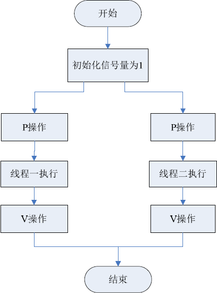
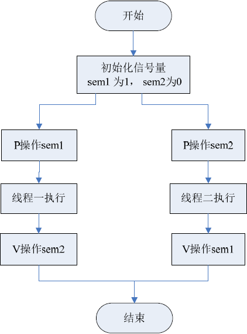

> 这里要讲的线程相关操作都是用户空间中的线程的操作。
>
> 在程序中无论创建n个线程，进入kernel都只有1个。

> 在Linux中，一般pthread线程库是一套通用的线程库(静态链接)，是由POSIX提出的，因此具有很好的可移植性。

## 函数详讲

| 函数             | 功能                                                         |
| ---------------- | ------------------------------------------------------------ |
| pthread_create() | 1.指定线程的入口(一个自定义函数)   2.指定传入线程入口的参数(在多线程公用一个入口的情况下，为了保证线程同步，首先要了解线程编号。故所传递的通常是线程id) |
| pthread_exit()   | 线程的主动退出程序。(**新创建的线程在运行完线程函数后，该线程也就退出了**，这也是线程退出的一种方法。)(**在使用线程函数时，不能随意使用exit()退出函数进行出错处理**，由于exit()的作用是使调用进程终止，往往一个进程包含多个线程，因此，在使用exit()之后，该进程中的所有线程都终止了。在线程中就可以使用pthread_exit()来代替进程中的exit()。) |
| pthread_join()   | 1.在线程退出后起作用  2.多个线程共享数据段，在线程退出之后，做类似exit(0);的工作。【pthread_join()可以用于将当前线程挂起来等待线程的结束，**这个函数是一个线程阻塞的函数。**调用它的函数将一直等待到被等待的线程结束为止，当函数返回时，被等待线程的资源就被收回】 |
| pthread_cancel() | 在一个线程中要终止另一个线程的执行。但在被取消的线程的内部需要调用pthread_setcancelstate()函数和pthread_setcanceltype()函数设置自己的取消状态，例如被取消的线程接收另一个线程的取消请求之后，是接受还是忽略这个请求；如果接受，是立刻进行终止操作还是等待某个函数的调用等。（本例没用到） |

## pthread_create()

> 关于第三个参数，为什么要传2级指针。1.`main函数的参数也是二级指针`2.`为了修改函数内的东西，就只传函数地址的地址`
>
> 关于第四个参数，其实设置为NULL也可以。它主要用于返回每个线程的id。

> 所需头文件

```c
#include <pthread.h>
```

> 函数原型

```c
int pthread_create ((pthread_t  *thread ,  pthread_attr_t  *attr , void *(*start_routine)(void *), void *arg))
```

> 函数传入值

```c
thread
    指向一个内存地址，用来记录新创建线程的线程标识符
```

```c
attr
    线程属性设置，通常取为NULL
```

```c
start_routine
    线程函数的起始地址，是一个以指向void的指针作为参数和返回值的函数指针
```

```c
arg
    传递给start_routine 的参数
```

> 返回值

```c
成功：0
出错：返回错误码
```

## pthread_exit()

> 所需头文件

```c
#include <pthread.h>
```

> 函数原型

```c
void pthread_exit(void *retval)
```

> 函数传入值

```c
retval：线程结束时的返回值，可由其他函数如pthread_join()来获取，一般为0或NULL
```

## pthread_join()

> 所需头文件

```c
#include <pthread.h>
```

> 函数原型

```c
int pthread_join ((pthread_t  th, void **thread_return))
```

> 函数传入值

```c
th
    等待线程的标识符
```

```c
thread_return
    用户定义的指针，用来存储被等待线程的标识符，如果不需要保存，可设置为NULL
```

> 返回值

```c
成功：0
出错：返回错误码
```

## pthread_cancel()

> 所需头文件

```c
#include <pthread.h>
```

> 函数原型

```c
int pthread_cancel((pthread_t  th)
```

> 函数传入值

```c
th
    要取消的线程的标识符
```

> 返回值

```c
成功：0
出错：返回错误码
```

> 以下实例中创建了3个线程，为了更好地描述线程之间的并行执行，让3个线程重用同一个执行函数。
>
> 每个线程都有5次循环（可以看成5个小任务），每次循环之间会随机等待1-3s的时间，意义在于模拟每个任务的到达时间是随机的，并没有任何特定规律。

### thread.c

> 因为pthread 库不是 Linux 系统默认的库，连接时需要使用静态库 libpthread.a，所以在使用pthread_create()创建线程，以及调用 pthread_atfork()函数建立fork处理程序时，需要在编译中添加-lpthread参数。

> gcc编译：`gcc thread.c -l pthread`

```c
/* thread.c */
#include <stdio.h>
#include <stdlib.h>
#include <pthread.h>
#define THREAD_NUMBER 3 /*线程数*/
#define REPEAT_NUMBER 5 /*每个线程中的小任务数*/
#define DELAY_TIME_LEVELS 3 /*小任务之间的最大时间间隔*/
  /* 线程函数*/
void *thrd_func(void *arg)
{
	int thrd_num = (int)arg;
	int delay_time = 0;
	int count = 0;
	printf("Thread %d is starting\n", thrd_num);
	for (count = 0; count < REPEAT_NUMBER; count++)
	{
		/* 得到1-3的随机数 */
		delay_time = rand()% DELAY_TIME_LEVELS  + 1;
		sleep(delay_time);
		printf("\tThread %d: job %d delay = %d\n"，thrd_num, count, delay_time);
	}
	printf("Thread %d finished\n", thrd_num);
	pthread_exit(NULL);
}
int main(void)
{
	pthread_t thread[THREAD_NUMBER]; /* 记录线程标识符 */
	int no = 0, res;
	srand(time(NULL));
	for (no = 0; no < THREAD_NUMBER; no++)
	{
		/* 创建多线程 */
		res = pthread_create(&thread[no], NULL, thrd_func, (void*)no);
		if (res != 0)
		{
			printf("Create thread %d failed\n", no);
			exit(res);
		}
	}
	printf("Create treads success\n Waiting for threads to finish...\n");
	for (no = 0; no < THREAD_NUMBER; no++)
	{
		/* 等待线程结束 */
		res = pthread_join(thread[no], NULL);
		if (!res)
		{
			printf("Thread %d joined\n", no);
		}
		else
		{
			printf("Thread %d join failed\n", no);
		}
	}
	return 0;
}
```

```
线程的创建顺序是一定的，但是执行顺序不一定。
根据for语句，线程创建的顺序为thread[0]→ thread[1]→ thread[2]，
但是执行的时候可能是thread[0]→ thread[1]→ thread[2]
也可能是thread[2]→ thread[1]→ thread[0]，
或者其他顺序，具体顺序由系统调度决定（可以增加线程的数量，随机效果更明显）。
另外，由于thread_join()是阻塞等待函数，所以不论线程结束的顺序如何
join的顺序一定是thread[0]→ thread[1]→ thread[2]。
```

> 可以看到，因为多个线程相互之间要用同样的地址空间，因此保证他们的同步就尤为重要。

## 线程信号量

```
前面已经讲到，信号量也就是操作系统中所用到的PV原子操作。
它广泛用于进程或线程间的同步与互斥。
信号量本质上是一个非负的整数计数器，它被用来控制对公共资源的访问。
这里先来简单复习一下PV原子操作的工作原理。
```

```
PV原子操作是对整数计数器信号量sem的操作。
一次P操作使sem减1，而一次V操作使sem加1。
```

```
进程（或线程）根据信号量的值来判断是否对公共资源具有访问权限。
```

```
当信号量sem的值大于等于零时，该进程（或线程）具有公共资源的访问权限；
相反，当信号量sem的值小于零时，该进程（或线程）就将阻塞直到信号量sem的值大于等于0为止。
```

> PV原子操作主要用于进程或线程间的同步和互斥这两种典型情况

- 互斥：指某一资源同时只允许一个访问者对其进行访问，具有唯一性和排它性。但互斥无法限制访问者对资源的访问顺序，即访问是无序的。
- 同步：指在互斥的基础上（大多数情况），通过其它机制实现访问者对资源的有序访问。

> 若用于互斥，几个进程（或线程）往往只设置一个信号量sem，它们的操作流程如下左图所示，此时依然无法控制执行的顺序：



> 当信号量用于同步操作时，往往会设置多个信号量，并安排不同的初始值来实现它们之间的顺序执行，它们的操作流程如图所示。



> 保证了sem1先执行，sem2再执行

> 若有三个线程，t1,t2,t3。则对应有三个信号量：sem1,sem2,sem3。
>
> 其中，保证t1先执行，则sem1=1,sem2=sem3=0；

| 函数名                    | 函数说明                                                     |
| ------------------------- | ------------------------------------------------------------ |
| sem_init()                | 用于创建一个信号量，并初始化它的值；                         |
| sem_wait()和sem_trywait() | 都相当于P操作，在信号量大于0时它们都能将信号量的值减1。两者的区别在于若信号量小于0时，sem_wait()将会阻塞进程，而sem_trywait()则会立即返回。 |
| sem_post()                | 相当于V操作，它将信号量的值加1，同时发出信号来唤醒等待的进程 |
| sem_getvalue()            | 用于得到信号量的值；                                         |
| sem_destroy()             | 用于删除信号量。                                             |

## sem_init()

> 所需头文件

```c
#include <semaphore.h>
```

> 函数原型

```c
int sem_init(sem_t *sem,int pshared,unsigned int value)
```

> 函数传入值

```c
sem
    信号量指针
```

```c
pshared
    决定信号量能在几个进程间共享。这个值取0，就表示这个信号量是当前进程的局部信号量（也就是用于进程创建的线程之间共享）
```

```c
value
    信号量初始化值
```

> 返回值

```c
成功：0
出错：-1
```

## sem_wait()

> 所需头文件

```c
#include <pthread.h>
```

> 函数原型

```c
int sem_wait(sem_t *sem)—same like P
int sem_trywait(sem_t *sem)
int sem_post(sem_t *sem)--same like V
int sem_getvalue(sem_t *sem)
int sem_destroy(sem_t *sem)
```

> 函数传入值

```c
sem：信号量指针
```

> 返回值

```c
成功：0
出错：-1
```

> 下面的例子是用信号量同步机制实现3个线程之间的有序执行，只是执行顺序是跟创建线程的顺序相反。

### thread_sem.c

```c
/*thread_sem.c*/
#include <stdio.h>
#include <stdlib.h>
#include <pthread.h>
#include <semaphore.h>
#define THREAD_NUMBER 3 /* 线程数 */
#define REPEAT_NUMBER 3 /* 每个线程中的小任务数 */
#define DELAY_TIME_LEVELS 3 /*小任务之间的最大时间间隔*/
sem_t sem[THREAD_NUMBER];
void *thrd_func(void *arg)
{
	int thrd_num = (int)arg;
	int delay_time = 0;
	int count = 0;	
	/* 对信号量进行P操作 */
	sem_wait(&sem[thrd_num]);
	printf("Thread %d is starting\n", thrd_num);
	for (count = 0; count < REPEAT_NUMBER; count++)
	{
		/* 得到1-3的随机数 */
		delay_time = rand()% DELAY_TIME_LEVELS  + 1;
		sleep(delay_time);
		printf("\tThread %d: job %d delay = %d\n",thrd_num, count, delay_time);
	}	
	printf("Thread %d finished\n", thrd_num);
	pthread_exit(NULL);
}
int main(void)
{
	pthread_t thread[THREAD_NUMBER];
	int no = 0, res;
    /*生产随机数种子*/
	srand(time(NULL));
	for (no = 0; no < THREAD_NUMBER; no++)
	{
		/* 创建3个初值为0的局部信号量*/
		sem_init(&sem[no], 0, 0);
		res = pthread_create(&thread[no], NULL, thrd_func, (void*)no);
		if (res != 0)
		{
			printf("Create thread %d failed\n", no);
			exit(res);
		}
	}
	printf("Create treads success\n Waiting for threads to finish...\n");
	/* 对最后创建的线程的信号量进行V 操作 */
	sem_post(&sem[THREAD_NUMBER - 1]);
	for(no = THREAD_NUMBER - 1; no >= 0; no--)
	{
		res = pthread_join(thread[no], NULL);
		if (!res)
		{
			printf("Thread %d joined\n", no);
		}
		else
		{
			printf("Thread %d join failed\n", no);
		}
		/* 对前一个线程进行V操作 */
		sem_post(&sem[(no - 1) % THREAD_NUMBER]);
	}
	for (no = 0; no < THREAD_NUMBER; no++)
	{
		/* 删除信号量 */
		sem_destroy(&sem[no]);
	}
	return 0;
}
```


 > mycode

### sem1.c

```c
#include <semaphore.h>
#include <pthread.h>
#include <stdio.h>
#include <stdlib.h>
/*thread's number*/
#define THREAD_NUM 400
/*This code is about create threads practice.And below is my threads's funciton*/
void *thread_fun(void *arg)
{
/*
receive args from main thread,and record it as thread_id,
warnning!!!:this is only on threads with the same thread-funciton.
*/
int thread_id = (int)arg;
printf("Current's thread_id is:%d\n",thread_id);
}
int main(void)
{
	sem_t s;
	int each;
	pthread_t threads[THREAD_NUM];
	/*1.create threads,and use the same function*/
	each=0;
	for(each;each<THREAD_NUM;each++)
	{
		//each + 1 is thread's id
		if(pthread_create(&threads[each],NULL,thread_fun,(void*)(each + 1))<0)
		{
		perror("create thread error!");
		exit(-1);
		}
	}
	/*2.block wait for each threads*/
    /*you need this step.If you don't join,image this:your main Thread which means process run over too fast,and your threads is not fast to get cpu,and then you will see nothing happened just like pthread_create is not working*/
	for(each;each>0;each--)
	{
		pthread_join(threads[each-1], NULL);
	}
	/*3.This step is for below's code.Init and create a semphanore,it just exits in one process's multiply's thread,and it's value is 1*/
	if(sem_init(&s,0,1)<0)
	{
		perror("sem_init_error!");
		exit(1);
	}
	return 0;
}
```

### sem2.c

```c
/*this is about process's synchronie*/
/*use PV(no name semaphore,don't like the prior's PV complex opration) to make sure sequence*/
#include <semaphore.h>
#include <pthread.h>
#include <stdio.h>
#include <stdlib.h>
/*thread's number*/
/*I want threads have some sequence,which needs semaphore*/
#define THREAD_NUM 3
/*opposite THREAD_NUM,which need to syno,..  one's s=1,others=0,and have N :(N equals threads's num)*/
#define SEM_NUM THREAD_NUM
/*My threads's funciton*/
/*below's funtion needs it to be global*/
sem_t sem[SEM_NUM];
void *thread_fun(void *arg)
{
	int thread_id = (int)arg;
	/*before the thread run,I need to give them a lock--P*/
	sem_wait(&sem[thread_id-1]);
	printf("Current's thread_id is:%d\n",thread_id);
}
int main(void)
{
	int each;
	pthread_t threads[THREAD_NUM];
	each=0;
	for(each;each<THREAD_NUM;each++)
	{
			/*1.init semaphore,and give them all the same value*/
			if(sem_init(&sem[each],0,0)<0)
			{
			perror("sem_init_error!");
			exit(1);
			}
			//each + 1 is thread's id
			/*2.create threads,and use the same function*/
			if(pthread_create(&threads[each],NULL,thread_fun,(void*)(each + 1))<0)
			{
			perror("create thread error!");
			exit(-1);
			}
	}
	//V to V the end thread's semaphore
	sem_post(&sem[THREAD_NUM-1]);
	/*3.block wait for each threads,make sure every can get time to use cpu*/
	for(each;each>0;each--)
	{
		pthread_join(threads[each-1], NULL);
		//,to be a circle
		sem_post(&sem[(each -1 - 1) % THREAD_NUM]);
	}
	return 0;
}
```

### thread.c

```c
/*create 1 thread(if you want to include this process like a main thread,then there are 2 threads)*/
#include <stdio.h>
#include <pthread.h>
#include <stdlib.h>
void *mythread(void *arg)
{
printf("I am be ...");
}
int main(void)
{
	/*my first thread*/
	pthread_t thread1;
	if(pthread_create(&thread1,NULL,mythread,NULL)<0)
	{
		perror("create thread error!");
		exit(-1);
	}
    /*wait (like wait function's work in charpet4),which means it will only wait until thread1 is run done*/
	pthread_join(thread1, NULL);	
	return 0;
}
```

