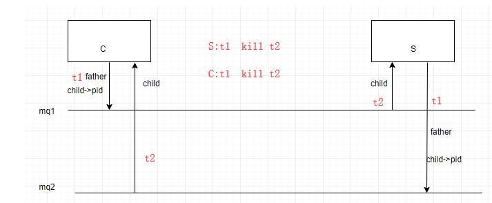

# 实验11

> 1. 将第11课讲稿中的例子代码编写、编译、调试、运行；

> 2. 线程和进程有什么区别？

> 3. 解释“thread.c”程序运行结果的意义，通过结果分析线程创建和运行的顺序；

> 4. 使用线程和消息队列，实现实验10第2题的聊天功能；【提示】可在进程中创建两个线程，分别负责发送信息和接受信息。

*

*

*

*

*

*

*

**

*

*

*

*

*

*

*

**

*

*

*

*

*

*

*

**

*

*

*

*

*

*

*

**

*

*

*

*

*

*

*

**

*

*

*

*

*

*

*

**

*

*

*

*

*

*

*

**

## 实验讲解

> 4.

### 思路图



> 复用了实验10的代码。

> client.c

```c
#include <stdio.h>
#include <sys/types.h> 
#include <unistd.h>
#include <stdlib.h>
#include <errno.h>
#include <sys/types.h>
#include <sys/ipc.h>
#include <sys/shm.h>
#include <sys/msg.h>
#include <string.h>
#include <stdio.h>
#include <pthread.h>
#include <stdlib.h>
#define MESSAGE_BUFF_SIZE 512
pthread_t thread1;
pthread_t thread2;
struct msgbuf
{
long mtype;
char mtext[MESSAGE_BUFF_SIZE];
};
int mqid,mqid2;
struct msgbuf mb,mb2;

void msg_receive2();
void msg_send();

	void *mythread(void *arg)
	{
		int thread_id = (int)arg;
		printf("[Client]:Thread: %d \n",thread_id);
		mqid = get_message_quene();
		msg_send();

	//pthread_exit(NULL);
	}


	void *mythread2(void *arg)
	{
		int thread_id = (int)arg;
		printf("[Client]:Thread: %d \n",thread_id);
		mqid2 = get_message_quene2();
		msg_receive2();//if p close message quene 1,then c close message quene2

	//pthread_exit(NULL);
	}


int main(void)
{
	if(pthread_create(&thread1,NULL,mythread,(void*)1)<0)
	{
	perror("create thread error!");
	exit(-1);
	}
	if(pthread_create(&thread2,NULL,mythread2,(void*)2)<0)
	{
	perror("create thread2 error!");
	exit(-1);
	}

	pthread_join(thread1, NULL);
	pthread_join(thread2, NULL);	
	return 0;
}


int get_message_quene()
{
	key_t key;
	if((key = ftok("/",'a')) < 0)
	{
		printf("errno is:%d",errno);
		exit(1);
	}
	if((mqid = msgget(key,IPC_EXCL))<0)
	{
		printf("Server is not started!!!\n");
		exit(1);
	}
	if((mqid = msgget(key,0666))<0)
	{
		perror("message quene open fail!!!");
		exit(1);
	}
	printf("[Client]:father process %d opened message quene: %d\n",getpid(),mqid);
    return mqid;
}

int get_message_quene2()
{
	key_t key;
	if((key = ftok("/",'b')) < 0)
	{
		printf("errno is:%d",errno);
		exit(1);
	}
	if((mqid2 = msgget(key,IPC_EXCL))<0)
	{
		printf("Server is not started!!!\n");
		exit(1);
	}
	if((mqid2 = msgget(key,0666))<0)
	{
		perror("message quene open fail!!!");
		exit(1);
	}
	printf("[Client]:child process %d opened message quene2: %d\n",getpid(),mqid2);
    return mqid2;
}

void msg_receive2()
{
	//添加信号，如果收到kill信号则关闭消息队列
	do
    {
    	memset(mb2.mtext, 0, MESSAGE_BUFF_SIZE);
        if(msgrcv(mqid2,&mb2,MESSAGE_BUFF_SIZE,0,0)<0)
        {
            perror("message receive error!");
        }
        printf("Client's Process %d received data from server:%s",getpid(),mb2.mtext);
    }while(strncmp(mb2.mtext, "quit", 4)!=0);

}
//client -f 
void msg_send()
{

    mb.mtype=getpid();
    while(1)
    {
//if(waitpid(child,NULL,WNOHANG)>0)
//{
//break;
//}
        printf("input some data to message quene buff:\n");
        if(fgets(mb.mtext,MESSAGE_BUFF_SIZE,stdin)==NULL)
        {
            printf("No message from stdin!\n");
            exit(1);
        }
        if(msgsnd(mqid,&mb,strlen(mb.mtext),IPC_NOWAIT)<0)
//        if(msgsnd(mqid,&mb,strlen(mb.mtext),0)<0)
        {
            perror("message send error!");
            exit(1);
        }
        if (strncmp(mb.mtext, "quit", 4) == 0)
        {
        	if ((msgctl(mqid, IPC_RMID, NULL)) < 0)
    		{
    			perror("remove message quene error");
    			exit(1);
    		}
/*    		if ((msgctl(mqid2, IPC_RMID, NULL)) < 0)
    		{
    			perror("remove message quene2 error");
    			exit(1);
    		}*/
    		printf("messages be removed by process %d\n",getpid());
//kill(child,2);
	
pthread_cancel(thread2);	
mqid2=get_message_quene2();
	
		if ((msgctl(mqid2, IPC_RMID, NULL)) < 0)
    		{
    			perror("remove message quene2 error");
    			exit(1);
    		}
		break;


        }
    }
}
```

> server.c

```c
#include <stdio.h>
#include <sys/types.h> 
#include <unistd.h>
#include <stdlib.h>
#include <errno.h>
#include <sys/types.h>
#include <sys/ipc.h>
#include <sys/shm.h>
#include <sys/msg.h>
#include <string.h>
#define MESSAGE_BUFF_SIZE 512
#define THREADNUM 2
pthread_t thread1,thread2;
struct msgbuf
{
long mtype;
char mtext[MESSAGE_BUFF_SIZE];
};
int mqid,mqid2;
struct msgbuf mb,mb2;
void msg_send2();
void msg_receive();
int get_message_quene();


	void *mythread(void *arg)
	{
		int thread_id = (int)arg;
		printf("[Server]:Thread: %d \n",thread_id);
		mqid2 = create_message_quene2();
		msg_send2();
	//pthread_exit(NULL);
	}


	void *mythread2(void *arg)
	{
		int thread_id = (int)arg;
		printf("[Server]:Thread: %d \n",thread_id);
		mqid = create_message_quene();
		msg_receive();
	//pthread_exit(NULL);
	}


int main(void)
{

		
	if(pthread_create(&thread1,NULL,mythread,(void*)1)<0)
	{
	perror("create thread error!");
	exit(-1);
	}
	if(pthread_create(&thread2,NULL,mythread2,(void*)2)<0)
	{
	perror("create thread2 error!");
	exit(-1);
	}

	pthread_join(thread1, NULL);
	pthread_join(thread2, NULL);	
	return 0;
}


int create_message_quene()
{
	key_t key;
	if((key = ftok("/",'a')) < 0)
	{
		printf("errno is:%d",errno);
		exit(1);
	}
	if((mqid = msgget(key,IPC_CREAT|0666))<0)
    {
        perror("message quene create failed!!!");
        exit(1);
    }
    printf("[Server]:father process %d created message quene :%d\n",getpid(),mqid);
    return mqid;
}

int create_message_quene2()
{
	key_t key;
	if((key = ftok("/",'b')) < 0)
	{
		printf("errno is:%d",errno);
		exit(1);
	}
	if((mqid2 = msgget(key,IPC_CREAT|0666))<0)
    {
        perror("message quene create failed!!!");
        exit(1);
    }
    printf("[Server]:child process created message quene2 :%d\n",mqid2);
    return mqid2;
}


//f
void msg_send2()
{


	mb2.mtype=getpid();
    while(1)
    {
//if((pc=waitpid(child,NULL,WNOHANG))==0)
//{
        printf("input some data to message quene buff:\n");
        if(fgets(mb2.mtext,MESSAGE_BUFF_SIZE,stdin)==NULL)
        {
            printf("No message from stdin!\n");
            exit(1);
        }
        if(msgsnd(mqid2,&mb2,strlen(mb2.mtext),IPC_NOWAIT)<0)
//        if(msgsnd(mqid2,&mb2,strlen(mb2.mtext),0)<0)
        {
            perror("message send error!");
            exit(1);
        }
        if (strncmp(mb2.mtext, "quit", 4) == 0)
        {
    		if ((msgctl(mqid2, IPC_RMID, NULL)) < 0)
    		{
    			perror("remove message quene2 error");
    			exit(1);
    		}
    		printf("messages be removed by process %d\n",getpid());
    		// if ((msgctl(mqid, IPC_RMID, NULL)) < 0)
    		// {
    		// 	perror("remove message quene error");
    		// 	exit(1);
    		// }
//kill(child,2);
		//open1,close mq1
	
pthread_cancel(thread2);		
		mqid=get_message_quene();
		
		if ((msgctl(mqid, IPC_RMID, NULL)) < 0)
    		 {
    		 	perror("remove message quene error");
    			exit(1);
    		 }
    		break;
        }
//}
//else if(pc>0)
//{
//	break;
//}
    }
}
//c
void msg_receive()
{
//int child = arg;
	do
    {
    	memset(mb.mtext, 0, MESSAGE_BUFF_SIZE);
    	//如果接受到杀死信号，则将消息队列关闭
        if(msgrcv(mqid,&mb,MESSAGE_BUFF_SIZE,0,0)<0)
        {
            perror("message receive error!");
        }
        printf("Server's Process %d received data from client:%s",getpid(),mb.mtext);
    }while(strncmp(mb.mtext, "quit", 4)!=0);
}

int get_message_quene()
{
	key_t key;
	if((key = ftok("/",'a')) < 0)
	{
		printf("errno is:%d",errno);
		exit(1);
	}
	if((mqid = msgget(key,IPC_EXCL))<0)
	{
		printf("Server is not started!!!\n");
		exit(1);
	}
	if((mqid = msgget(key,0666))<0)
	{
		perror("message quene open fail!!!");
		exit(1);
	}
	printf("[Client]:father process %d opened message quene: %d\n",getpid(),mqid);
    return mqid;
}
```

