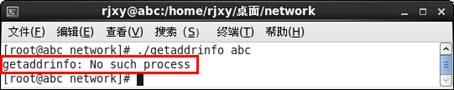

**一、**      **网络基础编程**

**2.1**  **socket****概述**

**2.1.1**      **socket****定义**

在Linux中的网络编程是通过socket接口来进行的。Socket也称为套接字，**它是一种特殊的****I/O****接口，也是一种文件描述符**。socket是一种常用的进程之间通信机制，通过它不仅能实现**本地机器上的进程之间的通信**，而且通过网络能够在**不同机器上的进程之间进行通信**。

每一个socket都用一个半相关描述{协议、本地地址、本地端口}来表示；一个完整的套接字则用一个相关描述{协议、本地地址、本地端口、远程地址、远程端口}来表示。socket也有一个类似于打开文件的函数调用，该函数返回一个整型的socket描述符，随后的连接建立、数据传输等操作都是通过socket来实现的。

**2.1.2**      **socket** **类型**

常见的socket有如下3种类型：

\1.    流式socket（SOCK_STREAM）。

流式套接字提供可靠的、面向连接的通信流；它使用TCP协议，从而保证了数据传输的正确性和顺序性。

\2.    数据报socket（SOCK_DGRAM）。

数据报套接字定义了一种无连接的服务，数据通过相互独立的报文进行传输，是无序的，并且不保证是可靠、无差错的。它使用数据报协议UDP。

\3.    原始socket。

原始套接字允许对底层协议如IP或ICMP进行直接访问，它功能强大但使用较为不便，主要用于一些协议的开发。

**2.2**  **地址及顺序处理**

**2.2.1**      **地址结构相关处理**

\1.    数据结构介绍。

下面首先介绍两个重要的数据类型：sockaddr和sockaddr_in，这两个结构类型都是用来保存socket信息的，如下所示：

这两个数据类型是等效的，可以相互转化，通常sockaddr_in数据类型使用更为方便。在建立sockaddr或sockaddr_in后，就可以对该socket进行适当的操作了。

\2.    结构字段。

表1列出了该结构sa_family字段可选的常见值。

| 表1 sa_family字段可选的常见值 |                                                              |
| ----------------------------- | ------------------------------------------------------------ |
| 结构定义头文件                | #include <netinet/in.h>                                      |
| sa_family                     | AF_INET：IPv4协议，在sockaddr和sockaddr_in中只能取这个值，要使用AF_INET6，需要使用sockaddr_in6。 |
| AF_INET6：IPv6协议            |                                                              |
| AF_LOCAL：UNIX域协议          |                                                              |
| AF_LINK：链路地址协议         |                                                              |
| AF_KEY：密钥套接字（socket）  |                                                              |

sockaddr_in其他字段的含义非常清楚，具体的设置涉及其他函数，在后面会有详细的

**2.2.2**      **数据存储优先顺序**

\1.    函数说明。

计算机数据存储有两种字节优先顺序：高位字节优先（称为大端模式）和低位字节优先（称为小端模式）。Internet上数据以大端模式传输，PC机通常采用小端模式，因此在有些情况下，需要对这两个字节存储优先顺序进行相互转化。这里用到了4个函数：htons()、ntohs()、htonl()和ntohl()，分别实现网络字节序和主机字节序的转化，这里的h代表host，n代表network，s代表short，l代表long。通常16位的IP端口号用s代表，而32位的IP地址用l来代表。

\2.    函数格式说明。

表2列出了这4个函数的语法格式。

| 表2 htons等函数语法要点         |                                                              |
| ------------------------------- | ------------------------------------------------------------ |
| 所需头文件                      | #include <netinet/in.h>                                      |
| 函数原型                        | uint16_t htons(unit16_t host16bit)  uint32_t htonl(unit32_t host32bit)  uint16_t ntohs(unit16_t net16bit)  uint32_t ntohs(unit32_t net32bit) |
| 函数传入值                      | host16bit：主机字节序的16位数据                              |
| host32bit：主机字节序的32位数据 |                                                              |
| net16bit：网络字节序的16位数据  |                                                              |
| net32bit：网络字节序的32位数据  |                                                              |
| 函数返回值                      | 成功：返回要转换的字节序                                     |
| 出错：-1                        |                                                              |

 

| 注意 | 调用该函数只是使其得到相应的字节序，用户不需清楚该系统的主机字节序和网络字节序是否真正相等。如果是相同不需要转换的话，该系统的这些函数会定义成空宏。 |
| ---- | ------------------------------------------------------------ |
|      |                                                              |

 

**2.2.3**      **地址格式转化**

\1.    函数说明。

通常用户在表达地址时采用的是点分十进制表示的数值（或者是以冒号分开的十进制 IPv6 地址），而在通常使用的socket 编程中所使用的则是二进制值，这就需要将这两个数值进行转换。这里主要介绍能同时兼容IPv4和IPv6的函数inet_pton()和inet_ntop()。

inet_pton()函数是将点分十进制地址映射为二进制地址，而inet_ntop()是将二进制地址映射为点分十进制地址。

\2.    函数格式。

表3列出了inet_pton 函数的语法要点。

| 表3 inet_pton函数语法要点 |                                                        |                      |
| ------------------------- | ------------------------------------------------------ | -------------------- |
| 所需头文件                | #include <arpa/inet.h>                                 |                      |
| 函数原型                  | int inet_pton(int family, const char  *src, void *dst) |                      |
| 函数传入值                | family                                                 | AF_INET： IPv4  协议 |
| AF_INET6： IPv6  协议     |                                                        |                      |
| src：来源地址             |                                                        |                      |
| dst：转化后的地址         |                                                        |                      |
| 函数返回值                | 成功： 0                                               |                      |
| 出错：-1                  |                                                        |                      |

表4列出了inet_ntop 函数的语法要点。

| 表4 inet_ntop函数语法要点                                    |                                                              |                      |
| ------------------------------------------------------------ | ------------------------------------------------------------ | -------------------- |
| 所需头文件                                                   | #include <arpa/inet.h>                                       |                      |
| 函数原型                                                     | int inet_ntop(int family, const void *src,  char *dst, size_t len) |                      |
| 函数传入值                                                   | family                                                       | AF_INET： IPv4  协议 |
| AF_INET6： IPv6  协议                                        |                                                              |                      |
| src：来源地址                                                |                                                              |                      |
| dst：转化后的地址                                            |                                                              |                      |
| len：缓存区dst的大小，避免溢出，如果缓存区太小无法存储地址的值，则返回一个空[指针](http://baike.baidu.com/view/159417.htm)，并将errno置为ENOSPC。 |                                                              |                      |
| 函数返回值                                                   | 成功： 0                                                     |                      |
| 出错：-1                                                     |                                                              |                      |

**2.2.4**      **名字地址转化**

\1.    函数说明。

通常，人们在使用过程中都不愿意记忆冗长的IP地址，尤其到IPv6时，地址长度多达128位，那时就更加不可能一次次记忆那么长的IP 地址了。因此，使用主机名将会是很好的选择。在Linux中，同样有一些函数可以实现主机名和地址的转化，最为常见的有gethostbyname()、gethostbyaddr()和getaddrinfo()等，它们都可以实现IPv4和IPv6的地址和主机名之间的转化。其中gethostbyname()是将主机名转化为IP地址，gethostbyaddr()则是逆操作，是将IP地址转化为主机名，另外getaddrinfo()还能实现自动识别IPv4地址和IPv6地址。

gethostbyname()和gethostbyaddr()都涉及一个hostent的结构体，如下所示：

调用gethostbyname()函数或gethostbyaddr()函数后就能返回hostent结构体的相关信息。

getaddrinfo()函数涉及一个addrinfo的结构体，如下所示：

表5列举了addrinfo结构体常见的选项值。

| 表5addrinfo  结构体常见选项值                                |                                                        |
| ------------------------------------------------------------ | ------------------------------------------------------ |
| 所需头文件                                                   | #include <netdb.h>                                     |
| ai_flags                                                     | AI_PASSIVE：该套接口是被动的，用于bind，主要用于服务器 |
| AI_CANONNAME：将正规主机名返回给addrinfo结构体中的ai_canonname成员 |                                                        |
| ai_family                                                    | AF_INET： IPv4  协议                                   |
| AF_INET6： IPv6  协议                                        |                                                        |
| AF_UNSPEC： IPv4 或 IPv6 均可                                |                                                        |
| ai_socktype                                                  | SOCK_STREAM：字节流套接字 socket（ TCP）               |
| SOCK_DGRAM：数据报套接字 socket（ UDP）                      |                                                        |
| ai_protocol                                                  | IPPROTO_IP： IP 协议                                   |
| IPPROTO_IPV4： IPv4 协议                                     |                                                        |
| IPPROTO_IPV6： IPv6 协议                                     |                                                        |
| IPPROTO_UDP： UDP                                            |                                                        |
| IPPROTO_TCP： TCP                                            |                                                        |

可见，相对于hostent 结构体，addrinfo 结构体包含更多的信息。

\2.    函数格式。

表6列出了gethostbyname()函数的语法要点。

| 表6gethostbyname  函数语法要点 |                                                      |
| ------------------------------ | ---------------------------------------------------- |
| 所需头文件                     | #include <netdb.h>                                   |
| 函数原型                       | struct hostent *gethostbyname(const  char *hostname) |
| 函数传入值                     | hostname：主机名                                     |
| 函数返回值                     | 成功： hostent 类型指针                              |
| 出错：-1                       |                                                      |

调用该函数时可以首先对 hostent 结构体中的h_addrtype 和h_length 进行设置，若为IPv4 可设置为AF_INET 和4；若为IPv6 可设置为AF_INET6 和16；若不设置则默认为IPv4 地址类型。

表7列出了getaddrinfo()函数的语法要点。

| 表7getaddrinfo()函数语法要点                             |                                                              |
| -------------------------------------------------------- | ------------------------------------------------------------ |
| 所需头文件                                               | #include <netdb.h>                                           |
| 函数原型                                                 | int getaddrinfo(const char *node,  const char *service, const struct addrinfo *hints,   struct addrinfo **result) |
| 函数传入值                                               | node：IP地址或者主机名                                       |
| service：十进制的端口号或已定义的服务名称，如ftp、http等 |                                                              |
| hints：服务线索                                          |                                                              |
| result：返回结果                                         |                                                              |
| 函数返回值                                               | 成功： 0                                                     |
| 出错：-1                                                 |                                                              |

在调用之前，首先要对 hints 服务线索进行设置，它也是addrinfo类型的结构体。

\3.    使用实例。

下面的实例给出了getaddrinfo函数用法的示例：

该程序可以将主机名hostname对应的IP地址存入res结构体。

若在程序中添加如下代码，可以把主机名对应的IP地址打印输出。

【测试1】将虚拟机的网络连接方式设置为“桥接”，并给Linux设置IP地址（可以自动获取），编译运行程序。

【测试2】用hostname命令把Linux的主机名修改为“abc”，再次运行程序，通过argv[1]把修改后的主机名传递给程序。

【注意1】主机名“localhost”时，对应的IP是本地环回路由127.0.0.1；主机名为hostname的值时，对应的IP是eth0的IP地址。

【注意2】若提示“No such process”，说明eth0未设置网关。

【注意3】若提示“Connection timed out”，如下图所示：

说明域名解析文件“/etc/hosts”中没有修改后的域名信息（正常情况下系统会自动添加），此时需要手动往/etc/hosts文件中添加信息。

【注意】getaddrinfo()函数的作用就是从域名解析服务器（DNS）或域名解析文件（/etc/hosts）中获取主机的信息。

**2.3**  **socket** **基础编程**

\1.    函数说明。

socket 编程的基本函数有socket()、bind()、listen()、accept()、send()、sendto()、recv()以及recvfrom()等，根据客户端还是服务端，或者根据使用TCP协议还是UDP协议，这些函数的调用流程都有所区别。这里先对每个函数进行说明，再给出各种情况下使用的流程图。

n socket()：该函数用于建立一个socket连接，可指定socket类型等信息。在建立了socket 连接之后，可对sockaddr或sockaddr_in结构进行初始化，以保存所建立的socket地址信息。

n bind()：该函数是用于将本地IP地址绑定到端口号，主要用于TCP的连接，而在UDP的连接中则无必要。

n listen()：在服务端程序成功建立套接字和与地址进行绑定之后，还需要准备在该套接字上接收新的连接请求，此时调用listen()函数来创建一个等待队列，在其中存放未处理的客户端连接请求。

n accept()：服务端程序调用listen()函数创建等待队列之后，调用accept()函数等待并接收客户端的连接请求。它通常从由listen()所创建的等待队列中取出第一个未处理的连接请求，创建一个新的套接字，并返回指向该套接字的文件描述符

n connect()：该函数在TCP中是用于bind()之后的client端，用于与服务器端建立连接。

n send()和recv()：这两个函数分别用于发送和接收数据，可以用在TCP中，也可以用在UDP中。

n sendto()和recvfrom()：这两个函数的作用与send()和recv()函数类似，也可以用在TCP和UDP中。当用在TCP时，后面的几个与地址有关参数不起作用，函数作用等同于send()和recv()；当用在UDP时，可以用在之前没有使用connect()的情况下，这两个函数可以自动寻找指定地址并进行连接。

服务器端和客户端使用TCP和UDP协议的流程分别如图6和图7所示。

   图6 使用TCP协议socket编程流程图     图7 使用UDP协议socket编程流程图

\2.    函数格式。

表8列出了socket()函数的语法要点。

| 表8 socket()函数语法要点                                     |                                                 |                      |
| ------------------------------------------------------------ | ----------------------------------------------- | -------------------- |
| 所需头文件                                                   | #include <sys/socket.h>                         |                      |
| 函数原型                                                     | int socket(int family, int type, int  protocol) |                      |
| 函数传入值                                                   | family：  协议族                                | AF_INET： IPv4  协议 |
| AF_INET6： IPv6  协议                                        |                                                 |                      |
| AF_LOCAL： UNIX  域协议                                      |                                                 |                      |
| AF_ROUTE：路由套接字                                         |                                                 |                      |
| AF_KEY：密钥套接字                                           |                                                 |                      |
| type：  套接字类型                                           | SOCK_STREAM：字节流套接字（TCP）                |                      |
| SOCK_DGRAM：数据报套接字（UDP）                              |                                                 |                      |
| SOCK_RAW：原始套接字                                         |                                                 |                      |
| protocol：常用的协议有IPPROTO_TCP、IPPROTO_UDP等，分别对应于TCP传输和UDP传输，如果不想指定，可以直接设置为0 |                                                 |                      |
| 函数返回值                                                   | 成功：非负套接字描述符                          |                      |
| 出错：-1                                                     |                                                 |                      |

表9列出了bind()函数的语法要点。

| 表9 bind()函数语法要点 |                                                             |
| ---------------------- | ----------------------------------------------------------- |
| 所需头文件             | #include <sys/socket.h>                                     |
| 函数原型               | int bind(int sockfd, struct sockaddr *my_addr, int addrlen) |
| 函数传入值             | sockfd：套接字描述符                                        |
| my_addr：本地地址      |                                                             |
| addrlen：地址长度      |                                                             |
| 函数返回值             | 成功： 0                                                    |
| 出错：-1               |                                                             |

端口号和地址在my_addr中给出，若不指定地址，则内核随意分配一个临时端口给该应用程序。

表10列出了listen()函数的语法要点。

| 表10 listen()函数语法要点                                |                                     |
| -------------------------------------------------------- | ----------------------------------- |
| 所需头文件                                               | #include <sys/socket.h>             |
| 函数原型                                                 | int listen(int sockfd, int backlog) |
| 函数传入值                                               | socktd：套接字描述符                |
| backlog：请求队列中允许的最大请求数，大多数系统缺省值为5 |                                     |
| 函数返回值                                               | 成功： 0                            |
| 出错：-1                                                 |                                     |

表11列出了accept()函数的语法要点。

| 表11 accept()函数语法要点             |                                                              |
| ------------------------------------- | ------------------------------------------------------------ |
| 所需头文件                            | #include <sys/socket.h>                                      |
| 函数原型                              | int accept(int sockfd, struct sockaddr  *addr, socklen_t *addrlen) |
| 函数传入值                            | socktd：服务器端套接字描述符                                 |
| addr：返回参数，返回客户端地址        |                                                              |
| addrlen：返回参数，返回客户端地址长度 |                                                              |
| 函数返回值                            | 成功：返回客户端的socket                                     |
| 出错：-1                              |                                                              |

表12列出了connect()函数的语法要点。

| 表12 connect()函数语法要点 |                                                              |
| -------------------------- | ------------------------------------------------------------ |
| 所需头文件                 | #include <sys/socket.h>                                      |
| 函数原型                   | int connect(int sockfd, struct  sockaddr *serv_addr, int addrlen) |
| 函数传入值                 | socktd：套接字描述符                                         |
| serv_addr：服务器端地址    |                                                              |
| addrlen：地址长度          |                                                              |
| 函数返回值                 | 成功： 0                                                     |
| 出错：-1                   |                                                              |

表13列出了send()函数的语法要点。

| 表13 send()函数语法要点   |                                                            |
| ------------------------- | ---------------------------------------------------------- |
| 所需头文件                | #include <sys/socket.h>                                    |
| 函数原型                  | int send(int sockfd, const void *msg,  int len, int flags) |
| 函数传入值                | socktd：套接字描述符                                       |
| msg：指向要发送数据的指针 |                                                            |
| len：数据长度             |                                                            |
| flags：一般为 0           |                                                            |
| 函数返回值                | 成功：发送的字节数                                         |
| 出错：-1                  |                                                            |

表14列出了recv()函数的语法要点。

| 表14 recv()函数语法要点   |                                                     |
| ------------------------- | --------------------------------------------------- |
| 所需头文件                | #include <sys/socket.h>                             |
| 函数原型                  | int recv(int sockfd, void *buf,int  len, int flags) |
| 函数传入值                | socktd：套接字描述符                                |
| buf：存放接收数据的缓冲区 |                                                     |
| len：数据长度             |                                                     |
| flags：一般为 0           |                                                     |
| 函数返回值                | 成功：接收的字节数                                  |
| 出错：-1                  |                                                     |

表15列出了sendto()函数的语法要点。

| 表15 sendto()函数语法要点        |                                                              |
| -------------------------------- | ------------------------------------------------------------ |
| 所需头文件                       | #include <sys/socket.h>                                      |
| 函数原型                         | int sendto(int sockfd, const void  *msg,int len, unsigned int flags, const struct sockaddr*to, int tolen) |
| 函数传入值                       | socktd：套接字描述符                                         |
| msg：指向要发送数据的指针        |                                                              |
| len：数据长度                    |                                                              |
| flags：一般为 0                  |                                                              |
| to：目地机的 IP 地址和端口号信息 |                                                              |
| tolen：地址长度                  |                                                              |
| 函数返回值                       | 成功：发送的字节数                                           |
| 出错：-1                         |                                                              |

表16列出了recvfrom()函数的语法要点。

| 表16 recvfrom()函数语法要点        |                                                              |
| ---------------------------------- | ------------------------------------------------------------ |
| 所需头文件                         | #include <sys/socket.h>                                      |
| 函数原型                           | int recvfrom(int sockfd,void *buf, int  len, unsigned int flags, struct sockaddr *from,int *fromlen) |
| 函数传入值                         | socktd：套接字描述符                                         |
| buf：存放接收数据的缓冲区          |                                                              |
| len：数据长度                      |                                                              |
| flags：一般为 0                    |                                                              |
| from：源主机的 IP 地址和端口号信息 |                                                              |
| tolen：地址长度                    |                                                              |
| 函数返回值                         | 成功：接收的字节数                                           |
| 出错：-1                           |                                                              |

\3.    使用实例。

该实例分为客户端和服务器端两部分，其中服务器端首先建立起socket，然后与本地端口进行绑定，接着就监听客户端，接收从客户端的连接请求并建立与它的连接，接下来，接收客户端发送的消息。客户端则在建立socket之后调用connect()函数来建立连接。

服务端的代码如下所示：

客户端的代码如下所示：

在运行时需要先启动服务器端，再启动客户端。。

 

**二、**      **网络高级编程**

在实际情况中，人们往往遇到多个客户端连接服务器端的情况。由于之前介绍的如connet()、recv()和send()等都是阻塞性函数，如果资源没有准备好，则调用该函数的进程将进入睡眠状态，这样就无法处理I/O 多路复用的情况了。本节使用select()解决多路复用的问题。可以看到，由于在Linux 中把socket 也作为一种特殊文件描述符，这给用户的处理带来了很大的方便。

\1.    select()

下面是使用select()函数的服务器端源代码。客户端程序与前面的例子基本相同，仅在“close(sockfd)”前面加一句“sleep(5)”，令客户端延迟5秒后再退出。

运行该程序时，可以先启动服务器端，再反复运行客户端程序（这里启动两个客户端进程）即可，服务器端运行结果如下所示：

 

------

struct in_addr

{

in_addr_t s_addr;

};

【解释】[结构体](http://baike.baidu.com/view/204974.htm)in_addr 用来表示一个32位的IPv4地址。in_addr_t 一般为 32位的unsigned int，其字节顺序为网络顺序（network byte ordered)，即该无符号整数采用大端字节序

**struct addrinfo**

{

int ai_flags;/*AI_PASSIVE，AI_CANONNAME*/

int ai_family;/*地址族*/

int ai_socktype;/*socket 类型*/

int ai_protocol;/*协议类型*/

size_t ai_addrlen;/*地址字节长度*/

char *ai_canonname;/*主机名*/

struct sockaddr *ai_addr;/*socket 结构体*/

struct addrinfo *ai_next;/*下一个指针链表*/

}

或写为(*res).ai_cannonname

该代码可以直接在程序中使用，只需要把res改为getaddrinfo函数的第四个参数对应的结构体变量即可。

在getaddrinfo.c中，只需要把该代码添加到“printf("Host name is %s\n", res->ai_canonname);”后面即可。

由于代码比较复杂，不再详细介绍。

**struct sockaddr_in**

{

short int sa_family; /*地址族*/

unsigned short int sin_port; /*端口号*/

struct in_addr sin_addr; /*IP 地址*/

unsigned char sin_zero[8]; /*填充0 以保持与struct sockaddr 同样大小*/

};

建立使用IPV4协议的字节流socket（TCP）

struct in_addr

{

in_addr_t s_addr; /*32位的IPv4地址*/

};

指定地址为0.0.0.0，即任意地址。

 

如果要设置为固定IP(譬如192.168.3.3)，可以修改为inet_addr("192.168.3.3")

清空sin_zero的前8个字节，以保持struct sockaddr_in与struct sockaddr同样大小

默认情况下，两个独立的套接字不可与同一本地端口绑定，但是少数情况下，还是需要对一个地址重复使用（譬如本例中多次运行程序），使用setsockopt()函数的SO_REUSEADDR参数可以实现这个功能。

 

参数i是一种布尔型选项，指向非零整数。

 

【函数原型】int setsockopt(int sockfd, int level, int optname,const void *optval, socklen_t optlen);

设置最大连接数

 

【函数原型】int accept(int sockfd, struct sockaddr *addr, socklen_t *addrlen)

【函数传入值】

socktd：套接字描述符

addr：客户端地址

addrlen：地址长度

【返回值】

返回客户端的socket

**struct hostent**

{

char *h_name;/*正式主机名*/

char **h_aliases;/*主机别名*/

int h_addrtype;/*地址类型*/

int h_length;/*地址字节长度*/

char **h_addr_list;/*指向IPv4 或IPv6 的地址指针数组*/

};

\#define h_addr h_addr_list[0]

把(*host).h_addr做类型转换。